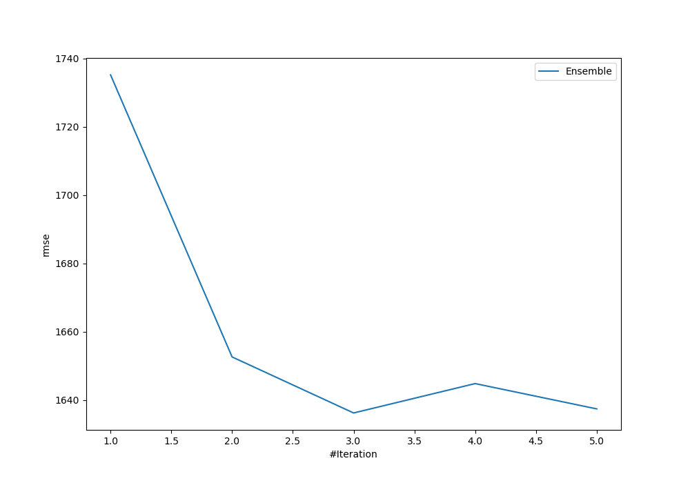
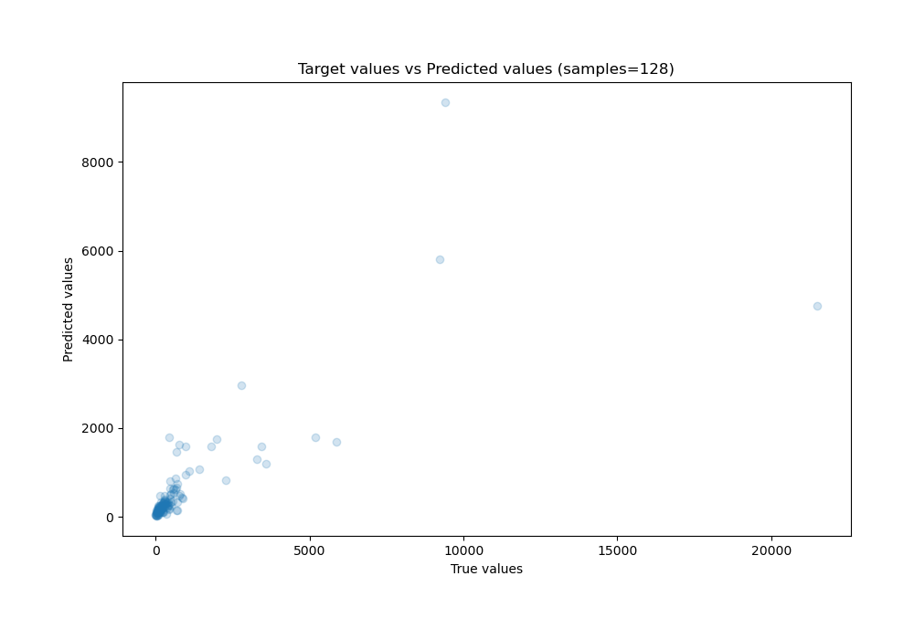
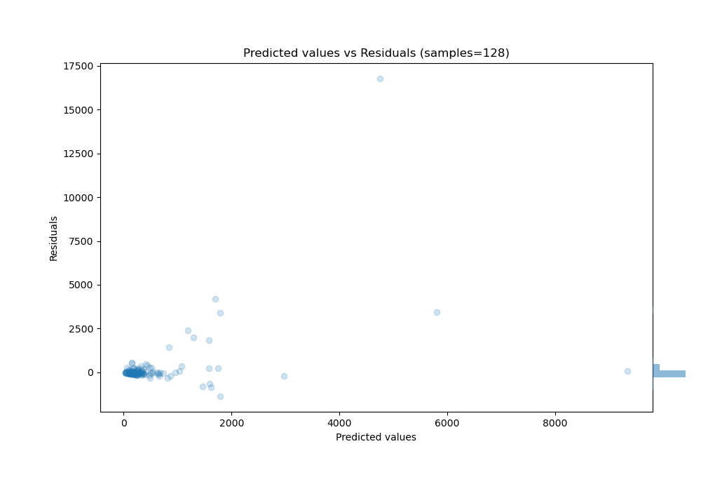

# Summary of Ensemble

[<< Go back](../README.md)

## Ensemble structure
| Model                   |   Weight |
|:------------------------|---------:|
| 3_Default_Xgboost       |        2 |
| 4_Default_NeuralNetwork |        1 |

### Metric details:
| Metric   |          Score |
|:---------|---------------:|
| MAE      |  399.601       |
| MSE      |    2.67713e+06 |
| RMSE     | 1636.19        |
| R2       |    0.499905    |
| MAPE     |    2.76545e+15 |

## Learning curves

## True vs Predicted

## Predicted vs Residuals

[<< Go back](../README.md)
