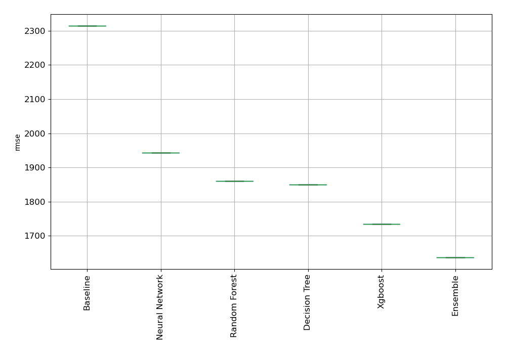

# AutoML Leaderboard

| Best model   | name                                             | model_type    | metric_type   |   metric_value |   train_time |
|:-------------|:-------------------------------------------------|:--------------|:--------------|---------------:|-------------:|
|              | [1_Baseline](1_Baseline/README.md)               | Baseline      | rmse          |        2314.88 |         1.34 |
|              | [2_DecisionTree](2_DecisionTree/README.md)       | Decision Tree | rmse          |        1849.7  |        15.47 |
| **the best** | [3_Default_Xgboost](3_Default_Xgboost/README.md) | Xgboost       | rmse          |        1735.18 |        12.71 |

### AutoML Performance

### AutoML Performance Boxplot
