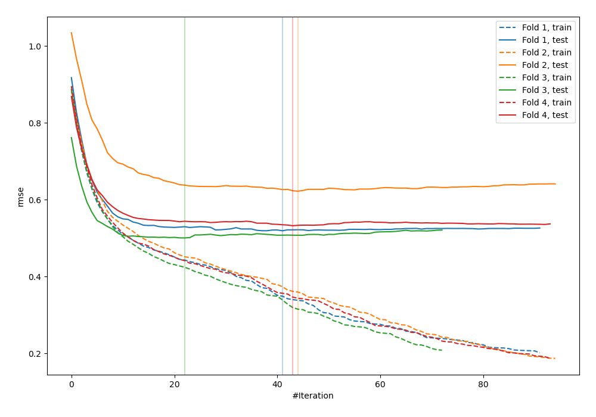
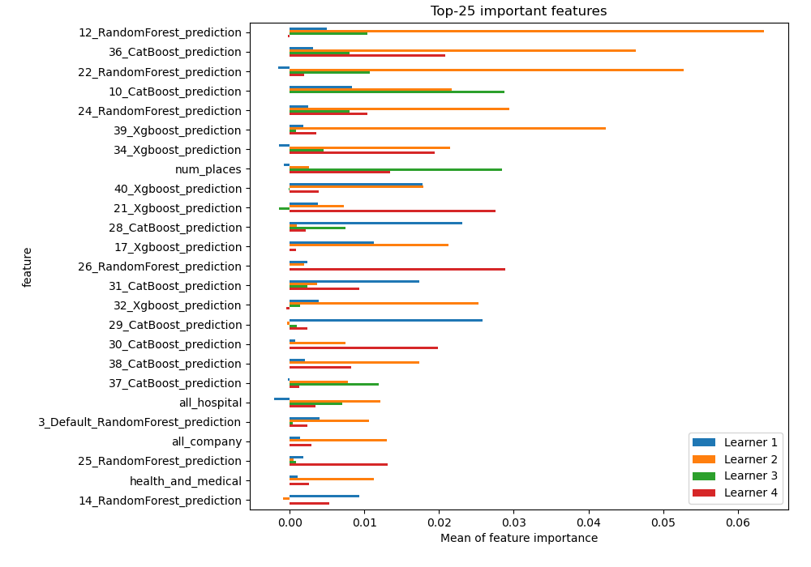
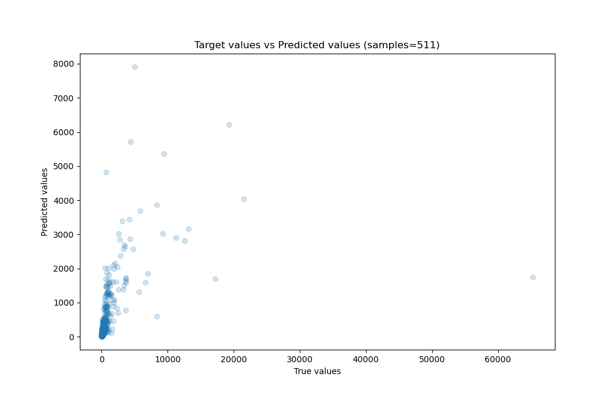
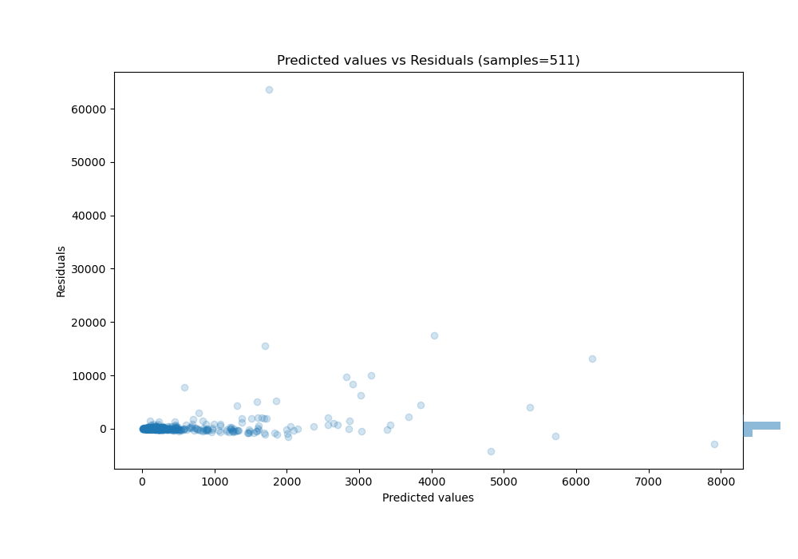

# Summary of 31_CatBoost_Stacked

[<< Go back](../README.md)

## CatBoost
- **n_jobs**: -1
- **learning_rate**: 0.2
- **depth**: 7
- **rsm**: 1.0
- **loss_function**: RMSE
- **eval_metric**: RMSE
- **explain_level**: 1

## Validation
 - **validation_type**: kfold
 - **k_folds**: 4
 - **shuffle**: False

## Optimized metric
rmse

## Training time

37.4 seconds

### Metric details:
| Metric   |          Score |
|:---------|---------------:|
| MAE      |  562.663       |
| MSE      |    1.04518e+07 |
| RMSE     | 3232.92        |
| R2       |    0.15417     |
| MAPE     |    6.23683e+14 |

## Learning curves

## Permutation-based Importance

## True vs Predicted

## Predicted vs Residuals

[<< Go back](../README.md)
