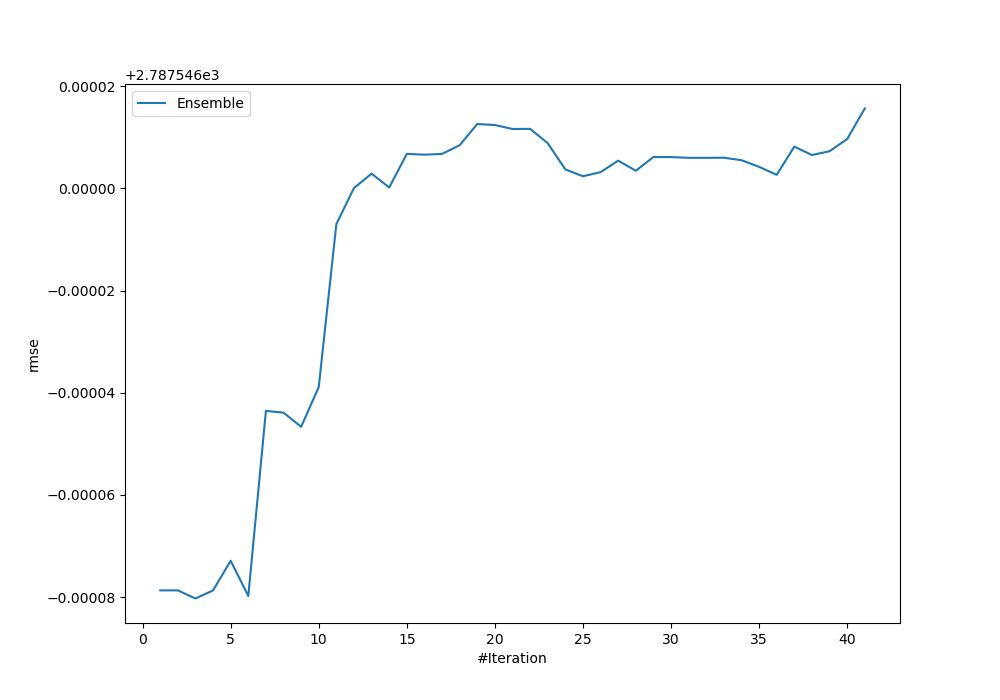
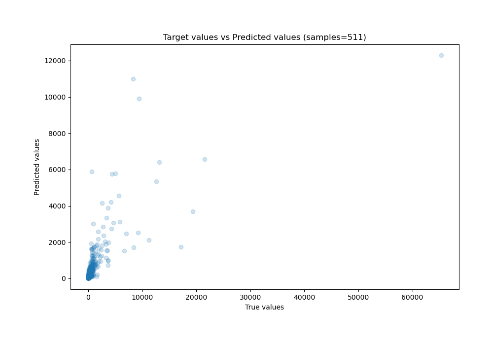
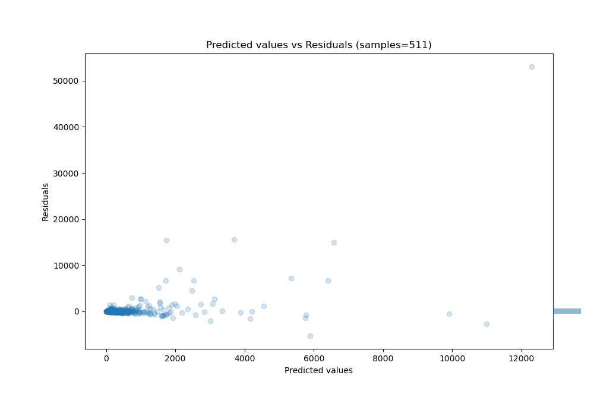

# Summary of Ensemble

[<< Go back](../README.md)

## Ensemble structure
| Model      |   Weight |
|:-----------|---------:|
| 17_Xgboost |        3 |

### Metric details:
| Metric   |          Score |
|:---------|---------------:|
| MAE      |  522.284       |
| MSE      |    7.77041e+06 |
| RMSE     | 2787.55        |
| R2       |    0.371163    |
| MAPE     |    7.72935e+14 |

## Learning curves

## True vs Predicted

## Predicted vs Residuals

[<< Go back](../README.md)
