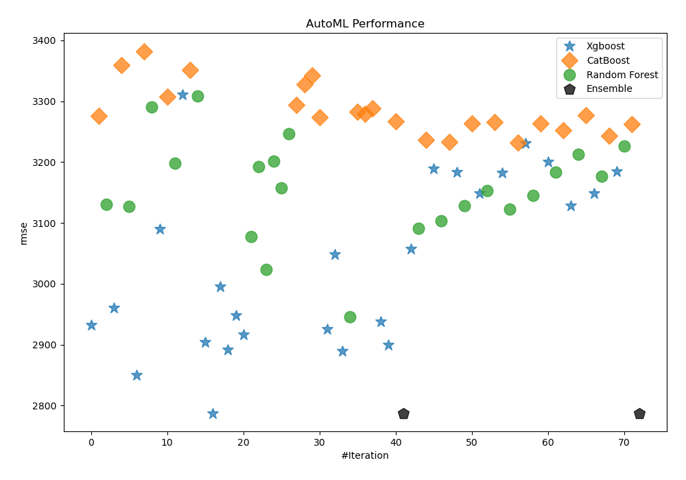
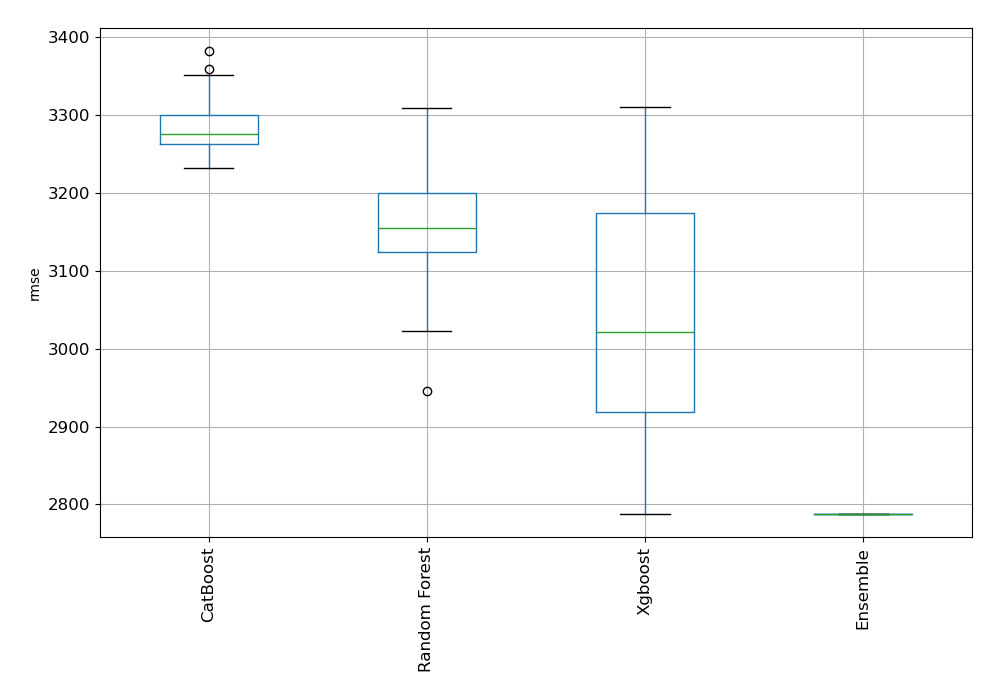
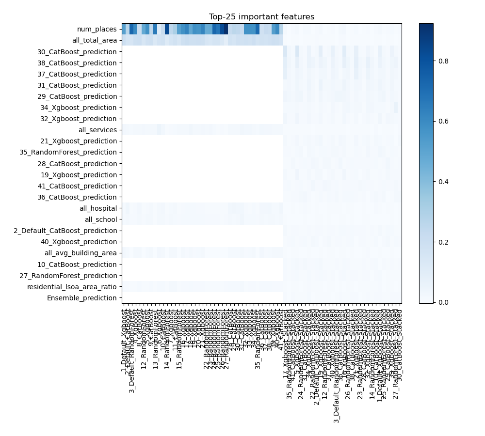
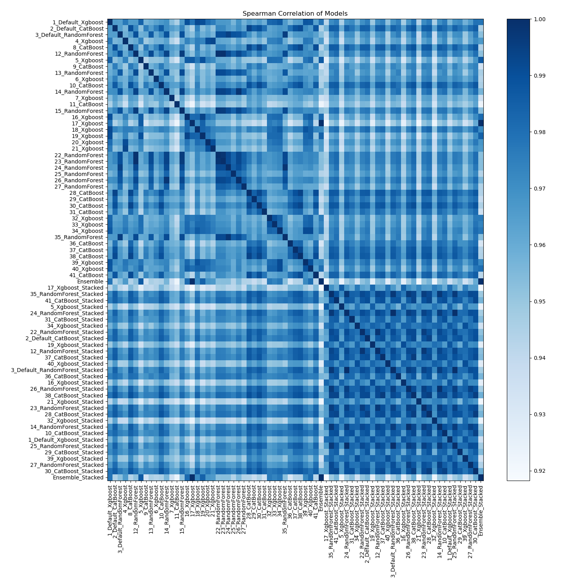

# AutoML Leaderboard

| Best model   | name                                                                       | model_type    | metric_type   |   metric_value |   train_time |
|:-------------|:---------------------------------------------------------------------------|:--------------|:--------------|---------------:|-------------:|
|              | [1_Default_Xgboost](1_Default_Xgboost/README.md)                           | Xgboost       | rmse          |        2931.83 |        21.37 |
|              | [2_Default_CatBoost](2_Default_CatBoost/README.md)                         | CatBoost      | rmse          |        3275.58 |        26.4  |
|              | [3_Default_RandomForest](3_Default_RandomForest/README.md)                 | Random Forest | rmse          |        3130.76 |        29.71 |
|              | [4_Xgboost](4_Xgboost/README.md)                                           | Xgboost       | rmse          |        2960.35 |        14.34 |
|              | [8_CatBoost](8_CatBoost/README.md)                                         | CatBoost      | rmse          |        3358.84 |        35.93 |
|              | [12_RandomForest](12_RandomForest/README.md)                               | Random Forest | rmse          |        3127.07 |        31.25 |
|              | [5_Xgboost](5_Xgboost/README.md)                                           | Xgboost       | rmse          |        2850.39 |        10.79 |
|              | [9_CatBoost](9_CatBoost/README.md)                                         | CatBoost      | rmse          |        3382.33 |        38.14 |
|              | [13_RandomForest](13_RandomForest/README.md)                               | Random Forest | rmse          |        3290.89 |        41.26 |
|              | [6_Xgboost](6_Xgboost/README.md)                                           | Xgboost       | rmse          |        3090.51 |        12.75 |
|              | [10_CatBoost](10_CatBoost/README.md)                                       | CatBoost      | rmse          |        3307.18 |        34.89 |
|              | [14_RandomForest](14_RandomForest/README.md)                               | Random Forest | rmse          |        3197.79 |        36.57 |
|              | [7_Xgboost](7_Xgboost/README.md)                                           | Xgboost       | rmse          |        3310.68 |        12.83 |
|              | [11_CatBoost](11_CatBoost/README.md)                                       | CatBoost      | rmse          |        3351.65 |        42.02 |
|              | [15_RandomForest](15_RandomForest/README.md)                               | Random Forest | rmse          |        3308.95 |        37.82 |
|              | [16_Xgboost](16_Xgboost/README.md)                                         | Xgboost       | rmse          |        2904.15 |        13.23 |
|              | [17_Xgboost](17_Xgboost/README.md)                                         | Xgboost       | rmse          |        2787.55 |        14.37 |
|              | [18_Xgboost](18_Xgboost/README.md)                                         | Xgboost       | rmse          |        2994.97 |        10.05 |
|              | [19_Xgboost](19_Xgboost/README.md)                                         | Xgboost       | rmse          |        2891.39 |        11.25 |
|              | [20_Xgboost](20_Xgboost/README.md)                                         | Xgboost       | rmse          |        2947.58 |         9.76 |
|              | [21_Xgboost](21_Xgboost/README.md)                                         | Xgboost       | rmse          |        2916.07 |        10.47 |
|              | [22_RandomForest](22_RandomForest/README.md)                               | Random Forest | rmse          |        3077.59 |        34.72 |
|              | [23_RandomForest](23_RandomForest/README.md)                               | Random Forest | rmse          |        3193.02 |        34.08 |
|              | [24_RandomForest](24_RandomForest/README.md)                               | Random Forest | rmse          |        3023.17 |        27.42 |
|              | [25_RandomForest](25_RandomForest/README.md)                               | Random Forest | rmse          |        3201.16 |        29.16 |
|              | [26_RandomForest](26_RandomForest/README.md)                               | Random Forest | rmse          |        3157.22 |        29.06 |
|              | [27_RandomForest](27_RandomForest/README.md)                               | Random Forest | rmse          |        3246.57 |        30.39 |
|              | [28_CatBoost](28_CatBoost/README.md)                                       | CatBoost      | rmse          |        3293.93 |        33.08 |
|              | [29_CatBoost](29_CatBoost/README.md)                                       | CatBoost      | rmse          |        3327.79 |        35.82 |
|              | [30_CatBoost](30_CatBoost/README.md)                                       | CatBoost      | rmse          |        3341.8  |        35.9  |
|              | [31_CatBoost](31_CatBoost/README.md)                                       | CatBoost      | rmse          |        3273.12 |        31.29 |
|              | [32_Xgboost](32_Xgboost/README.md)                                         | Xgboost       | rmse          |        2925.78 |        18.12 |
|              | [33_Xgboost](33_Xgboost/README.md)                                         | Xgboost       | rmse          |        3048.24 |        14.67 |
|              | [34_Xgboost](34_Xgboost/README.md)                                         | Xgboost       | rmse          |        2890.01 |        15.08 |
|              | [35_RandomForest](35_RandomForest/README.md)                               | Random Forest | rmse          |        2946.04 |        31.89 |
|              | [36_CatBoost](36_CatBoost/README.md)                                       | CatBoost      | rmse          |        3282.2  |        31.06 |
|              | [37_CatBoost](37_CatBoost/README.md)                                       | CatBoost      | rmse          |        3279.69 |        30.11 |
|              | [38_CatBoost](38_CatBoost/README.md)                                       | CatBoost      | rmse          |        3288.24 |        29.83 |
|              | [39_Xgboost](39_Xgboost/README.md)                                         | Xgboost       | rmse          |        2938.38 |        12.69 |
|              | [40_Xgboost](40_Xgboost/README.md)                                         | Xgboost       | rmse          |        2899.65 |        18.08 |
|              | [41_CatBoost](41_CatBoost/README.md)                                       | CatBoost      | rmse          |        3266.89 |        34.08 |
|              | [Ensemble](Ensemble/README.md)                                             | Ensemble      | rmse          |        2787.55 |         0.97 |
|              | [17_Xgboost_Stacked](17_Xgboost_Stacked/README.md)                         | Xgboost       | rmse          |        3056.89 |        13.8  |
|              | [35_RandomForest_Stacked](35_RandomForest_Stacked/README.md)               | Random Forest | rmse          |        3090.61 |        46.27 |
|              | [41_CatBoost_Stacked](41_CatBoost_Stacked/README.md)                       | CatBoost      | rmse          |        3236.53 |        34.95 |
|              | [5_Xgboost_Stacked](5_Xgboost_Stacked/README.md)                           | Xgboost       | rmse          |        3188.62 |        13.77 |
|              | [24_RandomForest_Stacked](24_RandomForest_Stacked/README.md)               | Random Forest | rmse          |        3104.08 |        36.27 |
|              | [31_CatBoost_Stacked](31_CatBoost_Stacked/README.md)                       | CatBoost      | rmse          |        3232.92 |        37.64 |
|              | [34_Xgboost_Stacked](34_Xgboost_Stacked/README.md)                         | Xgboost       | rmse          |        3183.83 |        13.92 |
|              | [22_RandomForest_Stacked](22_RandomForest_Stacked/README.md)               | Random Forest | rmse          |        3128.22 |        36.63 |
|              | [2_Default_CatBoost_Stacked](2_Default_CatBoost_Stacked/README.md)         | CatBoost      | rmse          |        3263.64 |        42.39 |
|              | [19_Xgboost_Stacked](19_Xgboost_Stacked/README.md)                         | Xgboost       | rmse          |        3148.58 |        12.76 |
|              | [12_RandomForest_Stacked](12_RandomForest_Stacked/README.md)               | Random Forest | rmse          |        3153.19 |        50.5  |
|              | [37_CatBoost_Stacked](37_CatBoost_Stacked/README.md)                       | CatBoost      | rmse          |        3265.32 |        43.35 |
|              | [40_Xgboost_Stacked](40_Xgboost_Stacked/README.md)                         | Xgboost       | rmse          |        3182.24 |        19.4  |
|              | [3_Default_RandomForest_Stacked](3_Default_RandomForest_Stacked/README.md) | Random Forest | rmse          |        3122.8  |        40.16 |
|              | [36_CatBoost_Stacked](36_CatBoost_Stacked/README.md)                       | CatBoost      | rmse          |        3232.49 |        46.54 |
|              | [16_Xgboost_Stacked](16_Xgboost_Stacked/README.md)                         | Xgboost       | rmse          |        3230.34 |        16.77 |
|              | [26_RandomForest_Stacked](26_RandomForest_Stacked/README.md)               | Random Forest | rmse          |        3145.58 |        41.92 |
|              | [38_CatBoost_Stacked](38_CatBoost_Stacked/README.md)                       | CatBoost      | rmse          |        3263.5  |        39.21 |
|              | [21_Xgboost_Stacked](21_Xgboost_Stacked/README.md)                         | Xgboost       | rmse          |        3200.69 |        14.67 |
|              | [23_RandomForest_Stacked](23_RandomForest_Stacked/README.md)               | Random Forest | rmse          |        3183.72 |        41.24 |
|              | [28_CatBoost_Stacked](28_CatBoost_Stacked/README.md)                       | CatBoost      | rmse          |        3252.52 |        45.3  |
|              | [32_Xgboost_Stacked](32_Xgboost_Stacked/README.md)                         | Xgboost       | rmse          |        3128.27 |        21.66 |
|              | [14_RandomForest_Stacked](14_RandomForest_Stacked/README.md)               | Random Forest | rmse          |        3212.66 |        45.71 |
|              | [10_CatBoost_Stacked](10_CatBoost_Stacked/README.md)                       | CatBoost      | rmse          |        3276.97 |        42.57 |
|              | [1_Default_Xgboost_Stacked](1_Default_Xgboost_Stacked/README.md)           | Xgboost       | rmse          |        3148.41 |        15.65 |
|              | [25_RandomForest_Stacked](25_RandomForest_Stacked/README.md)               | Random Forest | rmse          |        3176.99 |        39.62 |
|              | [29_CatBoost_Stacked](29_CatBoost_Stacked/README.md)                       | CatBoost      | rmse          |        3243.26 |        40.18 |
|              | [39_Xgboost_Stacked](39_Xgboost_Stacked/README.md)                         | Xgboost       | rmse          |        3184.66 |        15.81 |
|              | [27_RandomForest_Stacked](27_RandomForest_Stacked/README.md)               | Random Forest | rmse          |        3225.96 |        35    |
|              | [30_CatBoost_Stacked](30_CatBoost_Stacked/README.md)                       | CatBoost      | rmse          |        3262.3  |        44.38 |
| **the best** | [Ensemble_Stacked](Ensemble_Stacked/README.md)                             | Ensemble      | rmse          |        2787.55 |         3.13 |

### AutoML Performance

### AutoML Performance Boxplot

### Features Importance

### Spearman Correlation of Models

