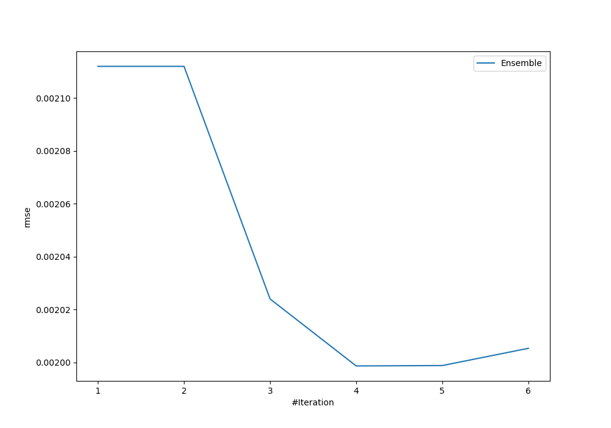

# Summary of Ensemble

[<< Go back](../README.md)

## Ensemble structure
| Model                   |   Weight |
|:------------------------|---------:|
| 5_Default_NeuralNetwork |        1 |
| 6_Default_RandomForest  |        3 |

### Metric details:
| Metric   |       Score |
|:---------|------------:|
| MAE      | 0.000886598 |
| MSE      | 3.99448e-06 |
| RMSE     | 0.00199862  |
| R2       | 0.827476    |
| MAPE     | 3.50586e+10 |

## Learning curves

## True vs Predicted

## Predicted vs Residuals

[<< Go back](../README.md)
