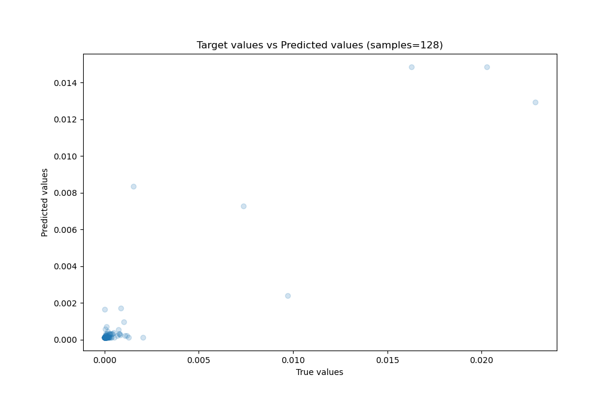

# Summary of Ensemble

[<< Go back](../README.md)

## Ensemble structure
| Model                  |   Weight |
|:-----------------------|---------:|
| 2_DecisionTree         |        1 |
| 6_Default_RandomForest |        4 |

### Metric details:
| Metric   |       Score |
|:---------|------------:|
| MAE      | 0.000410402 |
| MSE      | 1.89151e-06 |
| RMSE     | 0.00137532  |
| R2       | 0.811707    |
| MAPE     | 1.82568e+11 |

## Learning curves

## True vs Predicted

## Predicted vs Residuals

[<< Go back](../README.md)
