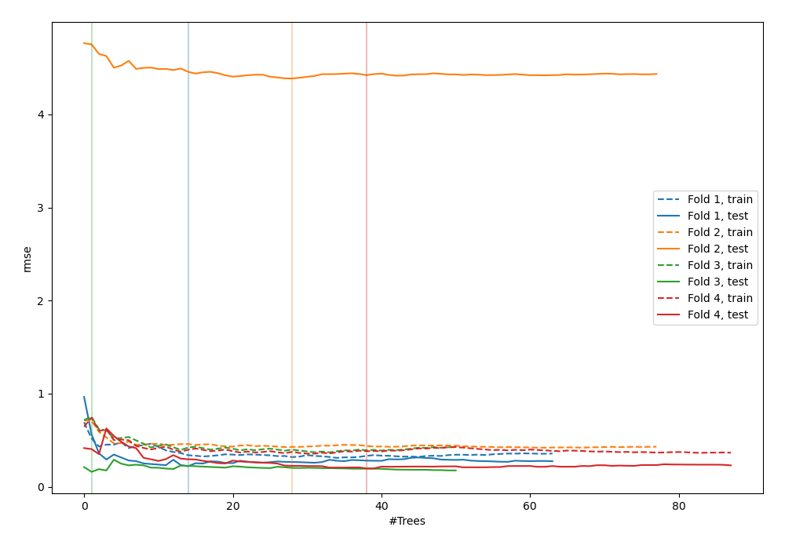
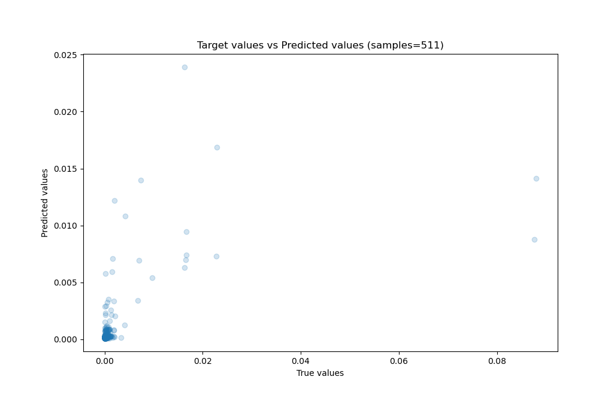
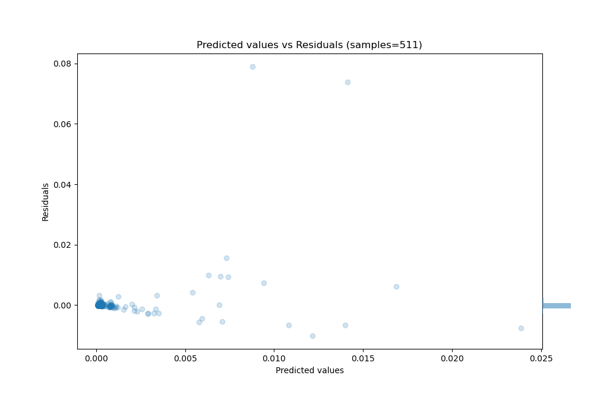

# Summary of 12_RandomForest

[<< Go back](../README.md)

## Random Forest
- **n_jobs**: -1
- **criterion**: squared_error
- **max_features**: 0.5
- **min_samples_split**: 20
- **max_depth**: 4
- **eval_metric_name**: rmse
- **explain_level**: 0

## Validation
 - **validation_type**: kfold
 - **k_folds**: 4
 - **shuffle**: False

## Optimized metric
rmse

## Training time

5.7 seconds

### Metric details:
| Metric   |       Score |
|:---------|------------:|
| MAE      | 0.000737278 |
| MSE      | 2.49352e-05 |
| RMSE     | 0.00499352  |
| R2       | 0.284518    |
| MAPE     | 1.98116e+11 |

## Learning curves

## True vs Predicted

## Predicted vs Residuals

[<< Go back](../README.md)
