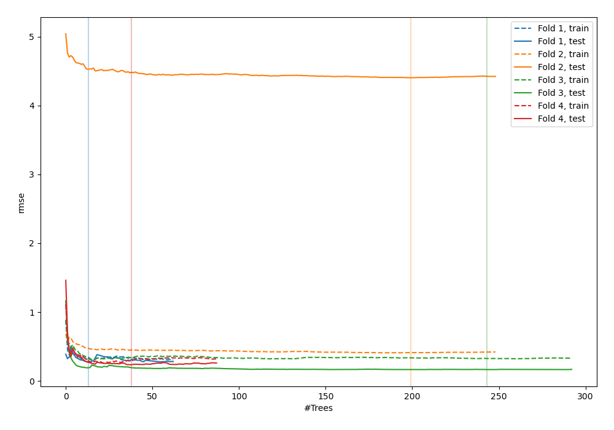
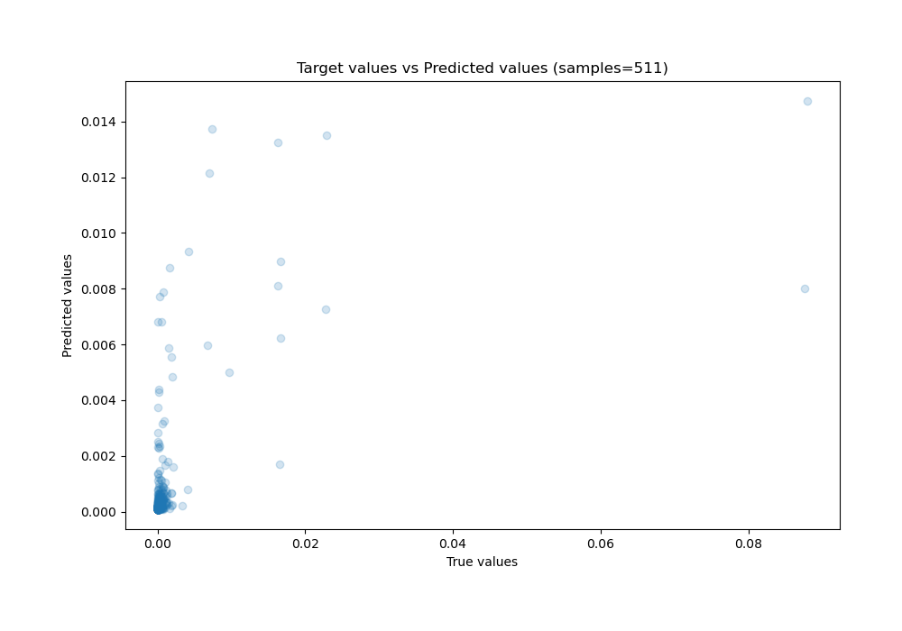
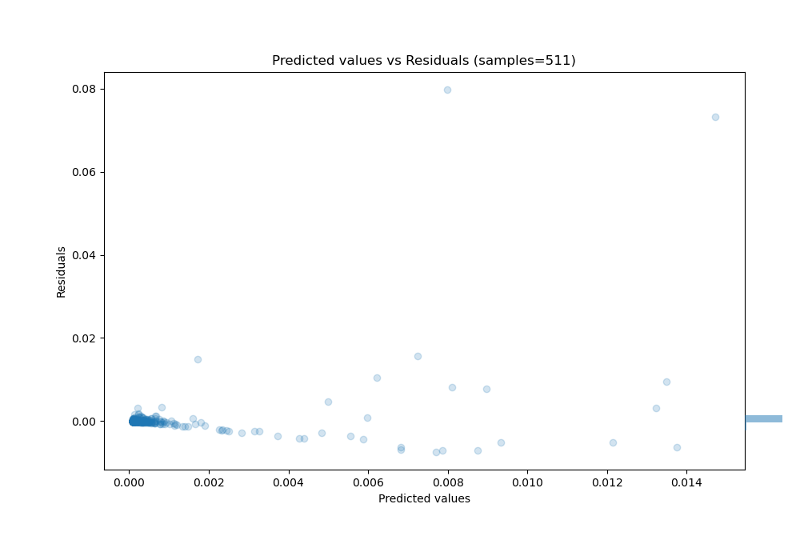

# Summary of 14_RandomForest

[<< Go back](../README.md)

## Random Forest
- **n_jobs**: -1
- **criterion**: squared_error
- **max_features**: 1.0
- **min_samples_split**: 40
- **max_depth**: 6
- **eval_metric_name**: rmse
- **explain_level**: 0

## Validation
 - **validation_type**: kfold
 - **k_folds**: 4
 - **shuffle**: False

## Optimized metric
rmse

## Training time

10.1 seconds

### Metric details:
| Metric   |       Score |
|:---------|------------:|
| MAE      | 0.000805312 |
| MSE      | 2.55676e-05 |
| RMSE     | 0.00505644  |
| R2       | 0.266373    |
| MAPE     | 2.42231e+11 |

## Learning curves

## True vs Predicted

## Predicted vs Residuals

[<< Go back](../README.md)
