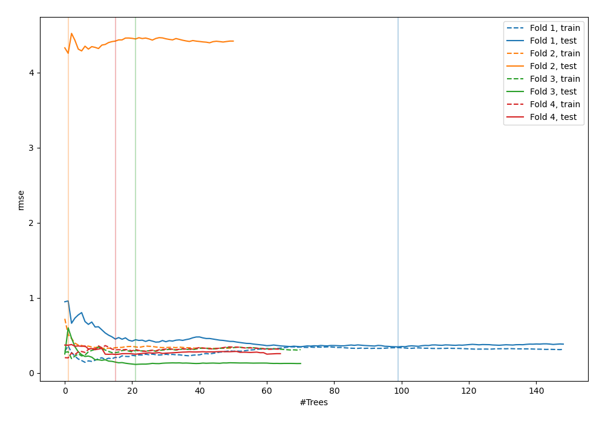
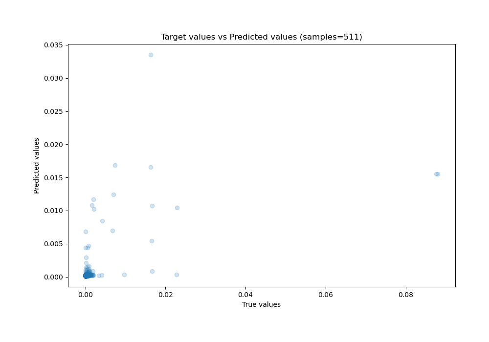
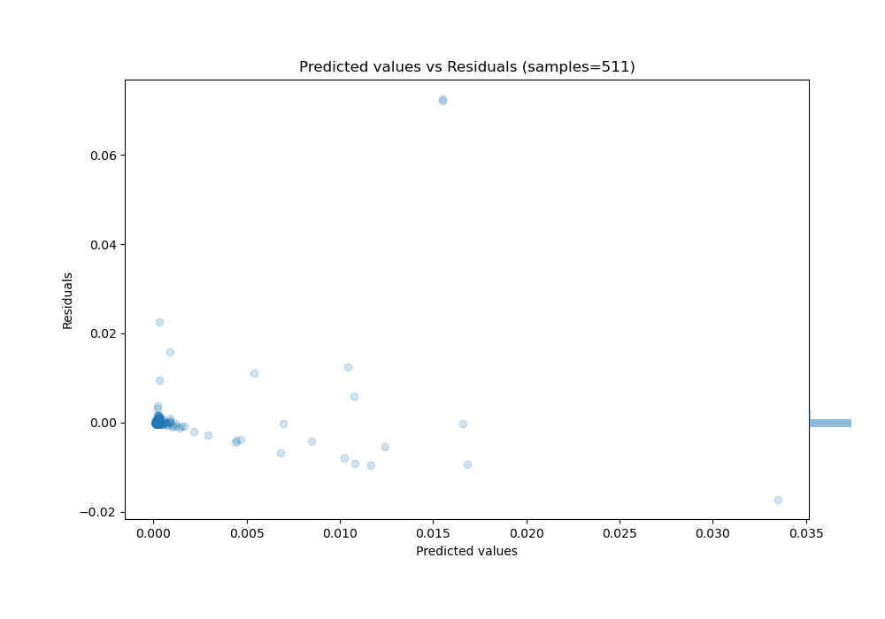

# Summary of 20_RandomForest_GoldenFeatures_Stacked

[<< Go back](../README.md)

## Random Forest
- **n_jobs**: -1
- **criterion**: squared_error
- **max_features**: 0.6
- **min_samples_split**: 50
- **max_depth**: 3
- **eval_metric_name**: rmse
- **explain_level**: 0

## Validation
 - **validation_type**: kfold
 - **k_folds**: 4
 - **shuffle**: False

## Optimized metric
rmse

## Training time

8.6 seconds

### Metric details:
| Metric   |       Score |
|:---------|------------:|
| MAE      | 0.000813623 |
| MSE      | 2.44091e-05 |
| RMSE     | 0.00494056  |
| R2       | 0.299616    |
| MAPE     | 2.31188e+11 |

## Learning curves

## True vs Predicted

## Predicted vs Residuals

[<< Go back](../README.md)
