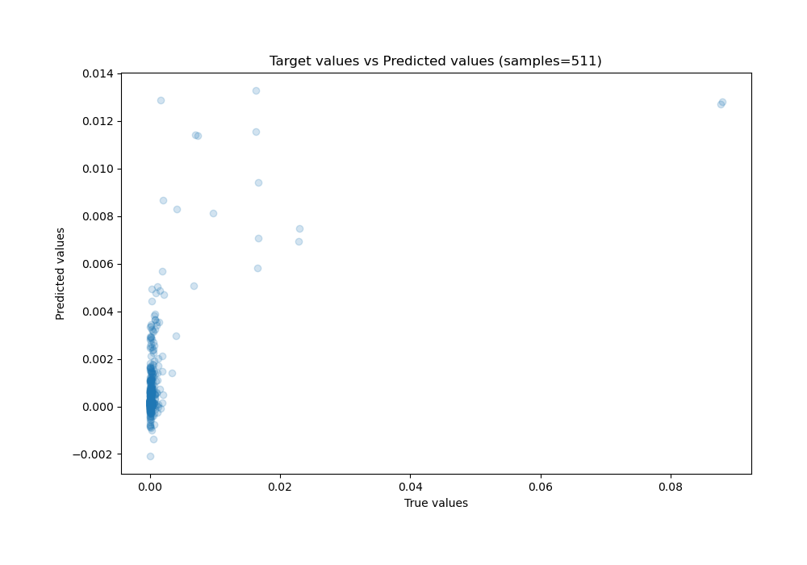
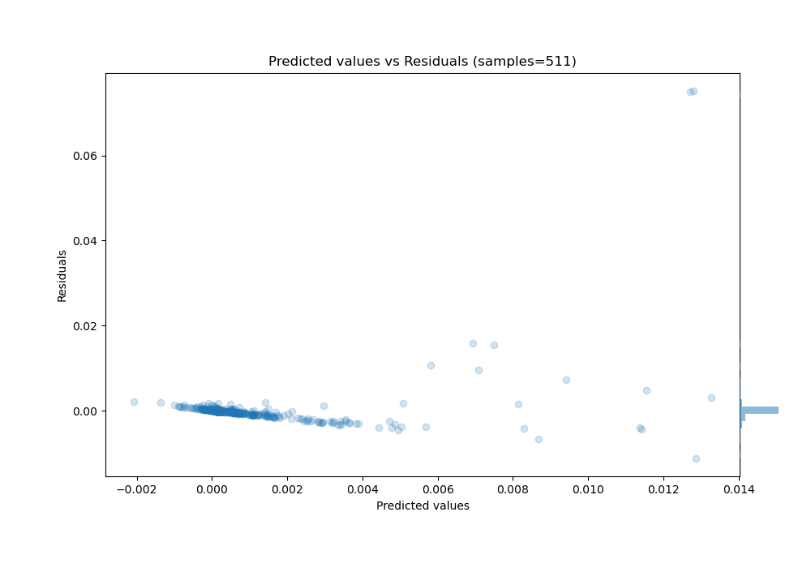

# Summary of 24_Xgboost_GoldenFeatures

[<< Go back](../README.md)

## Extreme Gradient Boosting (Xgboost)
- **n_jobs**: -1
- **objective**: reg:squarederror
- **eta**: 0.075
- **max_depth**: 7
- **min_child_weight**: 25
- **subsample**: 0.9
- **colsample_bytree**: 0.6
- **eval_metric**: rmse
- **explain_level**: 0

## Validation
 - **validation_type**: kfold
 - **k_folds**: 4
 - **shuffle**: False

## Optimized metric
rmse

## Training time

4.6 seconds

### Metric details:
| Metric   |       Score |
|:---------|------------:|
| MAE      | 0.00100811  |
| MSE      | 2.48775e-05 |
| RMSE     | 0.00498774  |
| R2       | 0.286174    |
| MAPE     | 2.77649e+11 |

## Learning curves

## True vs Predicted

## Predicted vs Residuals

[<< Go back](../README.md)
