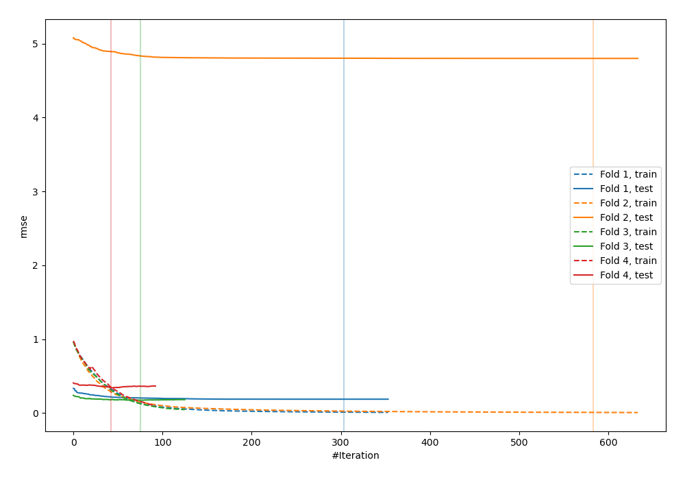
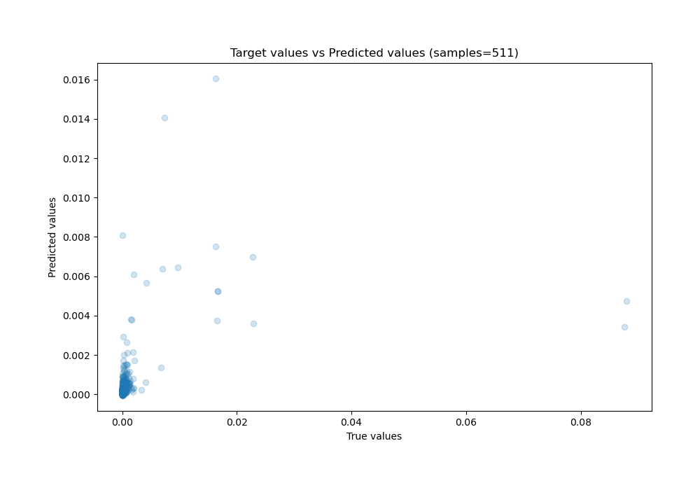
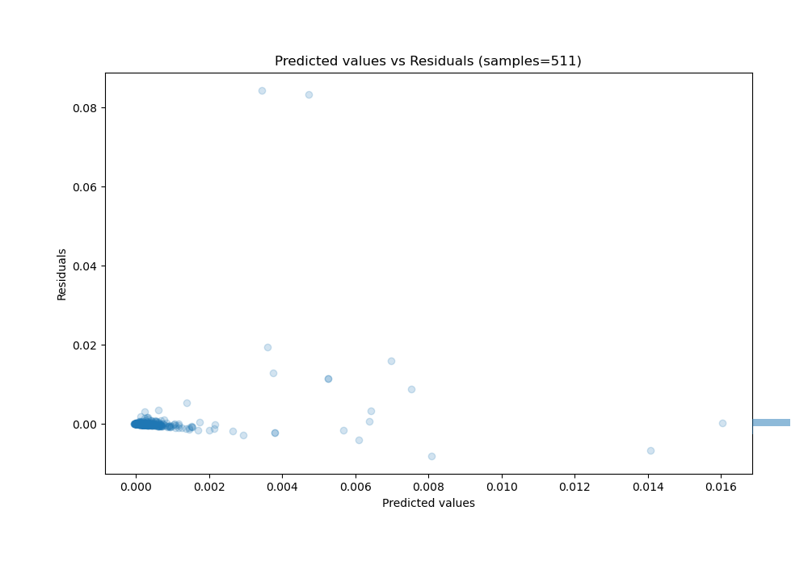

# Summary of 2_Default_CatBoost

[<< Go back](../README.md)

## CatBoost
- **n_jobs**: -1
- **learning_rate**: 0.1
- **depth**: 6
- **rsm**: 1
- **loss_function**: RMSE
- **eval_metric**: RMSE
- **explain_level**: 0

## Validation
 - **validation_type**: kfold
 - **k_folds**: 4
 - **shuffle**: False

## Optimized metric
rmse

## Training time

5.3 seconds

### Metric details:
| Metric   |       Score |
|:---------|------------:|
| MAE      | 0.000760199 |
| MSE      | 3.01673e-05 |
| RMSE     | 0.00549248  |
| R2       | 0.134392    |
| MAPE     | 1.11574e+11 |

## Learning curves

## True vs Predicted

## Predicted vs Residuals

[<< Go back](../README.md)
