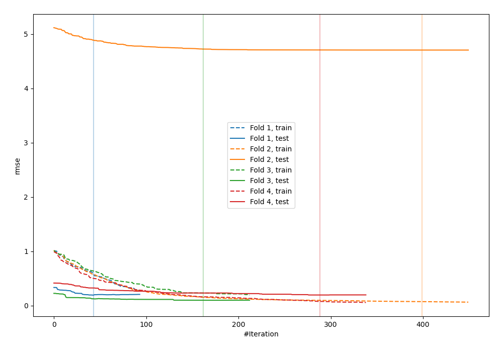
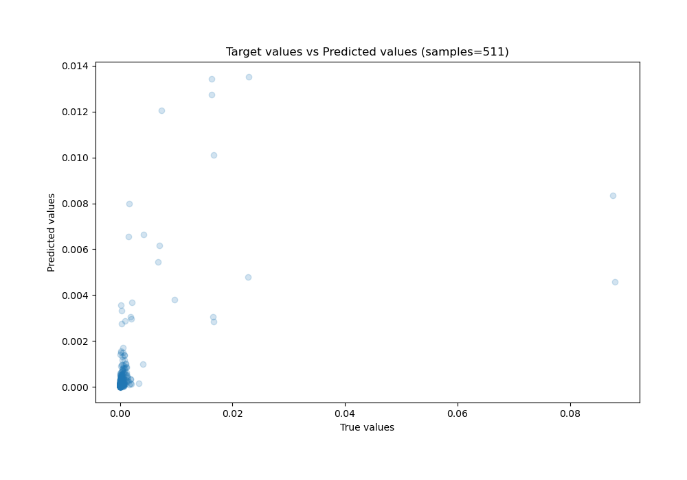
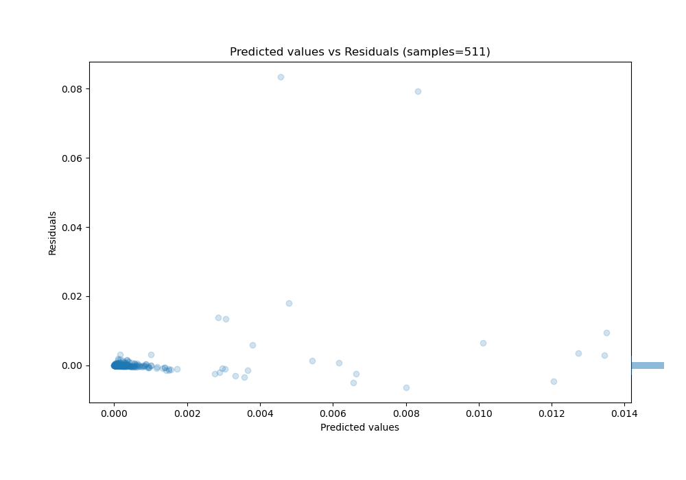

# Summary of 39_CatBoost_Stacked

[<< Go back](../README.md)

## CatBoost
- **n_jobs**: -1
- **learning_rate**: 0.05
- **depth**: 7
- **rsm**: 1.0
- **loss_function**: MAE
- **eval_metric**: RMSE
- **explain_level**: 0

## Validation
 - **validation_type**: kfold
 - **k_folds**: 4
 - **shuffle**: False

## Optimized metric
rmse

## Training time

7.9 seconds

### Metric details:
| Metric   |       Score |
|:---------|------------:|
| MAE      | 0.000687237 |
| MSE      | 2.80403e-05 |
| RMSE     | 0.00529531  |
| R2       | 0.195423    |
| MAPE     | 5.8379e+10  |

## Learning curves

## True vs Predicted

## Predicted vs Residuals

[<< Go back](../README.md)
