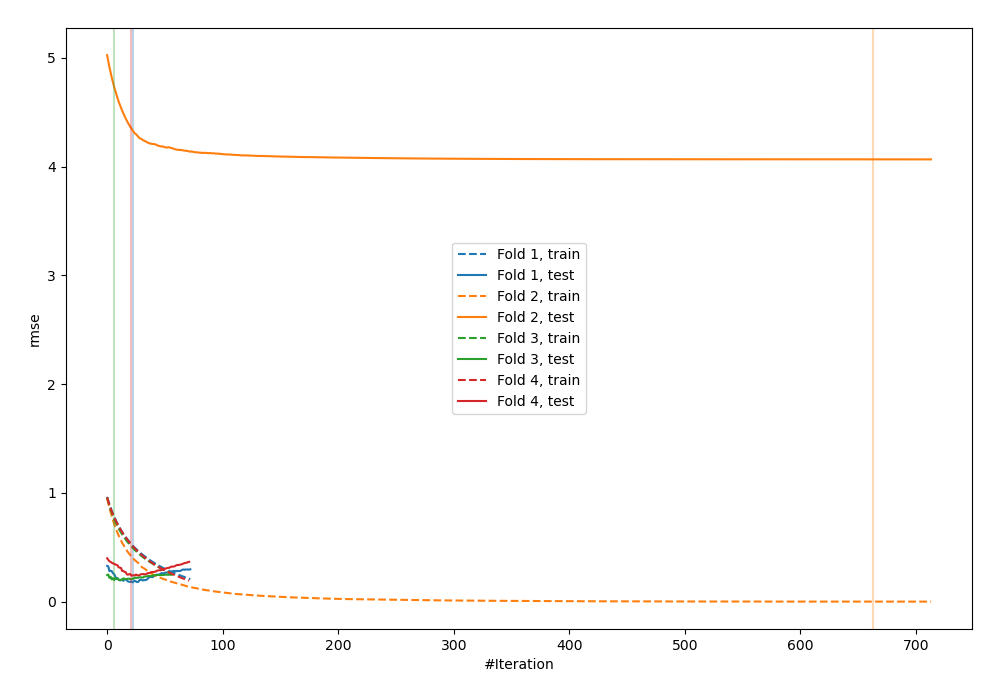
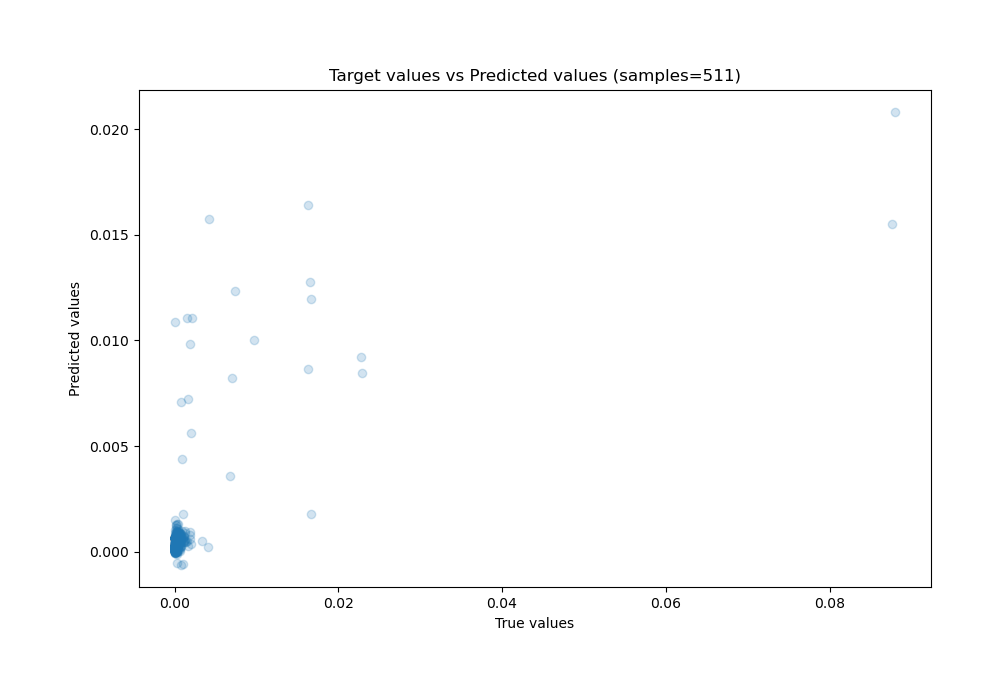
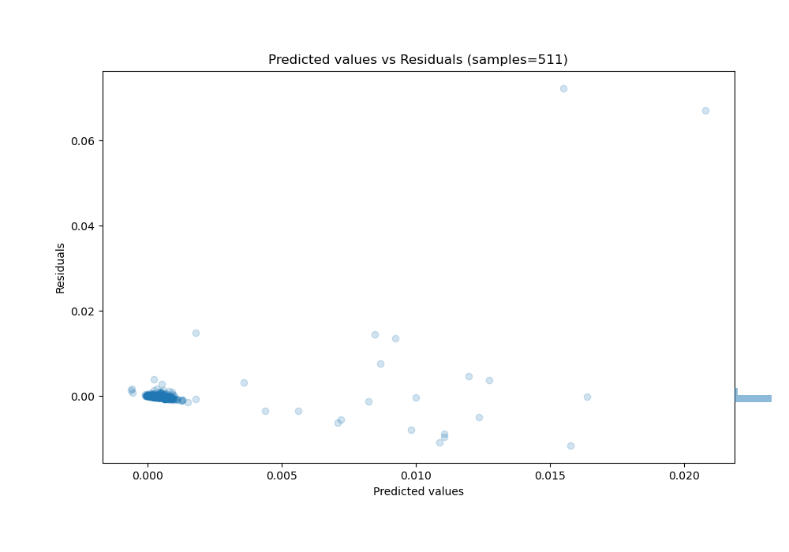

# Summary of 4_Xgboost_GoldenFeatures

[<< Go back](../README.md)

## Extreme Gradient Boosting (Xgboost)
- **n_jobs**: -1
- **objective**: reg:squarederror
- **eta**: 0.075
- **max_depth**: 8
- **min_child_weight**: 5
- **subsample**: 1.0
- **colsample_bytree**: 1.0
- **eval_metric**: rmse
- **explain_level**: 0

## Validation
 - **validation_type**: kfold
 - **k_folds**: 4
 - **shuffle**: False

## Optimized metric
rmse

## Training time

4.6 seconds

### Metric details:
| Metric   |       Score |
|:---------|------------:|
| MAE      | 0.000860002 |
| MSE      | 2.18268e-05 |
| RMSE     | 0.00467192  |
| R2       | 0.373711    |
| MAPE     | 2.82742e+11 |

## Learning curves

## True vs Predicted

## Predicted vs Residuals

[<< Go back](../README.md)
