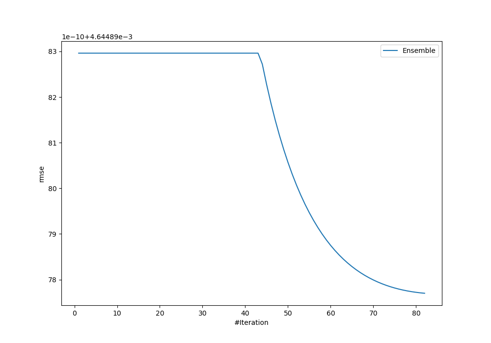
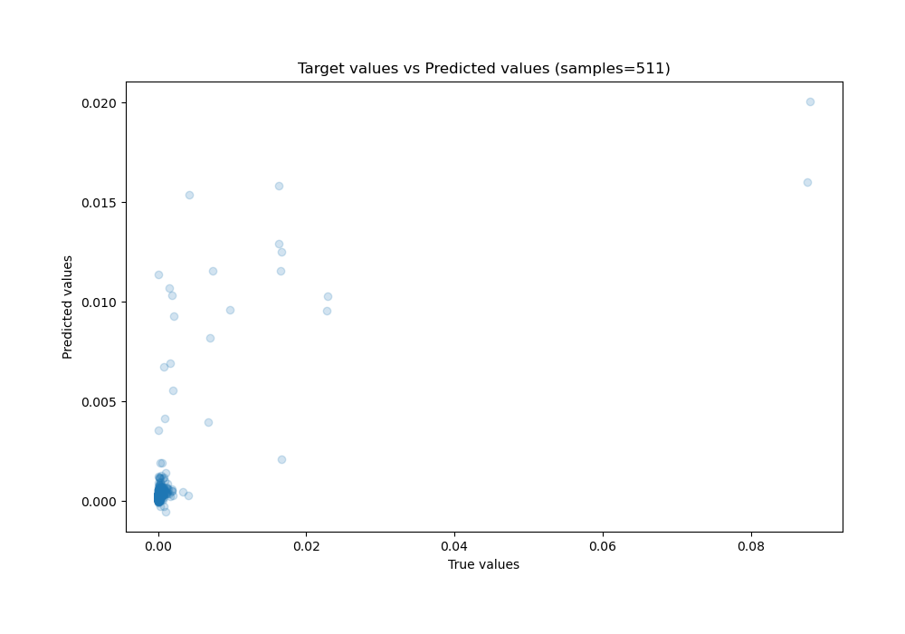
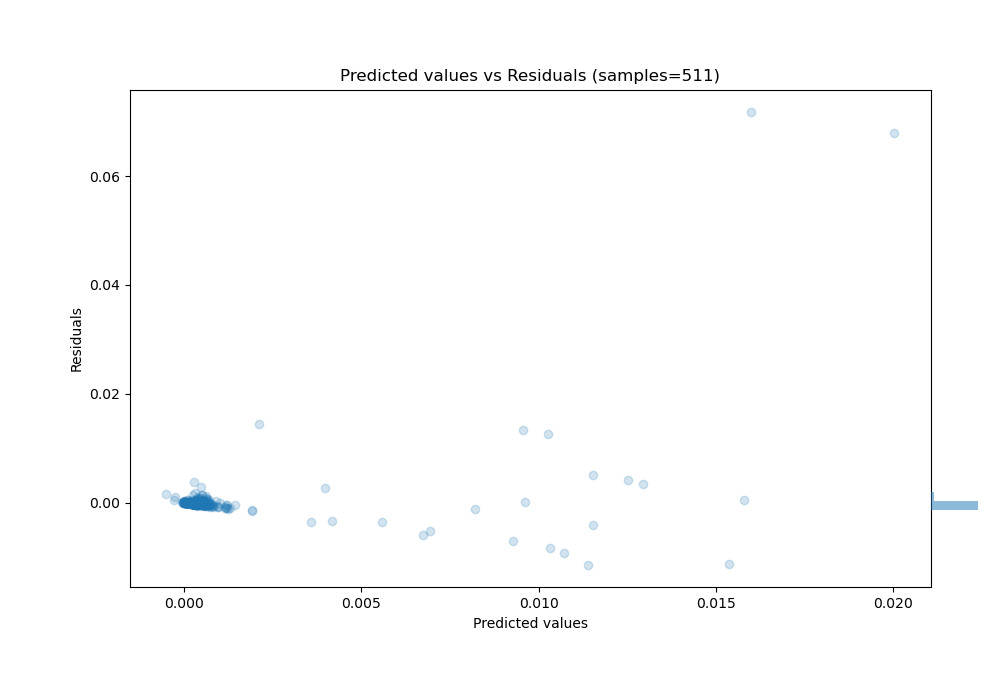

# Summary of Ensemble_Stacked

[<< Go back](../README.md)

## Ensemble structure
| Model                     |   Weight |
|:--------------------------|---------:|
| 40_Xgboost_GoldenFeatures |        1 |
| Ensemble                  |       81 |

### Metric details:
| Metric   |       Score |
|:---------|------------:|
| MAE      | 0.000798438 |
| MSE      | 2.15751e-05 |
| RMSE     | 0.0046449   |
| R2       | 0.380934    |
| MAPE     | 2.65252e+11 |

## Learning curves

## True vs Predicted

## Predicted vs Residuals

[<< Go back](../README.md)
