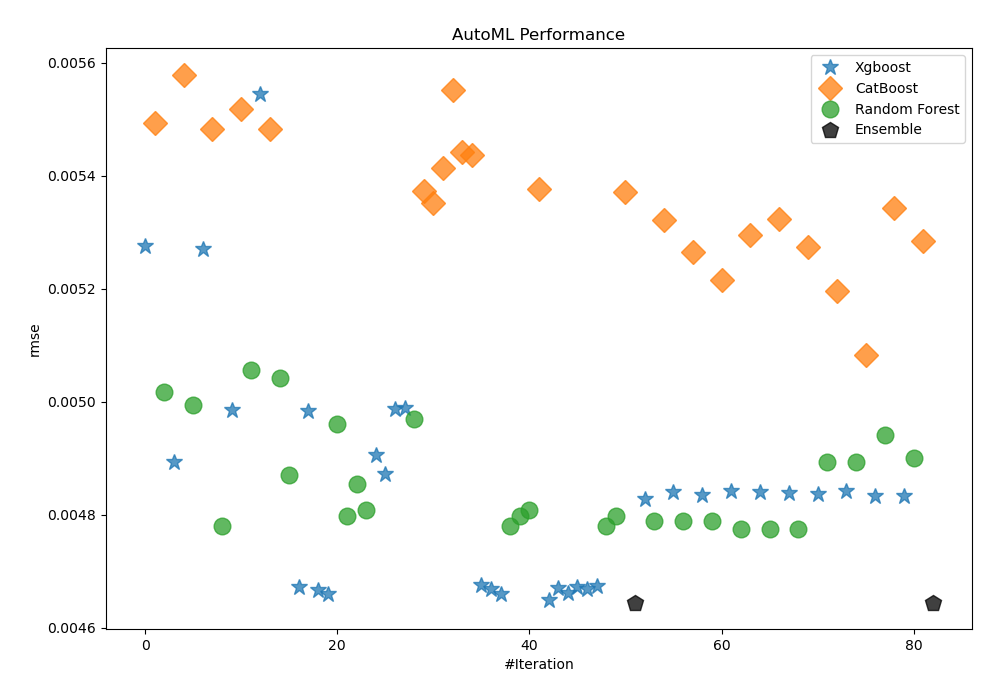
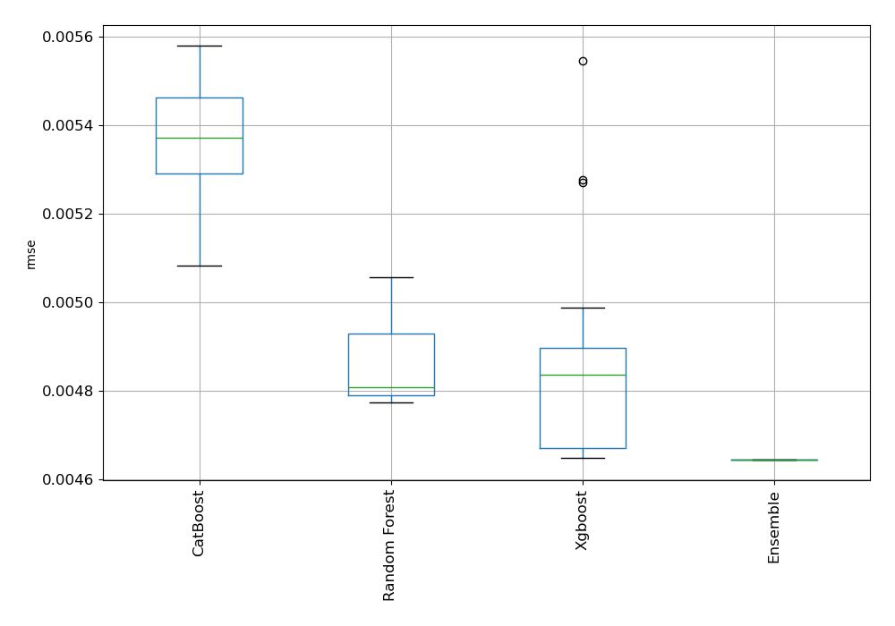
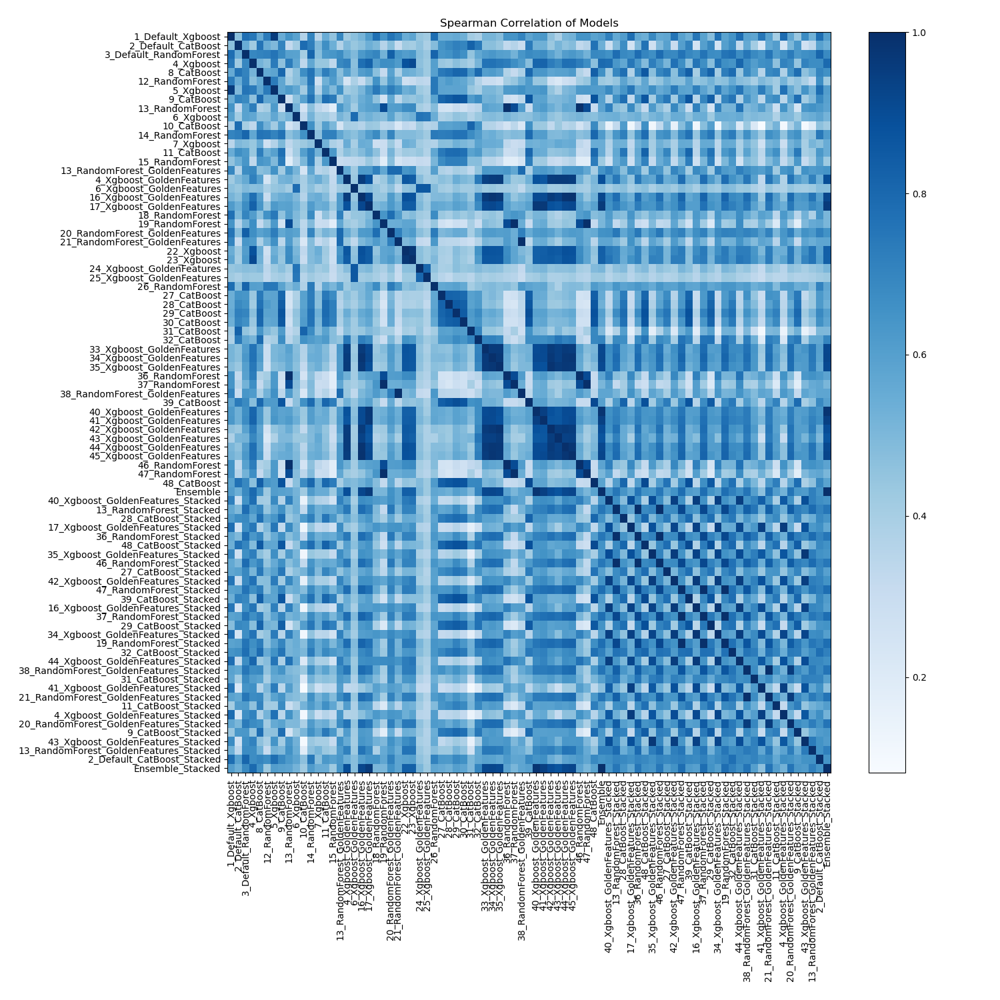

# AutoML Leaderboard

| Best model   | name                                                                                       | model_type    | metric_type   |   metric_value |   train_time |
|:-------------|:-------------------------------------------------------------------------------------------|:--------------|:--------------|---------------:|-------------:|
|              | [1_Default_Xgboost](1_Default_Xgboost/README.md)                                           | Xgboost       | rmse          |     0.00527569 |         5.07 |
|              | [2_Default_CatBoost](2_Default_CatBoost/README.md)                                         | CatBoost      | rmse          |     0.00549248 |         5.47 |
|              | [3_Default_RandomForest](3_Default_RandomForest/README.md)                                 | Random Forest | rmse          |     0.00501677 |         7.03 |
|              | [4_Xgboost](4_Xgboost/README.md)                                                           | Xgboost       | rmse          |     0.00489382 |         4.39 |
|              | [8_CatBoost](8_CatBoost/README.md)                                                         | CatBoost      | rmse          |     0.00557908 |        14.27 |
|              | [12_RandomForest](12_RandomForest/README.md)                                               | Random Forest | rmse          |     0.00499352 |         5.89 |
|              | [5_Xgboost](5_Xgboost/README.md)                                                           | Xgboost       | rmse          |     0.00527097 |         4.16 |
|              | [9_CatBoost](9_CatBoost/README.md)                                                         | CatBoost      | rmse          |     0.00548319 |         5.96 |
|              | [13_RandomForest](13_RandomForest/README.md)                                               | Random Forest | rmse          |     0.00478038 |         9.06 |
|              | [6_Xgboost](6_Xgboost/README.md)                                                           | Xgboost       | rmse          |     0.00498566 |         9.42 |
|              | [10_CatBoost](10_CatBoost/README.md)                                                       | CatBoost      | rmse          |     0.00551788 |         7.78 |
|              | [14_RandomForest](14_RandomForest/README.md)                                               | Random Forest | rmse          |     0.00505644 |        10.2  |
|              | [7_Xgboost](7_Xgboost/README.md)                                                           | Xgboost       | rmse          |     0.00554487 |         4.09 |
|              | [11_CatBoost](11_CatBoost/README.md)                                                       | CatBoost      | rmse          |     0.00548314 |         5.32 |
|              | [15_RandomForest](15_RandomForest/README.md)                                               | Random Forest | rmse          |     0.00504161 |         6.24 |
|              | [13_RandomForest_GoldenFeatures](13_RandomForest_GoldenFeatures/README.md)                 | Random Forest | rmse          |     0.00487028 |        29.64 |
|              | [4_Xgboost_GoldenFeatures](4_Xgboost_GoldenFeatures/README.md)                             | Xgboost       | rmse          |     0.00467192 |         4.77 |
|              | [6_Xgboost_GoldenFeatures](6_Xgboost_GoldenFeatures/README.md)                             | Xgboost       | rmse          |     0.004983   |         4.8  |
|              | [16_Xgboost_GoldenFeatures](16_Xgboost_GoldenFeatures/README.md)                           | Xgboost       | rmse          |     0.00466623 |         4.94 |
|              | [17_Xgboost_GoldenFeatures](17_Xgboost_GoldenFeatures/README.md)                           | Xgboost       | rmse          |     0.00465953 |         4.79 |
|              | [18_RandomForest](18_RandomForest/README.md)                                               | Random Forest | rmse          |     0.00496068 |         9.23 |
|              | [19_RandomForest](19_RandomForest/README.md)                                               | Random Forest | rmse          |     0.00479742 |         8.77 |
|              | [20_RandomForest_GoldenFeatures](20_RandomForest_GoldenFeatures/README.md)                 | Random Forest | rmse          |     0.00485433 |         7.75 |
|              | [21_RandomForest_GoldenFeatures](21_RandomForest_GoldenFeatures/README.md)                 | Random Forest | rmse          |     0.00480914 |         6.84 |
|              | [22_Xgboost](22_Xgboost/README.md)                                                         | Xgboost       | rmse          |     0.00490545 |         5.09 |
|              | [23_Xgboost](23_Xgboost/README.md)                                                         | Xgboost       | rmse          |     0.00487221 |         4.47 |
|              | [24_Xgboost_GoldenFeatures](24_Xgboost_GoldenFeatures/README.md)                           | Xgboost       | rmse          |     0.00498774 |         4.72 |
|              | [25_Xgboost_GoldenFeatures](25_Xgboost_GoldenFeatures/README.md)                           | Xgboost       | rmse          |     0.00498841 |         4.41 |
|              | [26_RandomForest](26_RandomForest/README.md)                                               | Random Forest | rmse          |     0.0049702  |         6.34 |
|              | [27_CatBoost](27_CatBoost/README.md)                                                       | CatBoost      | rmse          |     0.00537314 |         5.13 |
|              | [28_CatBoost](28_CatBoost/README.md)                                                       | CatBoost      | rmse          |     0.00535146 |         7.1  |
|              | [29_CatBoost](29_CatBoost/README.md)                                                       | CatBoost      | rmse          |     0.00541364 |         6.13 |
|              | [30_CatBoost](30_CatBoost/README.md)                                                       | CatBoost      | rmse          |     0.00555122 |         7.31 |
|              | [31_CatBoost](31_CatBoost/README.md)                                                       | CatBoost      | rmse          |     0.00544124 |         5.51 |
|              | [32_CatBoost](32_CatBoost/README.md)                                                       | CatBoost      | rmse          |     0.00543656 |         6.34 |
|              | [33_Xgboost_GoldenFeatures](33_Xgboost_GoldenFeatures/README.md)                           | Xgboost       | rmse          |     0.00467601 |         5.08 |
|              | [34_Xgboost_GoldenFeatures](34_Xgboost_GoldenFeatures/README.md)                           | Xgboost       | rmse          |     0.00466853 |         5.97 |
|              | [35_Xgboost_GoldenFeatures](35_Xgboost_GoldenFeatures/README.md)                           | Xgboost       | rmse          |     0.00466034 |         5.43 |
|              | [36_RandomForest](36_RandomForest/README.md)                                               | Random Forest | rmse          |     0.00478038 |         9.49 |
|              | [37_RandomForest](37_RandomForest/README.md)                                               | Random Forest | rmse          |     0.00479741 |         9.19 |
|              | [38_RandomForest_GoldenFeatures](38_RandomForest_GoldenFeatures/README.md)                 | Random Forest | rmse          |     0.00480914 |         6.98 |
|              | [39_CatBoost](39_CatBoost/README.md)                                                       | CatBoost      | rmse          |     0.00537715 |         7.74 |
|              | [40_Xgboost_GoldenFeatures](40_Xgboost_GoldenFeatures/README.md)                           | Xgboost       | rmse          |     0.0046488  |         5.17 |
|              | [41_Xgboost_GoldenFeatures](41_Xgboost_GoldenFeatures/README.md)                           | Xgboost       | rmse          |     0.00467087 |         5.52 |
|              | [42_Xgboost_GoldenFeatures](42_Xgboost_GoldenFeatures/README.md)                           | Xgboost       | rmse          |     0.00466114 |         5.82 |
|              | [43_Xgboost_GoldenFeatures](43_Xgboost_GoldenFeatures/README.md)                           | Xgboost       | rmse          |     0.0046726  |         5.23 |
|              | [44_Xgboost_GoldenFeatures](44_Xgboost_GoldenFeatures/README.md)                           | Xgboost       | rmse          |     0.00466965 |         5.25 |
|              | [45_Xgboost_GoldenFeatures](45_Xgboost_GoldenFeatures/README.md)                           | Xgboost       | rmse          |     0.00467374 |         6.29 |
|              | [46_RandomForest](46_RandomForest/README.md)                                               | Random Forest | rmse          |     0.00478038 |         9.62 |
|              | [47_RandomForest](47_RandomForest/README.md)                                               | Random Forest | rmse          |     0.00479741 |         9.08 |
|              | [48_CatBoost](48_CatBoost/README.md)                                                       | CatBoost      | rmse          |     0.00537104 |         8.73 |
|              | [Ensemble](Ensemble/README.md)                                                             | Ensemble      | rmse          |     0.0046449  |         1.34 |
|              | [40_Xgboost_GoldenFeatures_Stacked](40_Xgboost_GoldenFeatures_Stacked/README.md)           | Xgboost       | rmse          |     0.00482818 |         5.09 |
|              | [13_RandomForest_Stacked](13_RandomForest_Stacked/README.md)                               | Random Forest | rmse          |     0.00478949 |         9.12 |
|              | [28_CatBoost_Stacked](28_CatBoost_Stacked/README.md)                                       | CatBoost      | rmse          |     0.00532148 |         9.23 |
|              | [17_Xgboost_GoldenFeatures_Stacked](17_Xgboost_GoldenFeatures_Stacked/README.md)           | Xgboost       | rmse          |     0.00484071 |         5.6  |
|              | [36_RandomForest_Stacked](36_RandomForest_Stacked/README.md)                               | Random Forest | rmse          |     0.00478961 |         9.6  |
|              | [48_CatBoost_Stacked](48_CatBoost_Stacked/README.md)                                       | CatBoost      | rmse          |     0.0052652  |         9.84 |
|              | [35_Xgboost_GoldenFeatures_Stacked](35_Xgboost_GoldenFeatures_Stacked/README.md)           | Xgboost       | rmse          |     0.00483436 |         6.07 |
|              | [46_RandomForest_Stacked](46_RandomForest_Stacked/README.md)                               | Random Forest | rmse          |     0.00478959 |         9.71 |
|              | [27_CatBoost_Stacked](27_CatBoost_Stacked/README.md)                                       | CatBoost      | rmse          |     0.00521495 |         5.78 |
|              | [42_Xgboost_GoldenFeatures_Stacked](42_Xgboost_GoldenFeatures_Stacked/README.md)           | Xgboost       | rmse          |     0.00484278 |         5.58 |
|              | [47_RandomForest_Stacked](47_RandomForest_Stacked/README.md)                               | Random Forest | rmse          |     0.00477419 |         9.24 |
|              | [39_CatBoost_Stacked](39_CatBoost_Stacked/README.md)                                       | CatBoost      | rmse          |     0.00529531 |         8    |
|              | [16_Xgboost_GoldenFeatures_Stacked](16_Xgboost_GoldenFeatures_Stacked/README.md)           | Xgboost       | rmse          |     0.00484114 |         6.98 |
|              | [37_RandomForest_Stacked](37_RandomForest_Stacked/README.md)                               | Random Forest | rmse          |     0.00477423 |         9.88 |
|              | [29_CatBoost_Stacked](29_CatBoost_Stacked/README.md)                                       | CatBoost      | rmse          |     0.00532338 |         8.54 |
|              | [34_Xgboost_GoldenFeatures_Stacked](34_Xgboost_GoldenFeatures_Stacked/README.md)           | Xgboost       | rmse          |     0.00483955 |         6.48 |
|              | [19_RandomForest_Stacked](19_RandomForest_Stacked/README.md)                               | Random Forest | rmse          |     0.00477424 |         9.54 |
|              | [32_CatBoost_Stacked](32_CatBoost_Stacked/README.md)                                       | CatBoost      | rmse          |     0.00527416 |         7.01 |
|              | [44_Xgboost_GoldenFeatures_Stacked](44_Xgboost_GoldenFeatures_Stacked/README.md)           | Xgboost       | rmse          |     0.00483755 |         6.6  |
|              | [38_RandomForest_GoldenFeatures_Stacked](38_RandomForest_GoldenFeatures_Stacked/README.md) | Random Forest | rmse          |     0.00489417 |        11.13 |
|              | [31_CatBoost_Stacked](31_CatBoost_Stacked/README.md)                                       | CatBoost      | rmse          |     0.00519565 |         7.01 |
|              | [41_Xgboost_GoldenFeatures_Stacked](41_Xgboost_GoldenFeatures_Stacked/README.md)           | Xgboost       | rmse          |     0.00484197 |         7.36 |
|              | [21_RandomForest_GoldenFeatures_Stacked](21_RandomForest_GoldenFeatures_Stacked/README.md) | Random Forest | rmse          |     0.00489417 |        10.16 |
|              | [11_CatBoost_Stacked](11_CatBoost_Stacked/README.md)                                       | CatBoost      | rmse          |     0.00508216 |         6.56 |
|              | [4_Xgboost_GoldenFeatures_Stacked](4_Xgboost_GoldenFeatures_Stacked/README.md)             | Xgboost       | rmse          |     0.0048336  |         6    |
|              | [20_RandomForest_GoldenFeatures_Stacked](20_RandomForest_GoldenFeatures_Stacked/README.md) | Random Forest | rmse          |     0.00494056 |         8.98 |
|              | [9_CatBoost_Stacked](9_CatBoost_Stacked/README.md)                                         | CatBoost      | rmse          |     0.0053429  |        11.92 |
|              | [43_Xgboost_GoldenFeatures_Stacked](43_Xgboost_GoldenFeatures_Stacked/README.md)           | Xgboost       | rmse          |     0.00483309 |         6.23 |
|              | [13_RandomForest_GoldenFeatures_Stacked](13_RandomForest_GoldenFeatures_Stacked/README.md) | Random Forest | rmse          |     0.00490001 |         9.21 |
|              | [2_Default_CatBoost_Stacked](2_Default_CatBoost_Stacked/README.md)                         | CatBoost      | rmse          |     0.00528381 |         5.9  |
| **the best** | [Ensemble_Stacked](Ensemble_Stacked/README.md)                                             | Ensemble      | rmse          |     0.0046449  |         3.37 |

### AutoML Performance

### AutoML Performance Boxplot

### Spearman Correlation of Models

