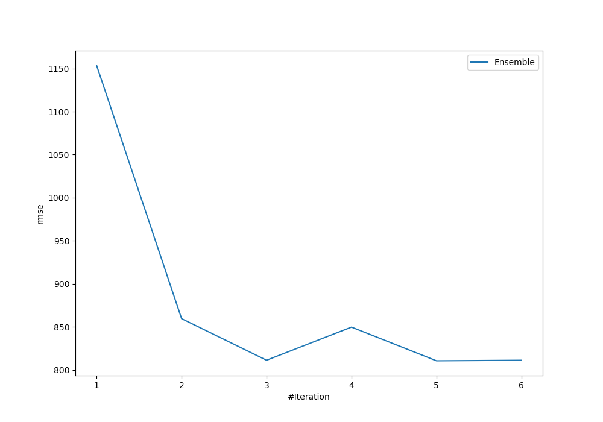
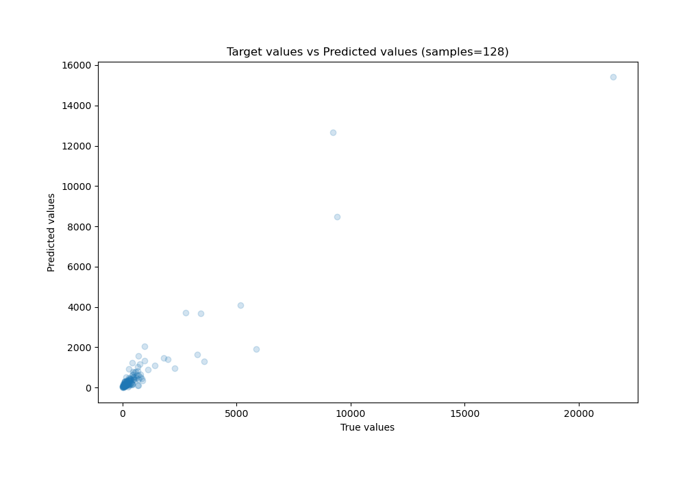
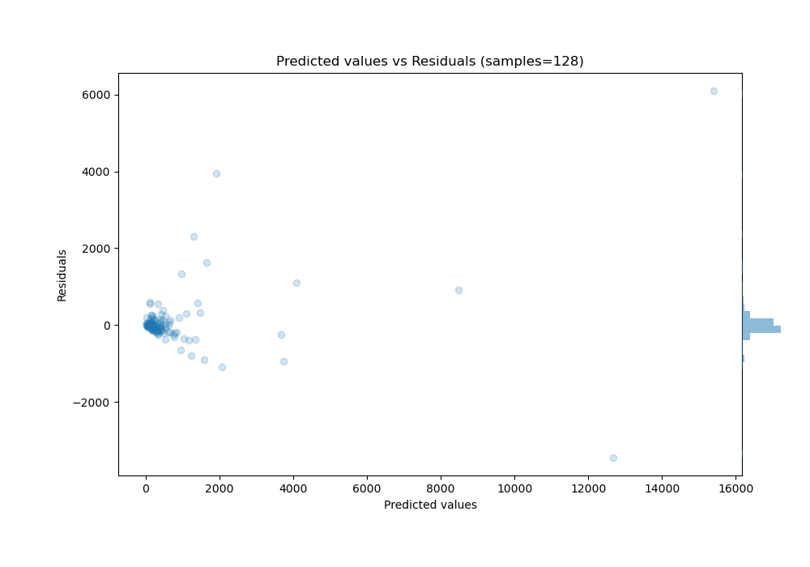

# Summary of Ensemble

[<< Go back](../README.md)

## Ensemble structure
| Model                   |   Weight |
|:------------------------|---------:|
| 4_Default_Xgboost       |        2 |
| 5_Default_NeuralNetwork |        3 |

### Metric details:
| Metric   |           Score |
|:---------|----------------:|
| MAE      |    310.121      |
| MSE      | 657247          |
| RMSE     |    810.708      |
| R2       |      0.877224   |
| MAPE     |      3.2591e+15 |

## Learning curves

## True vs Predicted

## Predicted vs Residuals

[<< Go back](../README.md)
