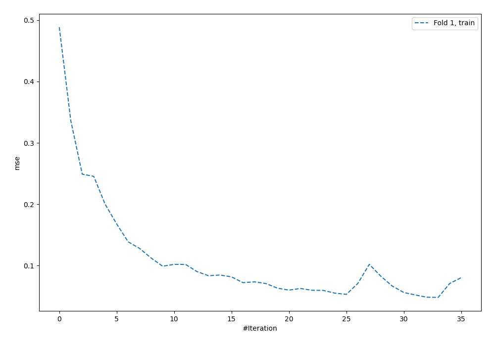
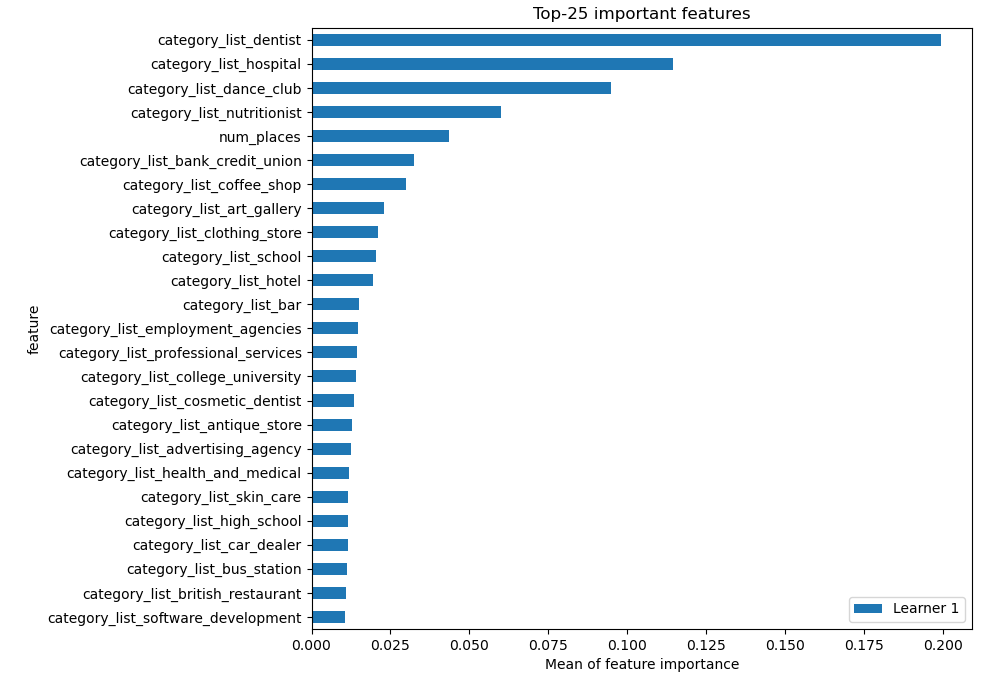
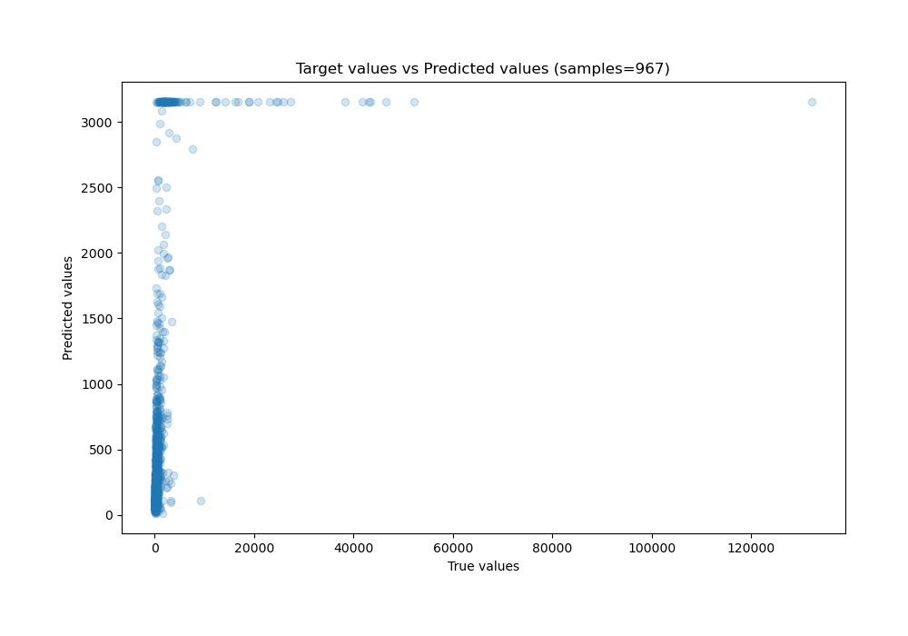
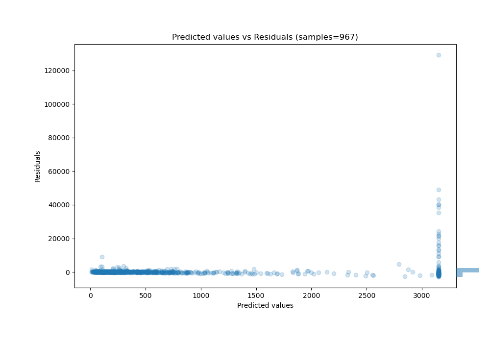

# Summary of 4_Default_NeuralNetwork

[<< Go back](../README.md)

## Neural Network
- **n_jobs**: -1
- **dense_1_size**: 32
- **dense_2_size**: 16
- **learning_rate**: 0.05
- **explain_level**: 2

## Validation
 - **validation_type**: split
 - **train_ratio**: 0.75
 - **shuffle**: True

## Optimized metric
rmse

## Training time

41.9 seconds

### Metric details:
| Metric   |         Score |
|:---------|--------------:|
| MAE      |   2.88377e+06 |
| MSE      |   8.00723e+15 |
| RMSE     |   8.94832e+07 |
| R2       |  -2.25609e+08 |
| MAPE     | 204.276       |

## Learning curves

## Permutation-based Importance

## True vs Predicted

## Predicted vs Residuals

[<< Go back](../README.md)
