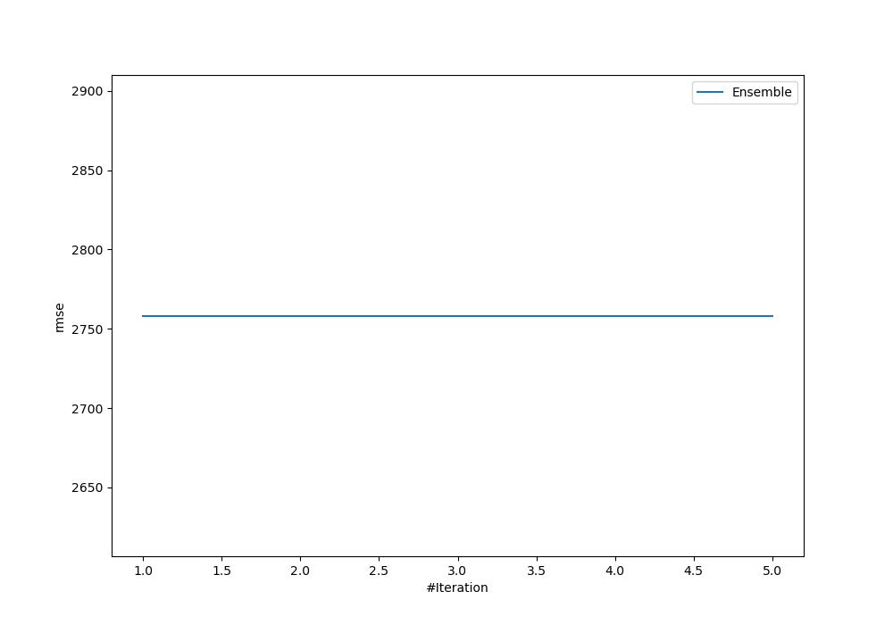
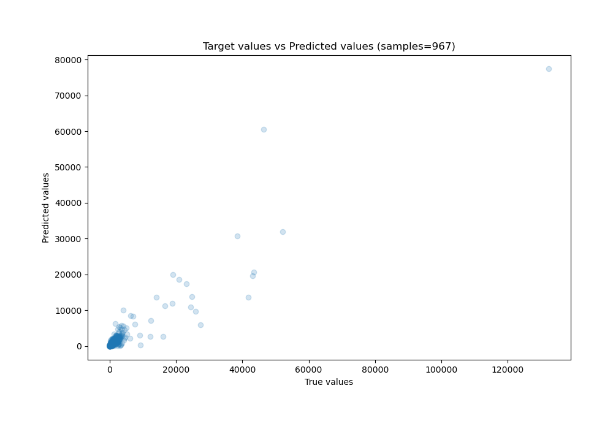
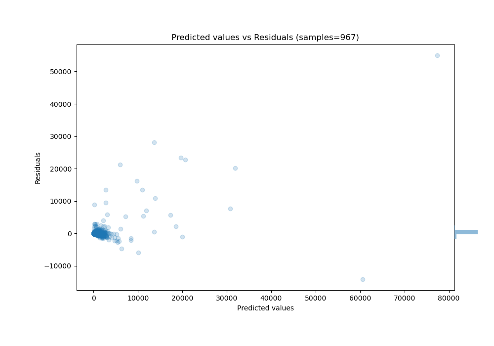

# Summary of Ensemble

[<< Go back](../README.md)

## Ensemble structure
| Model             |   Weight |
|:------------------|---------:|
| 3_Default_Xgboost |        1 |

### Metric details:
| Metric   |          Score |
|:---------|---------------:|
| MAE      |  579.54        |
| MSE      |    1.12537e+07 |
| RMSE     | 3354.65        |
| R2       |    0.68292     |
| MAPE     |    9.34625e+14 |

## Learning curves

## True vs Predicted

## Predicted vs Residuals

[<< Go back](../README.md)
