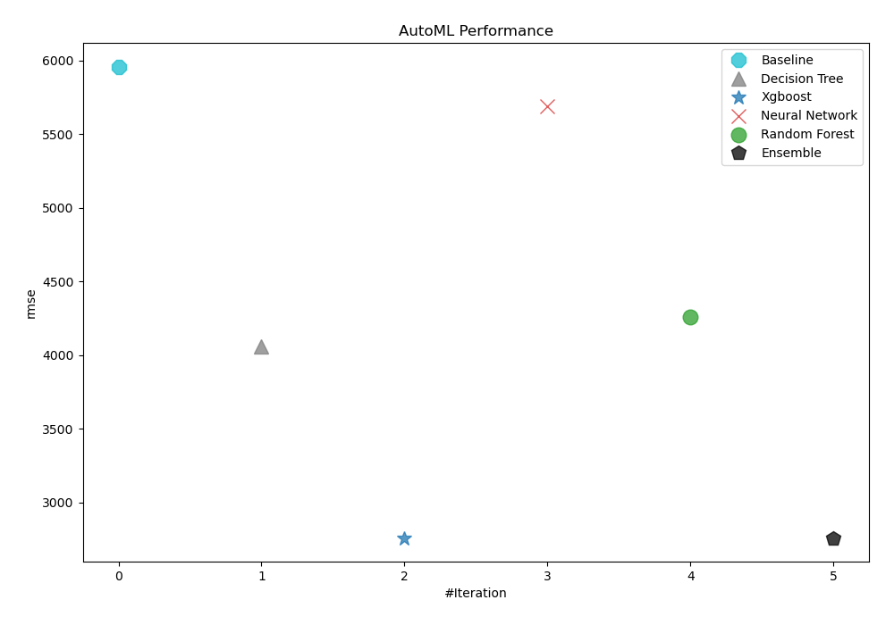
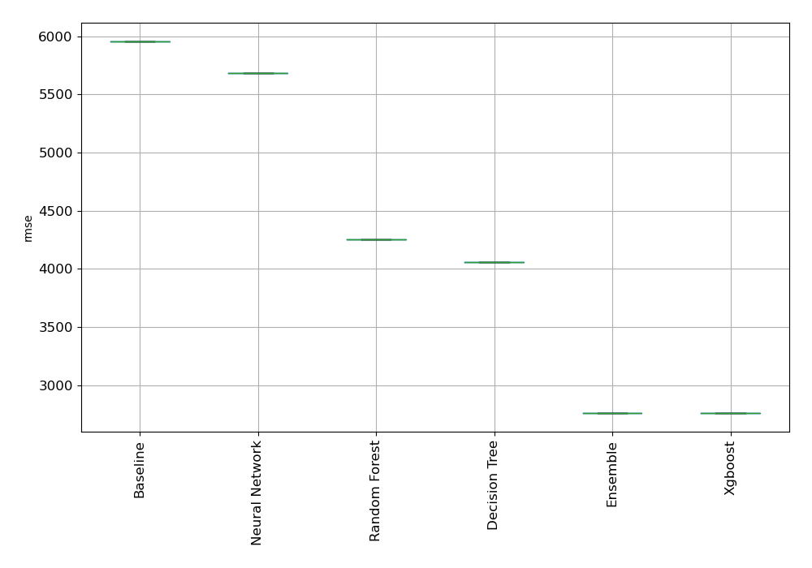
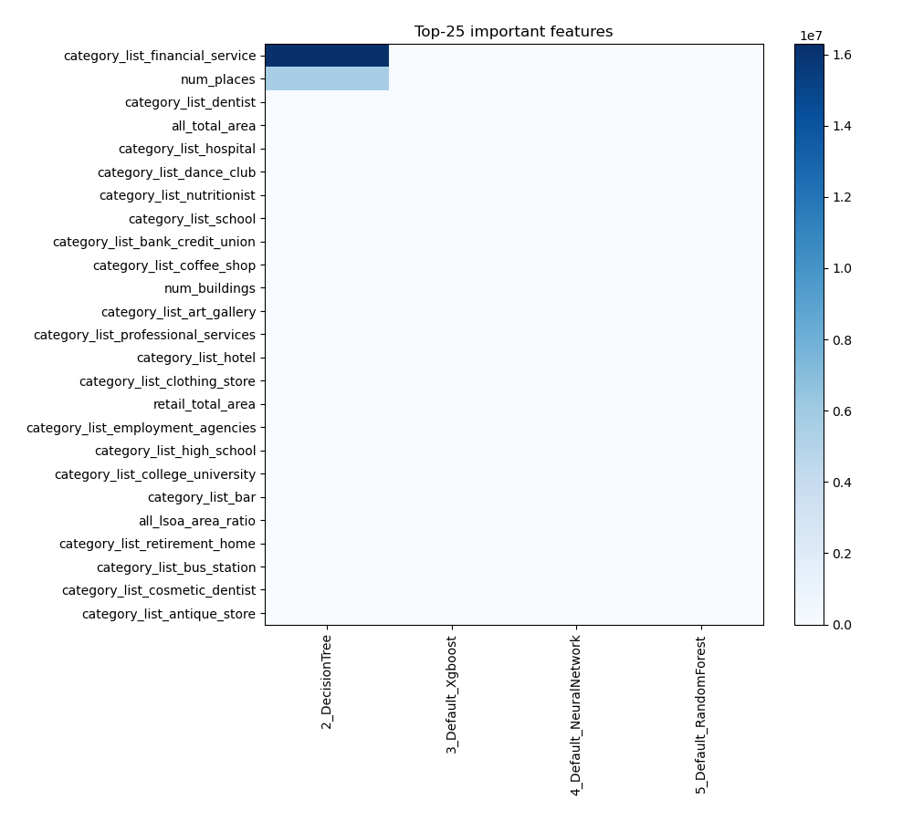
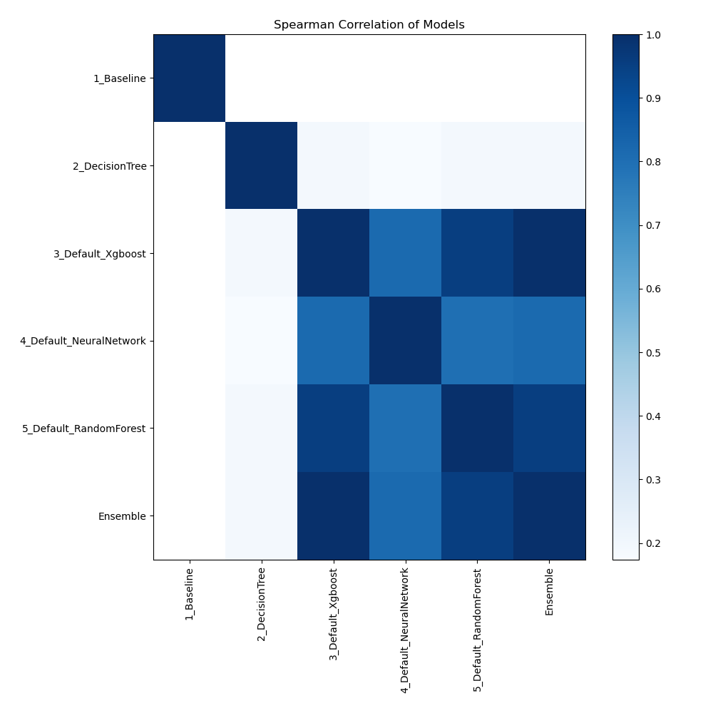

# AutoML Leaderboard

| Best model   | name                                                         | model_type     | metric_type   |    metric_value |   train_time |
|:-------------|:-------------------------------------------------------------|:---------------|:--------------|----------------:|-------------:|
|              | [1_Baseline](1_Baseline/README.md)                           | Baseline       | rmse          |  5958.18        |         0.73 |
|              | [2_DecisionTree](2_DecisionTree/README.md)                   | Decision Tree  | rmse          | 12594.5         |        68.85 |
| **the best** | [3_Default_Xgboost](3_Default_Xgboost/README.md)             | Xgboost        | rmse          |  3354.65        |        92.78 |
|              | [4_Default_NeuralNetwork](4_Default_NeuralNetwork/README.md) | Neural Network | rmse          |     8.94832e+07 |        42.11 |
|              | [5_Default_RandomForest](5_Default_RandomForest/README.md)   | Random Forest  | rmse          |  4216.07        |        90.56 |
|              | [Ensemble](Ensemble/README.md)                               | Ensemble       | rmse          |  3354.65        |         0.07 |

### AutoML Performance

### AutoML Performance Boxplot

### Features Importance

### Spearman Correlation of Models

