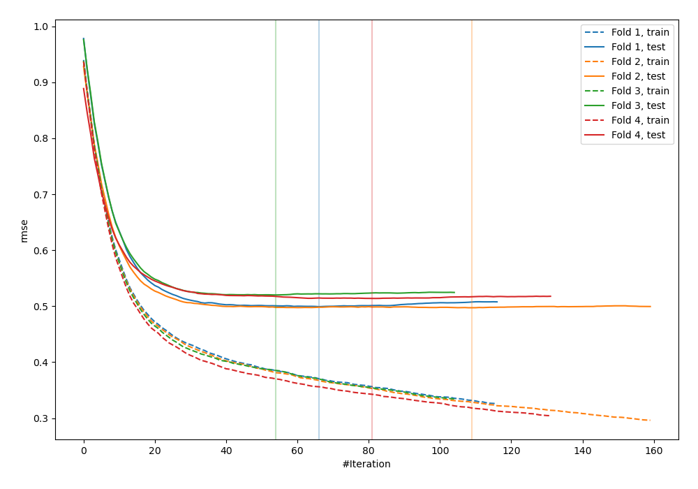
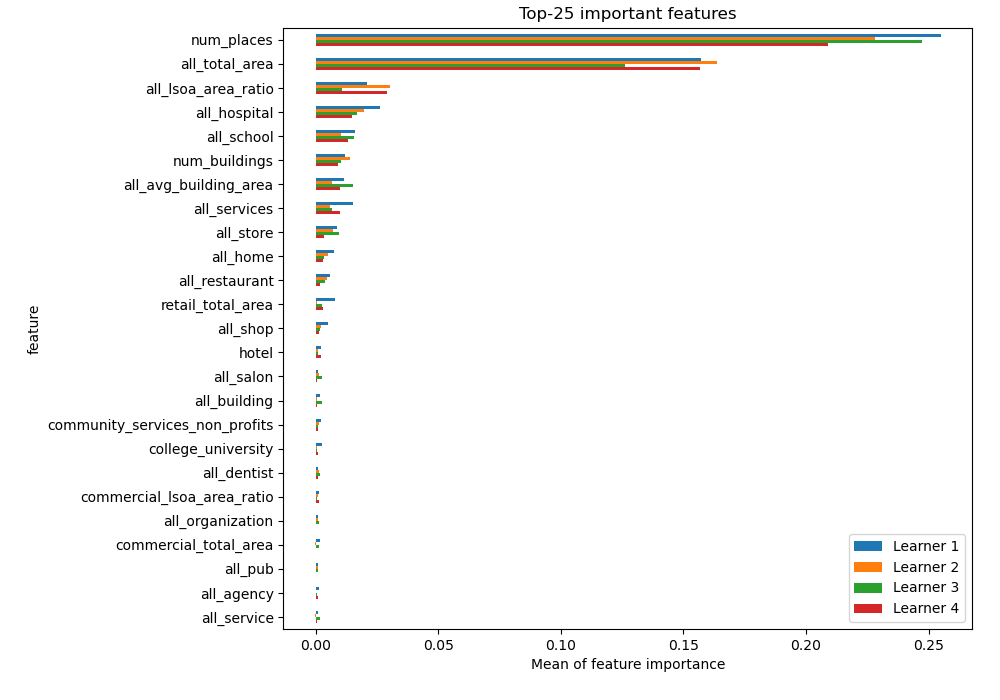
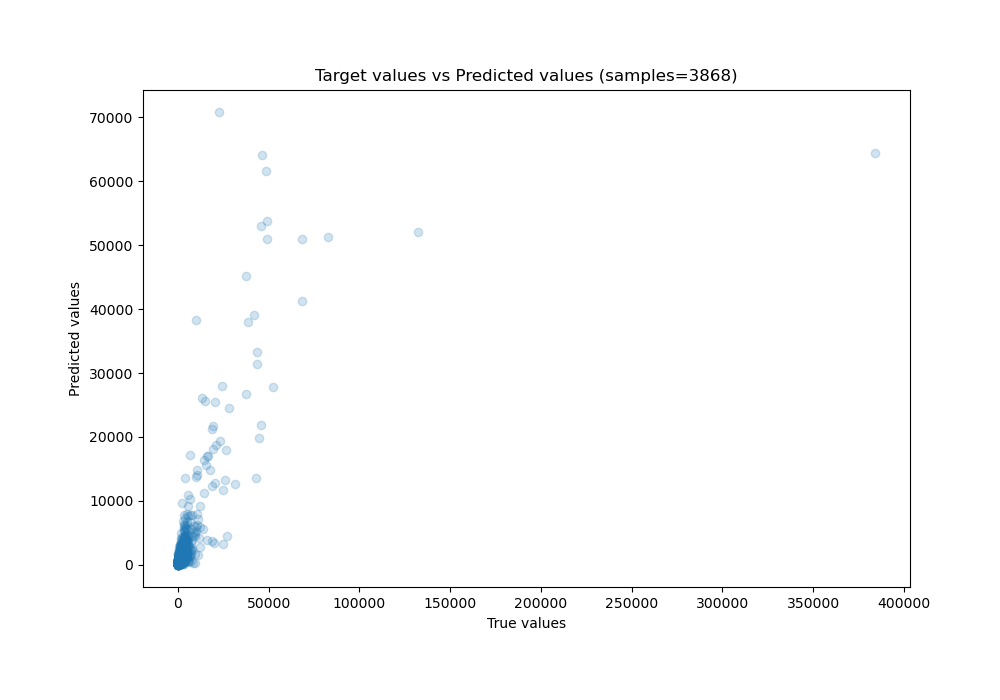
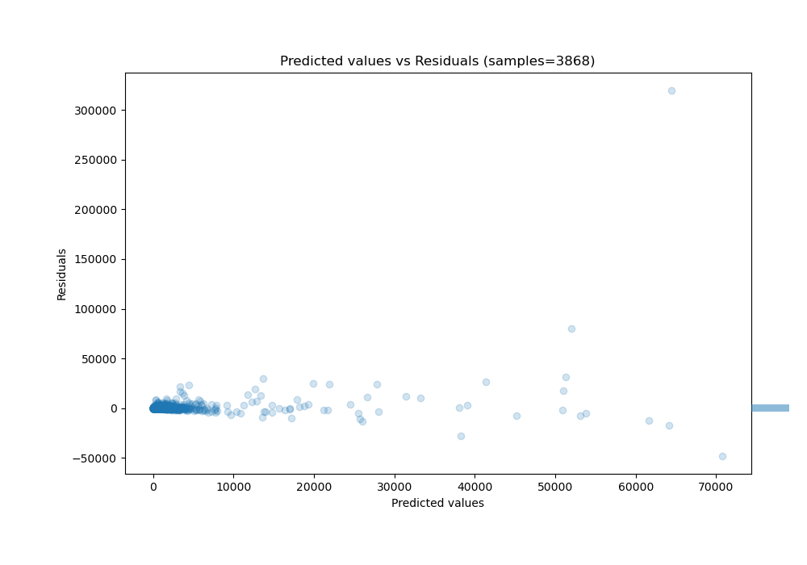

# Summary of 36_Xgboost

[<< Go back](../README.md)

## Extreme Gradient Boosting (Xgboost)
- **n_jobs**: -1
- **objective**: reg:squarederror
- **eta**: 0.1
- **max_depth**: 7
- **min_child_weight**: 25
- **subsample**: 0.8
- **colsample_bytree**: 0.6
- **eval_metric**: rmse
- **explain_level**: 1

## Validation
 - **validation_type**: kfold
 - **k_folds**: 4
 - **shuffle**: False

## Optimized metric
rmse

## Training time

45.5 seconds

### Metric details:
| Metric   |          Score |
|:---------|---------------:|
| MAE      |  543.254       |
| MSE      |    3.16955e+07 |
| RMSE     | 5629.87        |
| R2       |    0.455955    |
| MAPE     |    1.25055e+14 |

## Learning curves

## Permutation-based Importance

## True vs Predicted

## Predicted vs Residuals

[<< Go back](../README.md)
