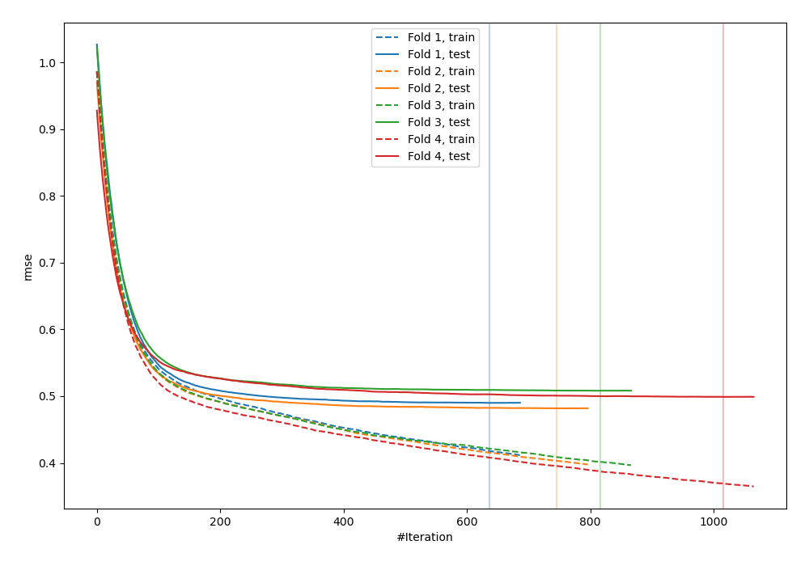
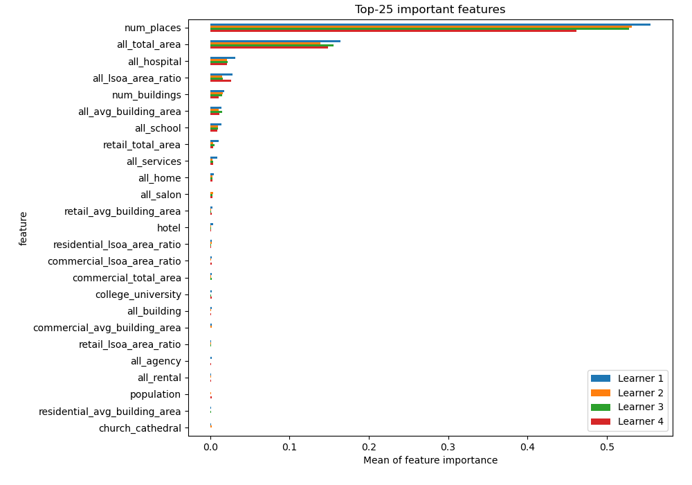
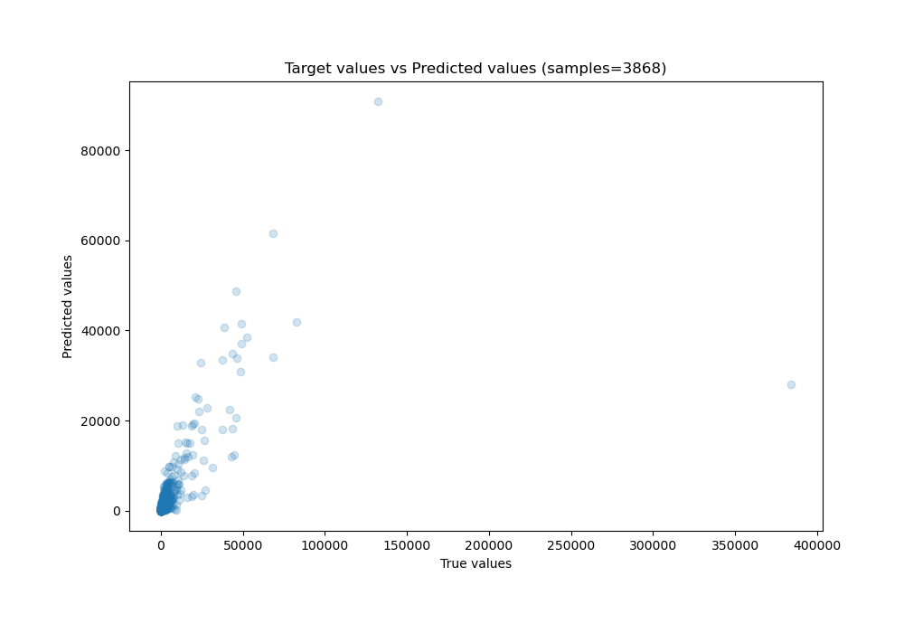
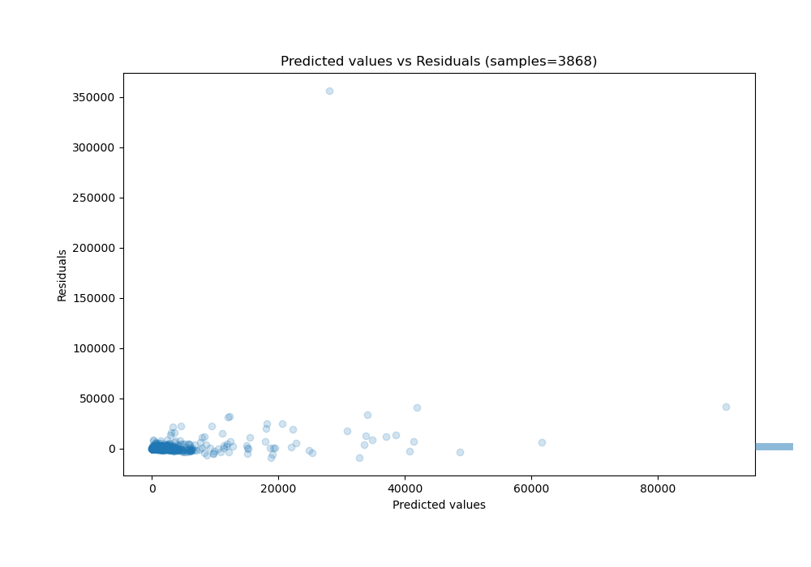

# Summary of 40_CatBoost

[<< Go back](../README.md)

## CatBoost
- **n_jobs**: -1
- **learning_rate**: 0.025
- **depth**: 6
- **rsm**: 1
- **loss_function**: RMSE
- **eval_metric**: RMSE
- **explain_level**: 1

## Validation
 - **validation_type**: kfold
 - **k_folds**: 4
 - **shuffle**: False

## Optimized metric
rmse

## Training time

86.4 seconds

### Metric details:
| Metric   |          Score |
|:---------|---------------:|
| MAE      |  525.58        |
| MSE      |    3.6558e+07  |
| RMSE     | 6046.32        |
| R2       |    0.372491    |
| MAPE     |    1.23034e+14 |

## Learning curves

## Permutation-based Importance

## True vs Predicted

## Predicted vs Residuals

[<< Go back](../README.md)
