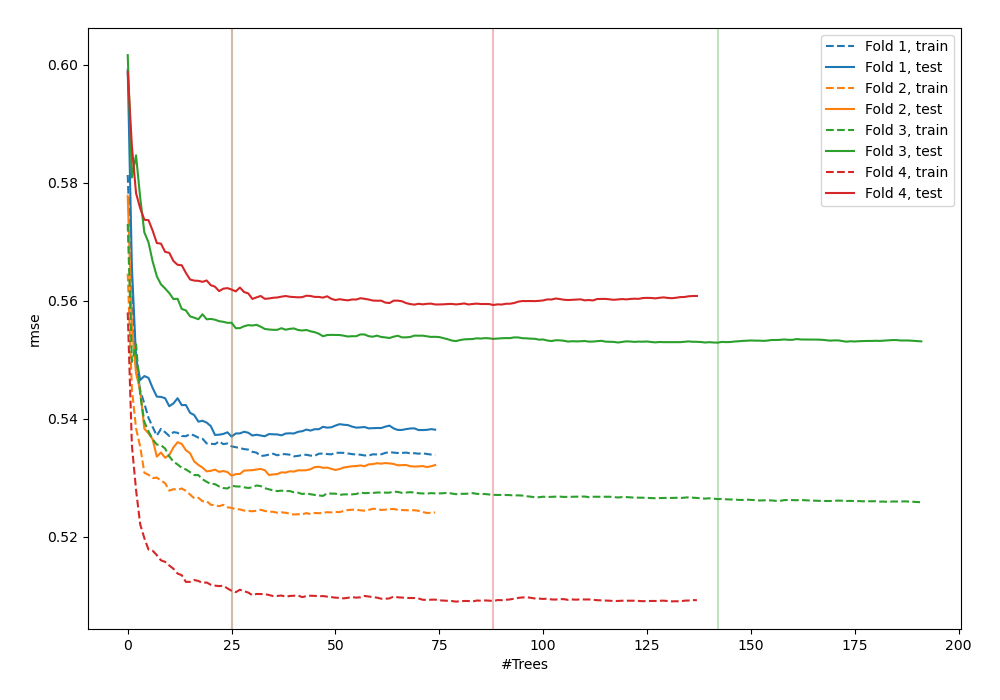

# Summary of 42_RandomForest

[<< Go back](../README.md)

## Random Forest
- **n_jobs**: -1
- **criterion**: squared_error
- **max_features**: 0.8
- **min_samples_split**: 20
- **max_depth**: 4
- **eval_metric_name**: rmse
- **explain_level**: 1

## Validation
 - **validation_type**: kfold
 - **k_folds**: 4
 - **shuffle**: False

## Optimized metric
rmse

## Training time

85.4 seconds

### Metric details:
| Metric   |          Score |
|:---------|---------------:|
| MAE      |  610.171       |
| MSE      |    3.84317e+07 |
| RMSE     | 6199.33        |
| R2       |    0.340329    |
| MAPE     |    2.07552e+14 |

## Learning curves

## Permutation-based Importance

## True vs Predicted

## Predicted vs Residuals

[<< Go back](../README.md)
