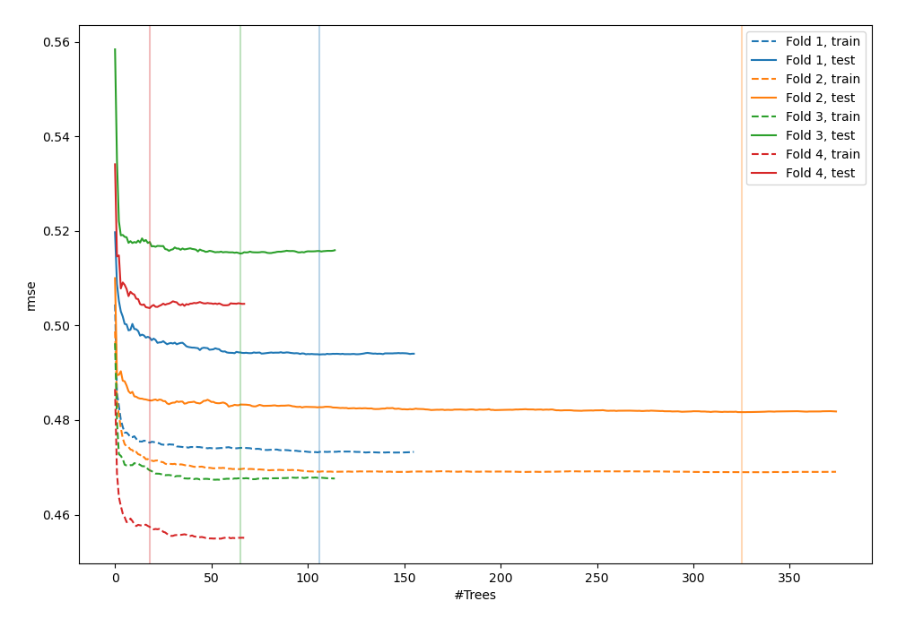
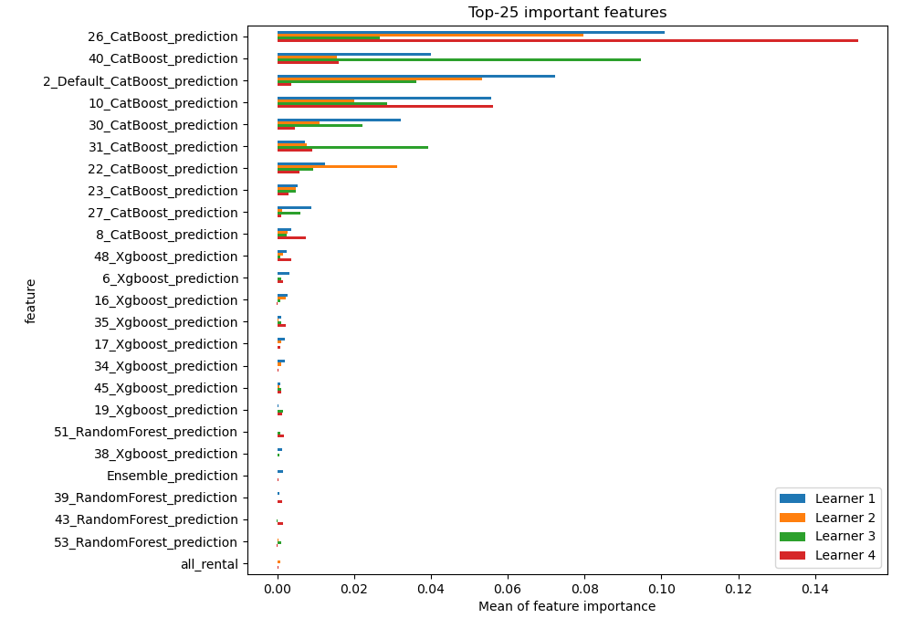
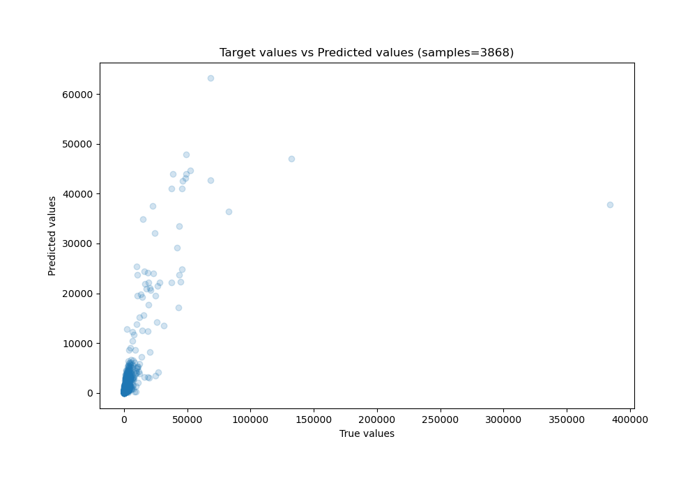
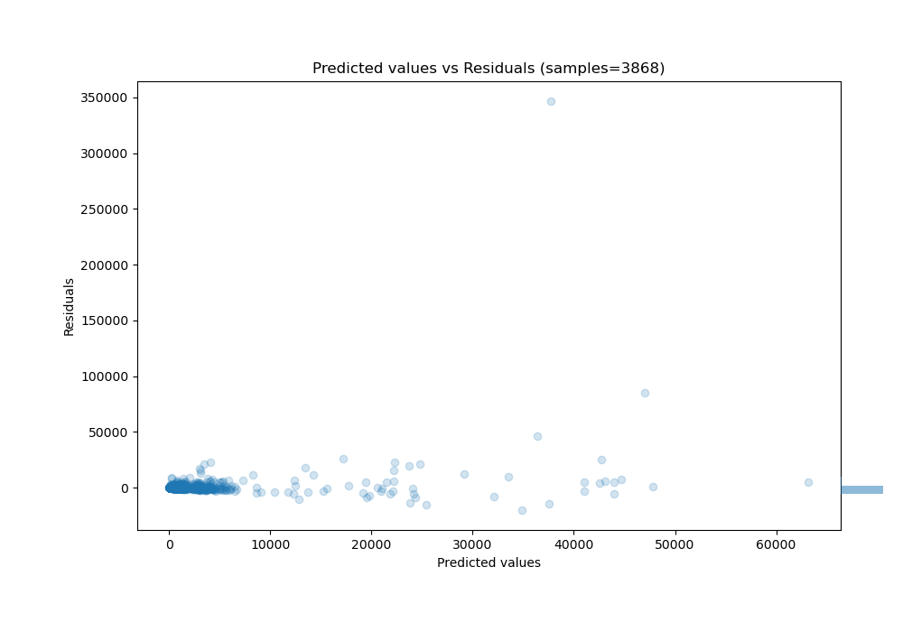

# Summary of 43_RandomForest_Stacked

[<< Go back](../README.md)

## Random Forest
- **n_jobs**: -1
- **criterion**: squared_error
- **max_features**: 1.0
- **min_samples_split**: 20
- **max_depth**: 4
- **eval_metric_name**: rmse
- **explain_level**: 1

## Validation
 - **validation_type**: kfold
 - **k_folds**: 4
 - **shuffle**: False

## Optimized metric
rmse

## Training time

90.4 seconds

### Metric details:
| Metric   |          Score |
|:---------|---------------:|
| MAE      |  532.43        |
| MSE      |    3.58476e+07 |
| RMSE     | 5987.29        |
| R2       |    0.384684    |
| MAPE     |    1.11075e+14 |

## Learning curves

## Permutation-based Importance

## True vs Predicted

## Predicted vs Residuals

[<< Go back](../README.md)
