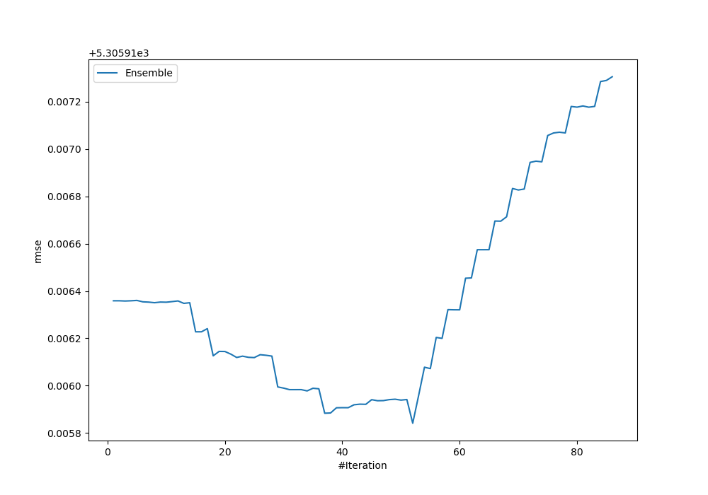
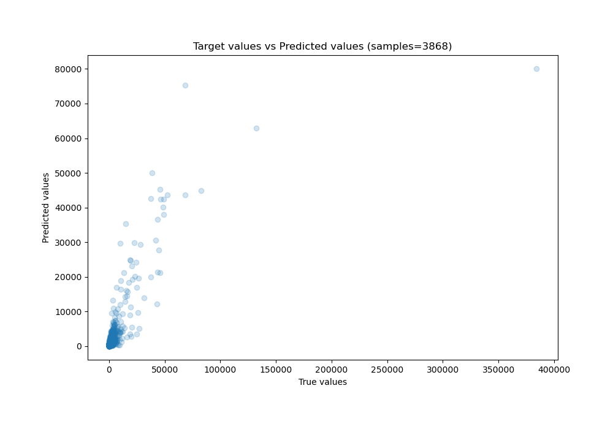
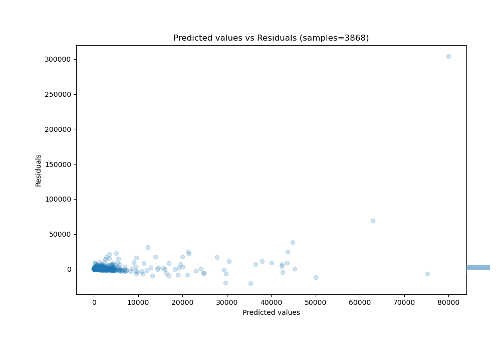

# Summary of Ensemble_Stacked

[<< Go back](../README.md)

## Ensemble structure
| Model      |   Weight |
|:-----------|---------:|
| 38_Xgboost |       11 |
| Ensemble   |       41 |

### Metric details:
| Metric   |          Score |
|:---------|---------------:|
| MAE      |  526.632       |
| MSE      |    2.81527e+07 |
| RMSE     | 5305.92        |
| R2       |    0.516765    |
| MAPE     |    1.32161e+14 |

## Learning curves

## True vs Predicted

## Predicted vs Residuals

[<< Go back](../README.md)
