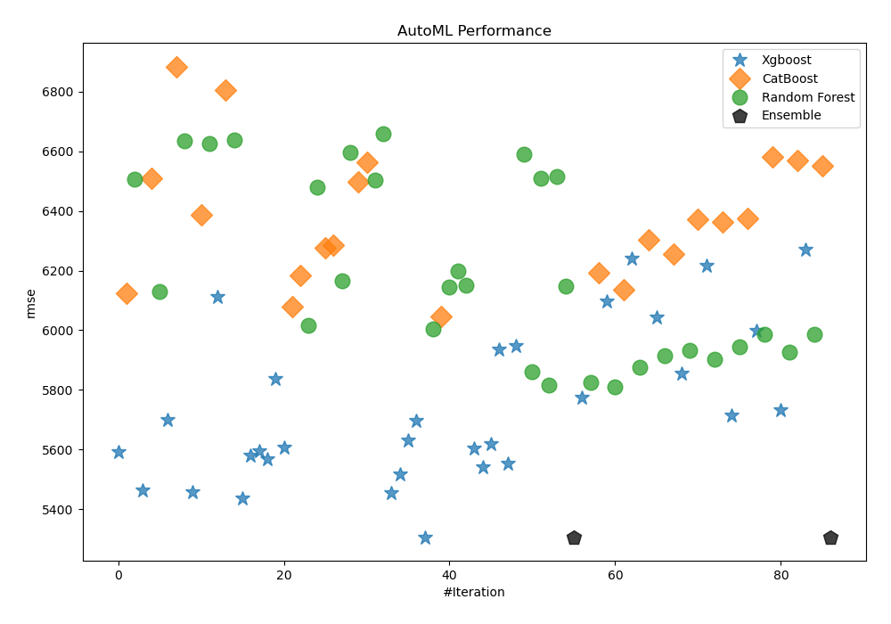
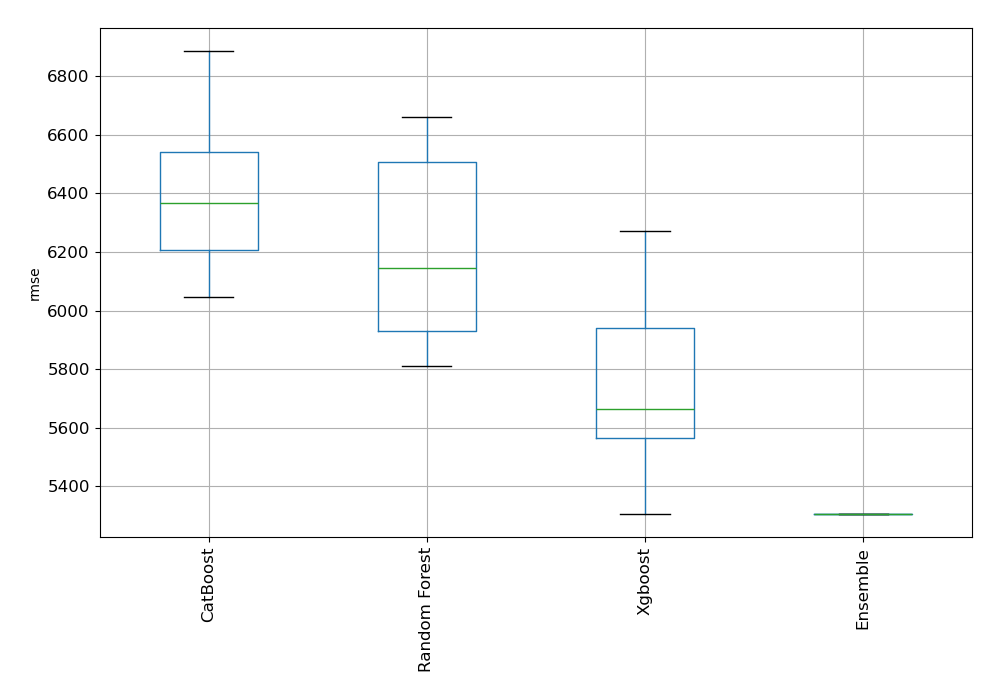
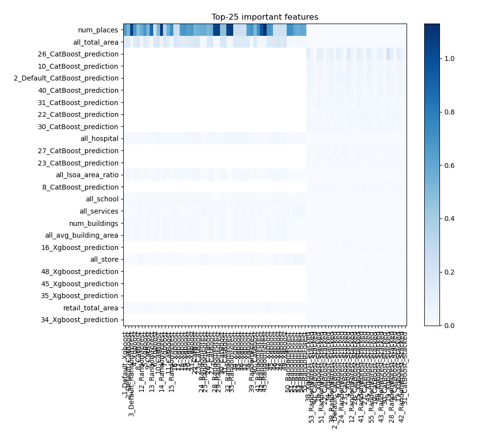
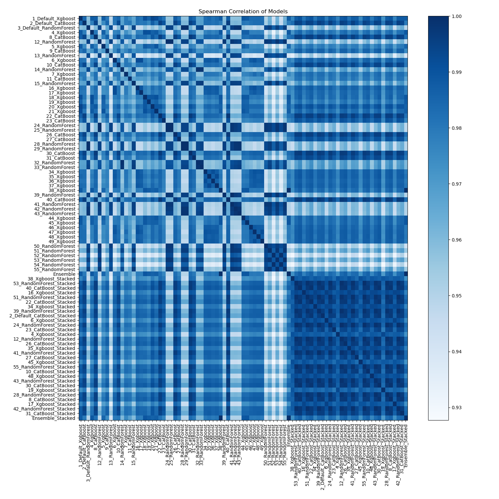

# AutoML Leaderboard

| Best model   | name                                                               | model_type    | metric_type   |   metric_value |   train_time |
|:-------------|:-------------------------------------------------------------------|:--------------|:--------------|---------------:|-------------:|
|              | [1_Default_Xgboost](1_Default_Xgboost/README.md)                   | Xgboost       | rmse          |        5591.33 |        43.62 |
|              | [2_Default_CatBoost](2_Default_CatBoost/README.md)                 | CatBoost      | rmse          |        6123.02 |        56.81 |
|              | [3_Default_RandomForest](3_Default_RandomForest/README.md)         | Random Forest | rmse          |        6507.42 |        64.42 |
|              | [4_Xgboost](4_Xgboost/README.md)                                   | Xgboost       | rmse          |        5462.62 |        41.37 |
|              | [8_CatBoost](8_CatBoost/README.md)                                 | CatBoost      | rmse          |        6509.85 |        77.67 |
|              | [12_RandomForest](12_RandomForest/README.md)                       | Random Forest | rmse          |        6130.13 |        66.7  |
|              | [5_Xgboost](5_Xgboost/README.md)                                   | Xgboost       | rmse          |        5700.49 |        40.79 |
|              | [9_CatBoost](9_CatBoost/README.md)                                 | CatBoost      | rmse          |        6885.03 |        53.84 |
|              | [13_RandomForest](13_RandomForest/README.md)                       | Random Forest | rmse          |        6636.3  |        65.65 |
|              | [6_Xgboost](6_Xgboost/README.md)                                   | Xgboost       | rmse          |        5456.55 |        47.25 |
|              | [10_CatBoost](10_CatBoost/README.md)                               | CatBoost      | rmse          |        6386.74 |        60.18 |
|              | [14_RandomForest](14_RandomForest/README.md)                       | Random Forest | rmse          |        6626.91 |        57.9  |
|              | [7_Xgboost](7_Xgboost/README.md)                                   | Xgboost       | rmse          |        6112.49 |        41.13 |
|              | [11_CatBoost](11_CatBoost/README.md)                               | CatBoost      | rmse          |        6805.52 |        61.09 |
|              | [15_RandomForest](15_RandomForest/README.md)                       | Random Forest | rmse          |        6636.91 |        68.03 |
|              | [16_Xgboost](16_Xgboost/README.md)                                 | Xgboost       | rmse          |        5435.82 |        46.63 |
|              | [17_Xgboost](17_Xgboost/README.md)                                 | Xgboost       | rmse          |        5580.2  |        51.73 |
|              | [18_Xgboost](18_Xgboost/README.md)                                 | Xgboost       | rmse          |        5595.19 |        40.59 |
|              | [19_Xgboost](19_Xgboost/README.md)                                 | Xgboost       | rmse          |        5568.69 |        47.1  |
|              | [20_Xgboost](20_Xgboost/README.md)                                 | Xgboost       | rmse          |        5837.08 |        43.12 |
|              | [21_Xgboost](21_Xgboost/README.md)                                 | Xgboost       | rmse          |        5606.61 |        44.4  |
|              | [22_CatBoost](22_CatBoost/README.md)                               | CatBoost      | rmse          |        6078.71 |        62.46 |
|              | [23_CatBoost](23_CatBoost/README.md)                               | CatBoost      | rmse          |        6184.55 |        56.46 |
|              | [24_RandomForest](24_RandomForest/README.md)                       | Random Forest | rmse          |        6017.38 |        74.92 |
|              | [25_RandomForest](25_RandomForest/README.md)                       | Random Forest | rmse          |        6481.21 |        70.68 |
|              | [26_CatBoost](26_CatBoost/README.md)                               | CatBoost      | rmse          |        6276.86 |        68.73 |
|              | [27_CatBoost](27_CatBoost/README.md)                               | CatBoost      | rmse          |        6286.83 |        57.35 |
|              | [28_RandomForest](28_RandomForest/README.md)                       | Random Forest | rmse          |        6164.64 |        62.73 |
|              | [29_RandomForest](29_RandomForest/README.md)                       | Random Forest | rmse          |        6595.59 |        64.9  |
|              | [30_CatBoost](30_CatBoost/README.md)                               | CatBoost      | rmse          |        6497.9  |        87.94 |
|              | [31_CatBoost](31_CatBoost/README.md)                               | CatBoost      | rmse          |        6563.2  |        70.04 |
|              | [32_RandomForest](32_RandomForest/README.md)                       | Random Forest | rmse          |        6502.3  |        65.23 |
|              | [33_RandomForest](33_RandomForest/README.md)                       | Random Forest | rmse          |        6660.49 |        73.35 |
|              | [34_Xgboost](34_Xgboost/README.md)                                 | Xgboost       | rmse          |        5452.88 |        48.8  |
|              | [35_Xgboost](35_Xgboost/README.md)                                 | Xgboost       | rmse          |        5517.3  |        45.5  |
|              | [36_Xgboost](36_Xgboost/README.md)                                 | Xgboost       | rmse          |        5629.87 |        45.73 |
|              | [37_Xgboost](37_Xgboost/README.md)                                 | Xgboost       | rmse          |        5697.04 |        45.9  |
|              | [38_Xgboost](38_Xgboost/README.md)                                 | Xgboost       | rmse          |        5305.92 |        47.86 |
|              | [39_RandomForest](39_RandomForest/README.md)                       | Random Forest | rmse          |        6005.77 |        68.32 |
|              | [40_CatBoost](40_CatBoost/README.md)                               | CatBoost      | rmse          |        6046.32 |        86.72 |
|              | [41_RandomForest](41_RandomForest/README.md)                       | Random Forest | rmse          |        6145.22 |        65.23 |
|              | [42_RandomForest](42_RandomForest/README.md)                       | Random Forest | rmse          |        6199.33 |        85.82 |
|              | [43_RandomForest](43_RandomForest/README.md)                       | Random Forest | rmse          |        6152.03 |        88.01 |
|              | [44_Xgboost](44_Xgboost/README.md)                                 | Xgboost       | rmse          |        5604.04 |        39.38 |
|              | [45_Xgboost](45_Xgboost/README.md)                                 | Xgboost       | rmse          |        5541.52 |        39.95 |
|              | [46_Xgboost](46_Xgboost/README.md)                                 | Xgboost       | rmse          |        5618.5  |        39.69 |
|              | [47_Xgboost](47_Xgboost/README.md)                                 | Xgboost       | rmse          |        5936.31 |        40    |
|              | [48_Xgboost](48_Xgboost/README.md)                                 | Xgboost       | rmse          |        5552.49 |        41.38 |
|              | [49_Xgboost](49_Xgboost/README.md)                                 | Xgboost       | rmse          |        5947.51 |        40.23 |
|              | [50_RandomForest](50_RandomForest/README.md)                       | Random Forest | rmse          |        6591.41 |        77.5  |
|              | [51_RandomForest](51_RandomForest/README.md)                       | Random Forest | rmse          |        5861.95 |        68.33 |
|              | [52_RandomForest](52_RandomForest/README.md)                       | Random Forest | rmse          |        6508.41 |        49.88 |
|              | [53_RandomForest](53_RandomForest/README.md)                       | Random Forest | rmse          |        5815.58 |       103.1  |
|              | [54_RandomForest](54_RandomForest/README.md)                       | Random Forest | rmse          |        6515.43 |        47.52 |
|              | [55_RandomForest](55_RandomForest/README.md)                       | Random Forest | rmse          |        6147.44 |       159.2  |
|              | [Ensemble](Ensemble/README.md)                                     | Ensemble      | rmse          |        5305.92 |         1.61 |
|              | [38_Xgboost_Stacked](38_Xgboost_Stacked/README.md)                 | Xgboost       | rmse          |        5774.32 |        51.52 |
|              | [53_RandomForest_Stacked](53_RandomForest_Stacked/README.md)       | Random Forest | rmse          |        5825.88 |        96.43 |
|              | [40_CatBoost_Stacked](40_CatBoost_Stacked/README.md)               | CatBoost      | rmse          |        6191.84 |        80.74 |
|              | [16_Xgboost_Stacked](16_Xgboost_Stacked/README.md)                 | Xgboost       | rmse          |        6098.45 |        49.6  |
|              | [51_RandomForest_Stacked](51_RandomForest_Stacked/README.md)       | Random Forest | rmse          |        5810.21 |        79.57 |
|              | [22_CatBoost_Stacked](22_CatBoost_Stacked/README.md)               | CatBoost      | rmse          |        6135.12 |        69.12 |
|              | [34_Xgboost_Stacked](34_Xgboost_Stacked/README.md)                 | Xgboost       | rmse          |        6240.55 |        52.04 |
|              | [39_RandomForest_Stacked](39_RandomForest_Stacked/README.md)       | Random Forest | rmse          |        5875.4  |        72.51 |
|              | [2_Default_CatBoost_Stacked](2_Default_CatBoost_Stacked/README.md) | CatBoost      | rmse          |        6301.98 |       104.77 |
|              | [6_Xgboost_Stacked](6_Xgboost_Stacked/README.md)                   | Xgboost       | rmse          |        6044.25 |        51.02 |
|              | [24_RandomForest_Stacked](24_RandomForest_Stacked/README.md)       | Random Forest | rmse          |        5915.75 |        87.63 |
|              | [23_CatBoost_Stacked](23_CatBoost_Stacked/README.md)               | CatBoost      | rmse          |        6254.9  |        72.97 |
|              | [4_Xgboost_Stacked](4_Xgboost_Stacked/README.md)                   | Xgboost       | rmse          |        5853.7  |        55.54 |
|              | [12_RandomForest_Stacked](12_RandomForest_Stacked/README.md)       | Random Forest | rmse          |        5931.76 |        82.56 |
|              | [26_CatBoost_Stacked](26_CatBoost_Stacked/README.md)               | CatBoost      | rmse          |        6372.22 |        75.81 |
|              | [35_Xgboost_Stacked](35_Xgboost_Stacked/README.md)                 | Xgboost       | rmse          |        6215.71 |        49.24 |
|              | [41_RandomForest_Stacked](41_RandomForest_Stacked/README.md)       | Random Forest | rmse          |        5902.67 |        65.44 |
|              | [27_CatBoost_Stacked](27_CatBoost_Stacked/README.md)               | CatBoost      | rmse          |        6362.19 |        77.05 |
|              | [45_Xgboost_Stacked](45_Xgboost_Stacked/README.md)                 | Xgboost       | rmse          |        5715.32 |        53.46 |
|              | [55_RandomForest_Stacked](55_RandomForest_Stacked/README.md)       | Random Forest | rmse          |        5945.12 |        94.47 |
|              | [10_CatBoost_Stacked](10_CatBoost_Stacked/README.md)               | CatBoost      | rmse          |        6374.53 |        60.5  |
|              | [48_Xgboost_Stacked](48_Xgboost_Stacked/README.md)                 | Xgboost       | rmse          |        5999.34 |        44.57 |
|              | [43_RandomForest_Stacked](43_RandomForest_Stacked/README.md)       | Random Forest | rmse          |        5987.29 |        90.71 |
|              | [30_CatBoost_Stacked](30_CatBoost_Stacked/README.md)               | CatBoost      | rmse          |        6580.99 |        78.67 |
|              | [19_Xgboost_Stacked](19_Xgboost_Stacked/README.md)                 | Xgboost       | rmse          |        5731.03 |        48.86 |
|              | [28_RandomForest_Stacked](28_RandomForest_Stacked/README.md)       | Random Forest | rmse          |        5926.79 |        71.53 |
|              | [8_CatBoost_Stacked](8_CatBoost_Stacked/README.md)                 | CatBoost      | rmse          |        6568.9  |        70.94 |
|              | [17_Xgboost_Stacked](17_Xgboost_Stacked/README.md)                 | Xgboost       | rmse          |        6270.9  |        44.27 |
|              | [42_RandomForest_Stacked](42_RandomForest_Stacked/README.md)       | Random Forest | rmse          |        5987.24 |        77.07 |
|              | [31_CatBoost_Stacked](31_CatBoost_Stacked/README.md)               | CatBoost      | rmse          |        6550.19 |        58.98 |
| **the best** | [Ensemble_Stacked](Ensemble_Stacked/README.md)                     | Ensemble      | rmse          |        5305.92 |         3.83 |

### AutoML Performance

### AutoML Performance Boxplot

### Features Importance

### Spearman Correlation of Models

