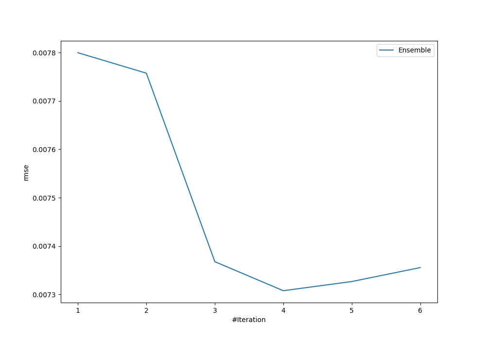

# Summary of Ensemble

[<< Go back](../README.md)

## Ensemble structure
| Model                  |   Weight |
|:-----------------------|---------:|
| 3_Linear               |        1 |
| 4_Default_Xgboost      |        2 |
| 6_Default_RandomForest |        1 |

### Metric details:
| Metric   |       Score |
|:---------|------------:|
| MAE      | 0.00256086  |
| MSE      | 5.34037e-05 |
| RMSE     | 0.00730778  |
| R2       | 0.785178    |
| MAPE     | 2.12002e+10 |

## Learning curves

## True vs Predicted

## Predicted vs Residuals

[<< Go back](../README.md)
