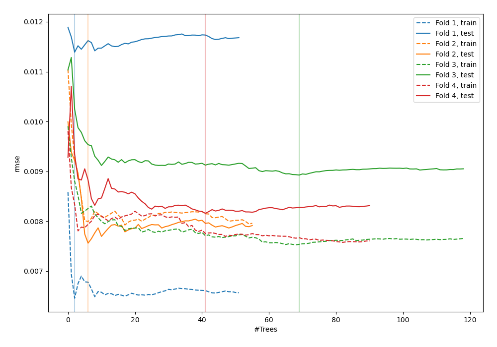
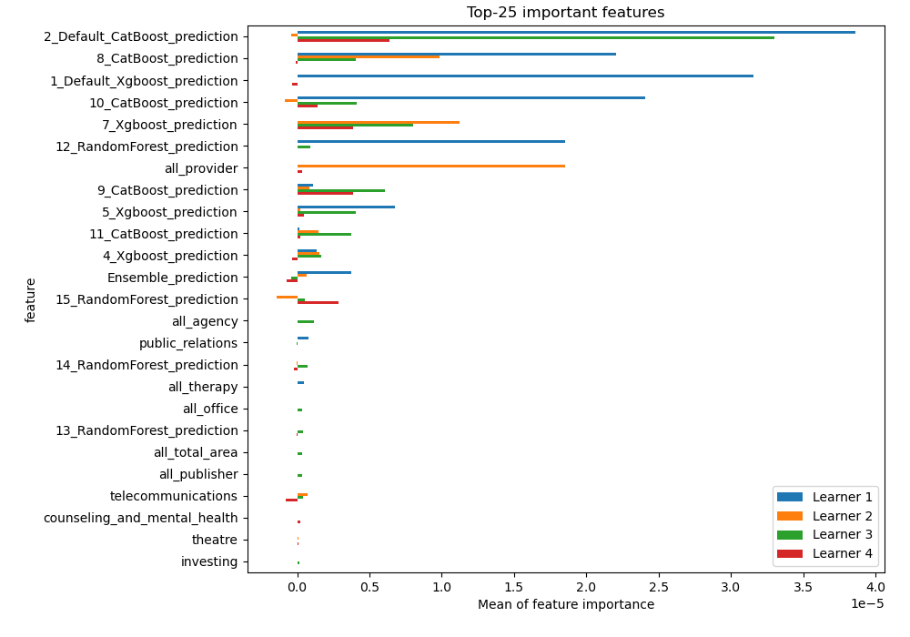
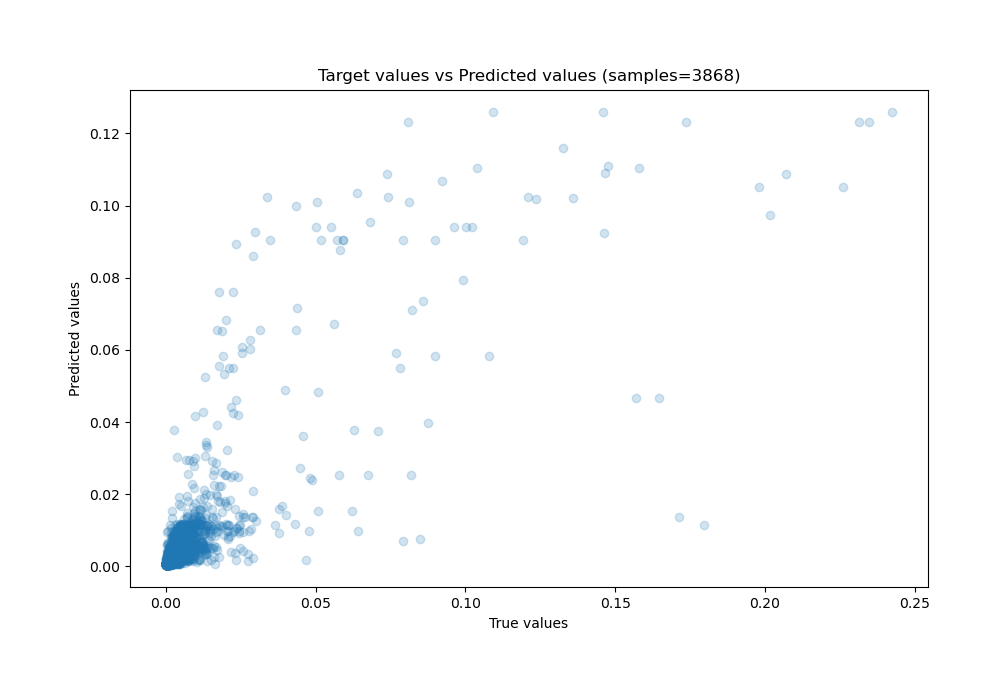
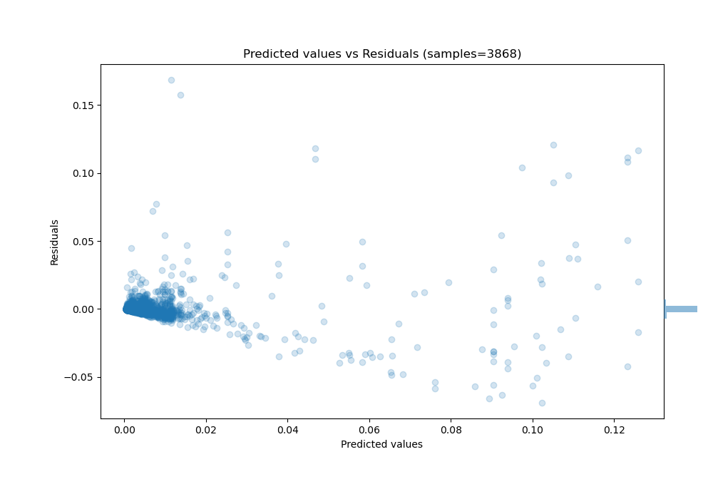

# Summary of 14_RandomForest_Stacked

[<< Go back](../README.md)

## Random Forest
- **n_jobs**: -1
- **criterion**: squared_error
- **max_features**: 1.0
- **min_samples_split**: 40
- **max_depth**: 6
- **eval_metric_name**: rmse
- **explain_level**: 1

## Validation
 - **validation_type**: kfold
 - **k_folds**: 4
 - **shuffle**: False

## Optimized metric
rmse

## Training time

62.0 seconds

### Metric details:
| Metric   |       Score |
|:---------|------------:|
| MAE      | 0.00255082  |
| MSE      | 8.32734e-05 |
| RMSE     | 0.00912543  |
| R2       | 0.665926    |
| MAPE     | 6.17574e+09 |

## Learning curves

## Permutation-based Importance

## True vs Predicted

## Predicted vs Residuals

[<< Go back](../README.md)
