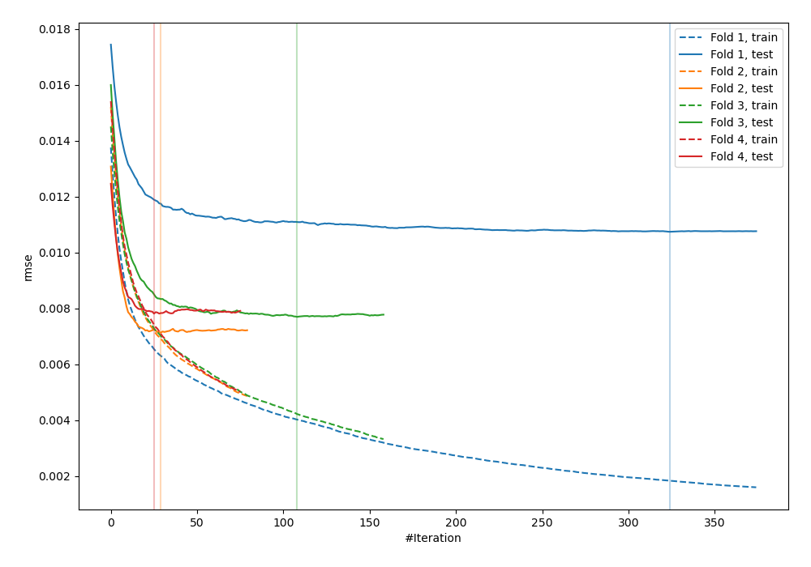
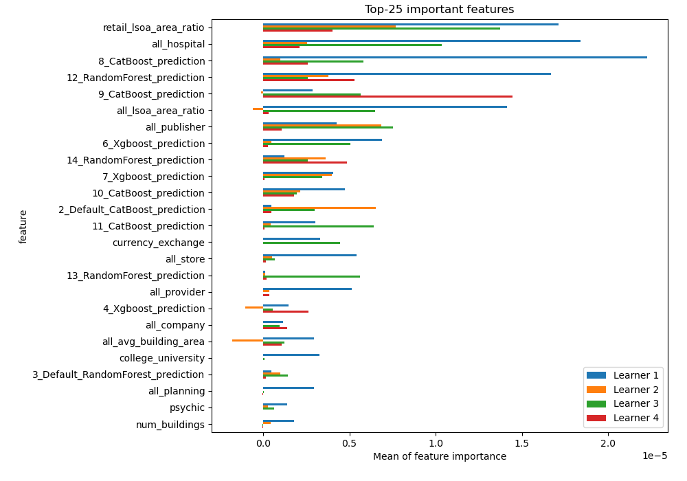
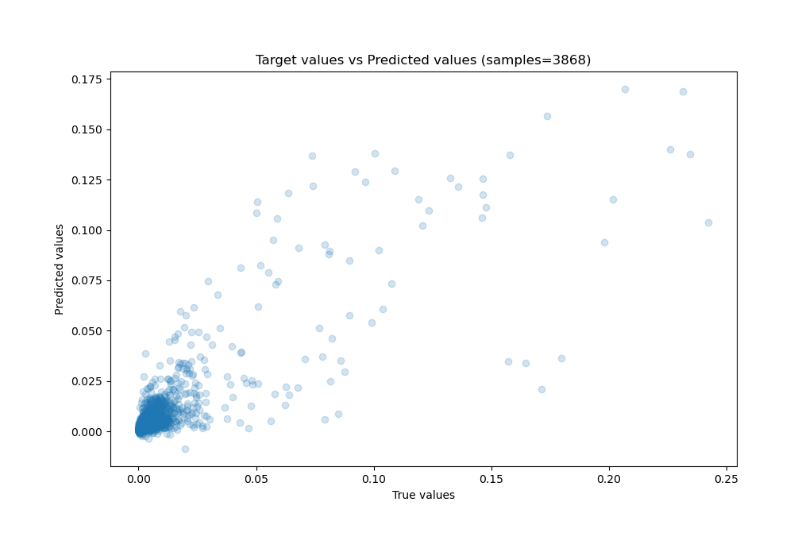
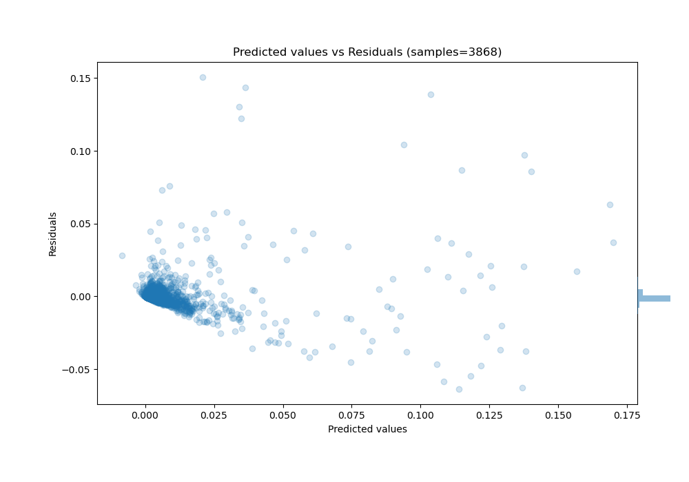

# Summary of 6_Xgboost_Stacked

[<< Go back](../README.md)

## Extreme Gradient Boosting (Xgboost)
- **n_jobs**: -1
- **objective**: reg:squarederror
- **eta**: 0.1
- **max_depth**: 7
- **min_child_weight**: 25
- **subsample**: 0.9
- **colsample_bytree**: 0.6
- **eval_metric**: rmse
- **explain_level**: 1

## Validation
 - **validation_type**: kfold
 - **k_folds**: 4
 - **shuffle**: False

## Optimized metric
rmse

## Training time

40.9 seconds

### Metric details:
| Metric   |       Score |
|:---------|------------:|
| MAE      | 0.0025725   |
| MSE      | 7.1717e-05  |
| RMSE     | 0.00846859  |
| R2       | 0.712288    |
| MAPE     | 8.22252e+09 |

## Learning curves

## Permutation-based Importance

## True vs Predicted

## Predicted vs Residuals

[<< Go back](../README.md)
