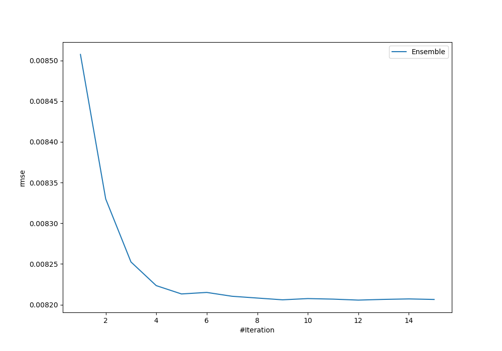
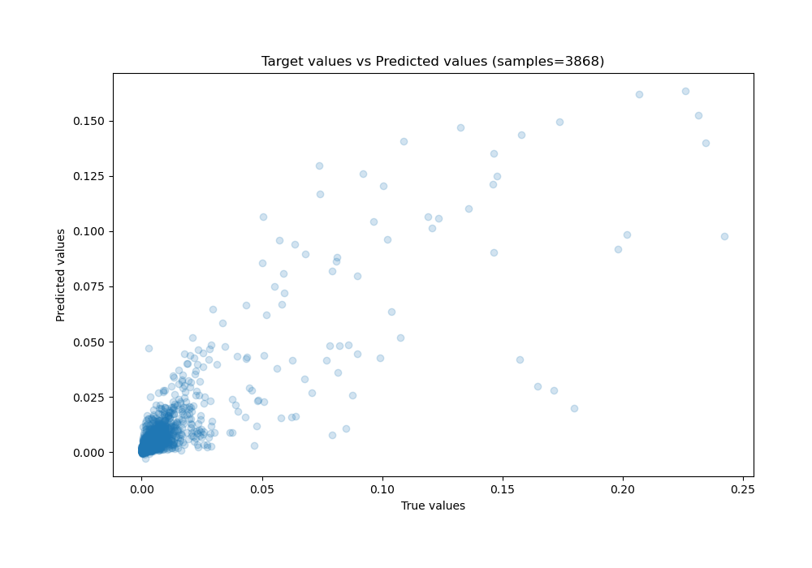
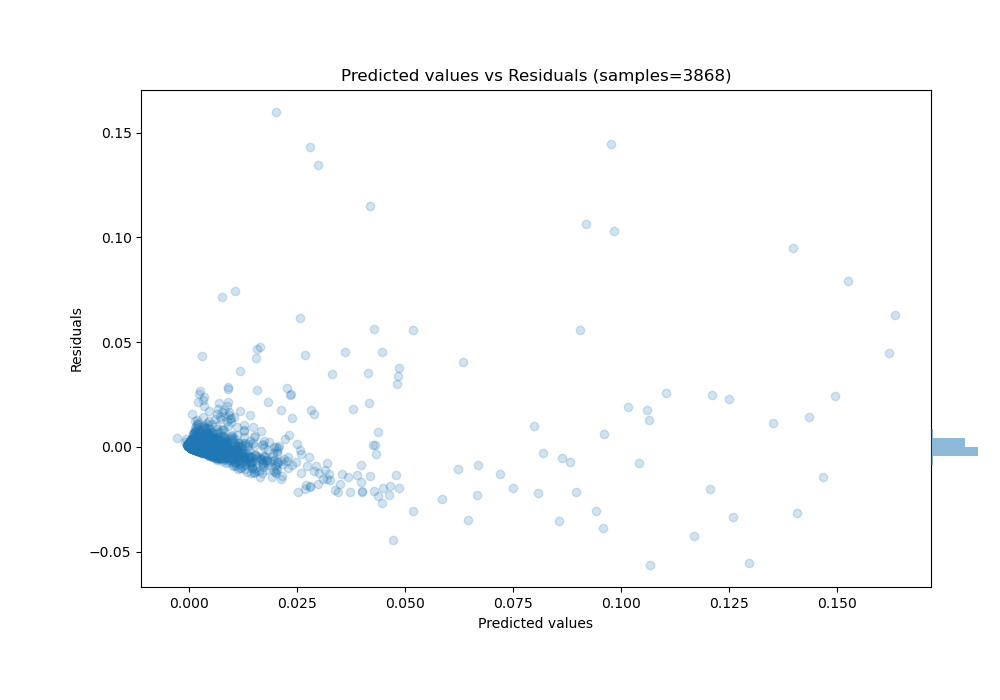

# Summary of Ensemble

[<< Go back](../README.md)

## Ensemble structure
| Model             |   Weight |
|:------------------|---------:|
| 11_CatBoost       |        2 |
| 1_Default_Xgboost |        2 |
| 4_Xgboost         |        1 |
| 6_Xgboost         |        4 |
| 7_Xgboost         |        3 |

### Metric details:
| Metric   |       Score |
|:---------|------------:|
| MAE      | 0.00241341  |
| MSE      | 6.73317e-05 |
| RMSE     | 0.00820559  |
| R2       | 0.729881    |
| MAPE     | 5.7585e+09  |

## Learning curves

## True vs Predicted

## Predicted vs Residuals

[<< Go back](../README.md)
