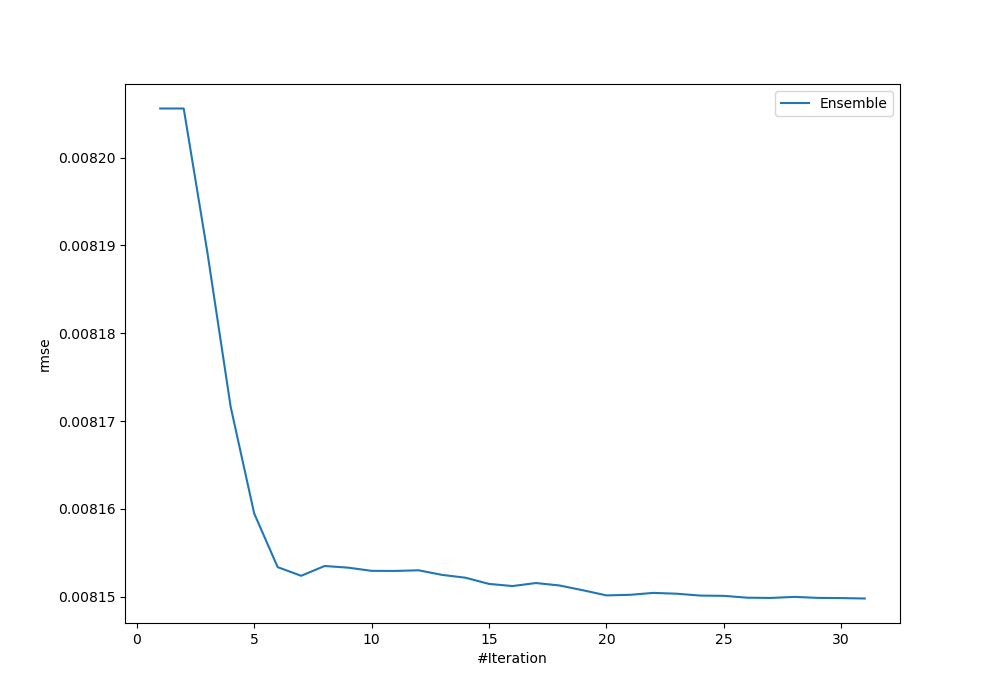
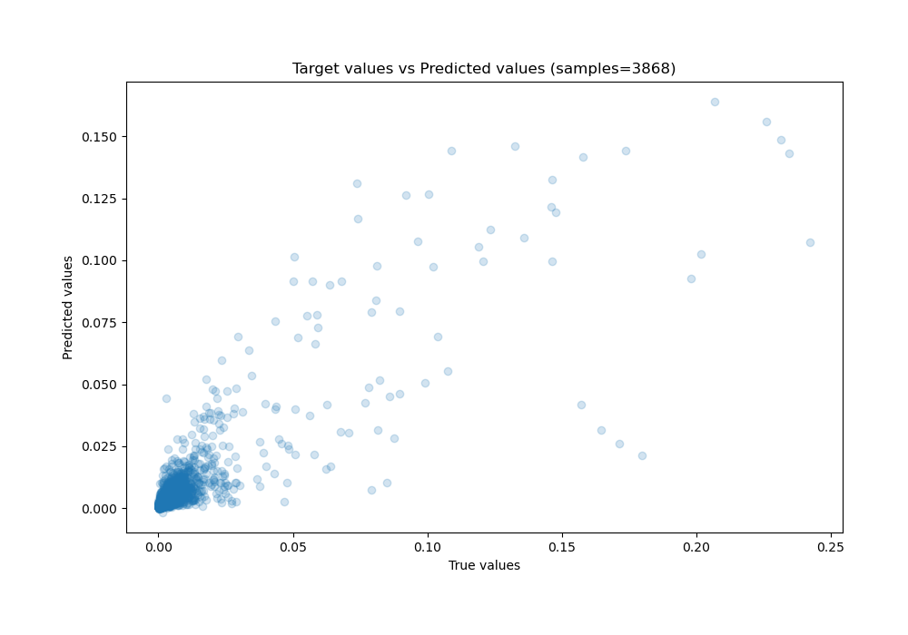
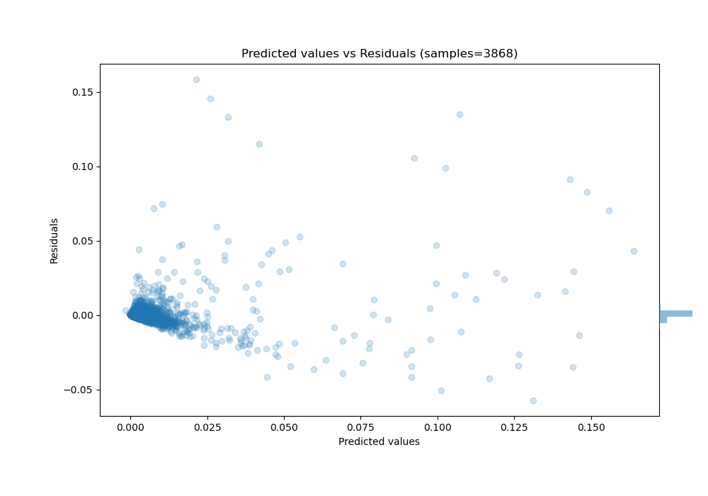

# Summary of Ensemble_Stacked

[<< Go back](../README.md)

## Ensemble structure
| Model                     |   Weight |
|:--------------------------|---------:|
| 11_CatBoost               |        1 |
| 1_Default_Xgboost_Stacked |        5 |
| 4_Xgboost_Stacked         |        1 |
| 6_Xgboost                 |        2 |
| 6_Xgboost_Stacked         |        4 |
| 7_Xgboost_Stacked         |        4 |
| Ensemble                  |       14 |

### Metric details:
| Metric   |       Score |
|:---------|------------:|
| MAE      | 0.00238748  |
| MSE      | 6.64194e-05 |
| RMSE     | 0.00814981  |
| R2       | 0.73354     |
| MAPE     | 6.33209e+09 |

## Learning curves

## True vs Predicted

## Predicted vs Residuals

[<< Go back](../README.md)
