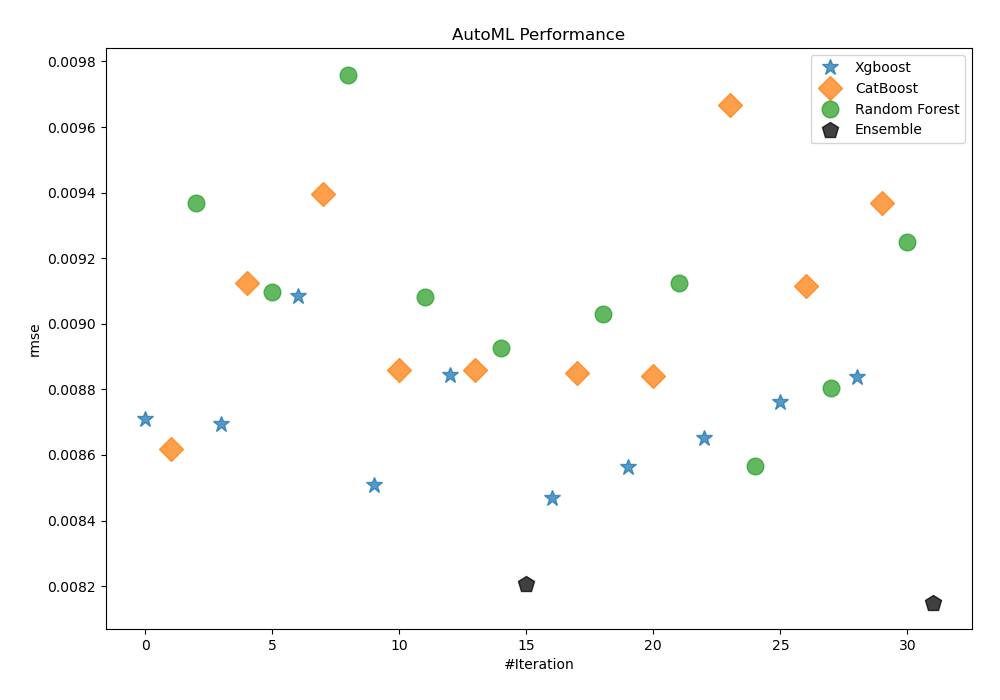
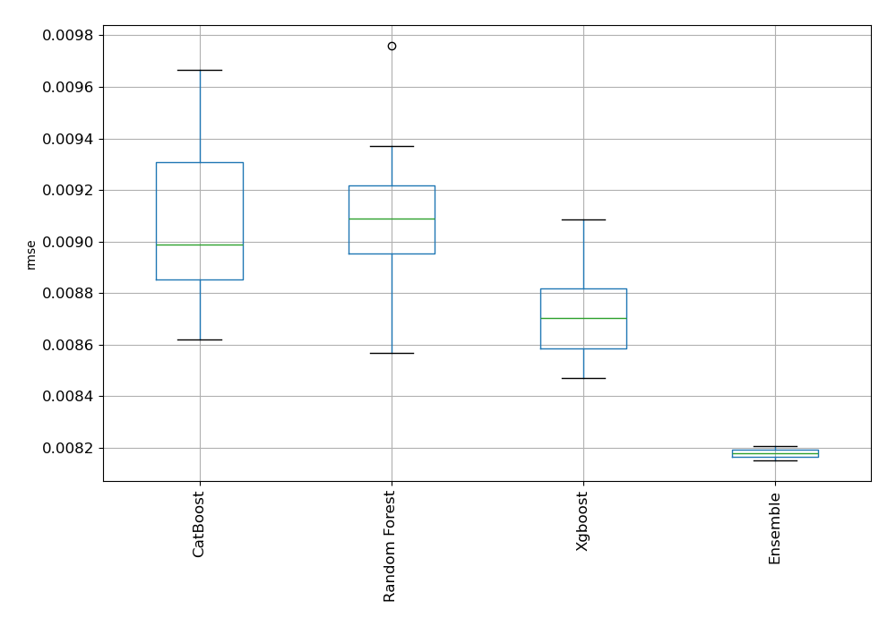
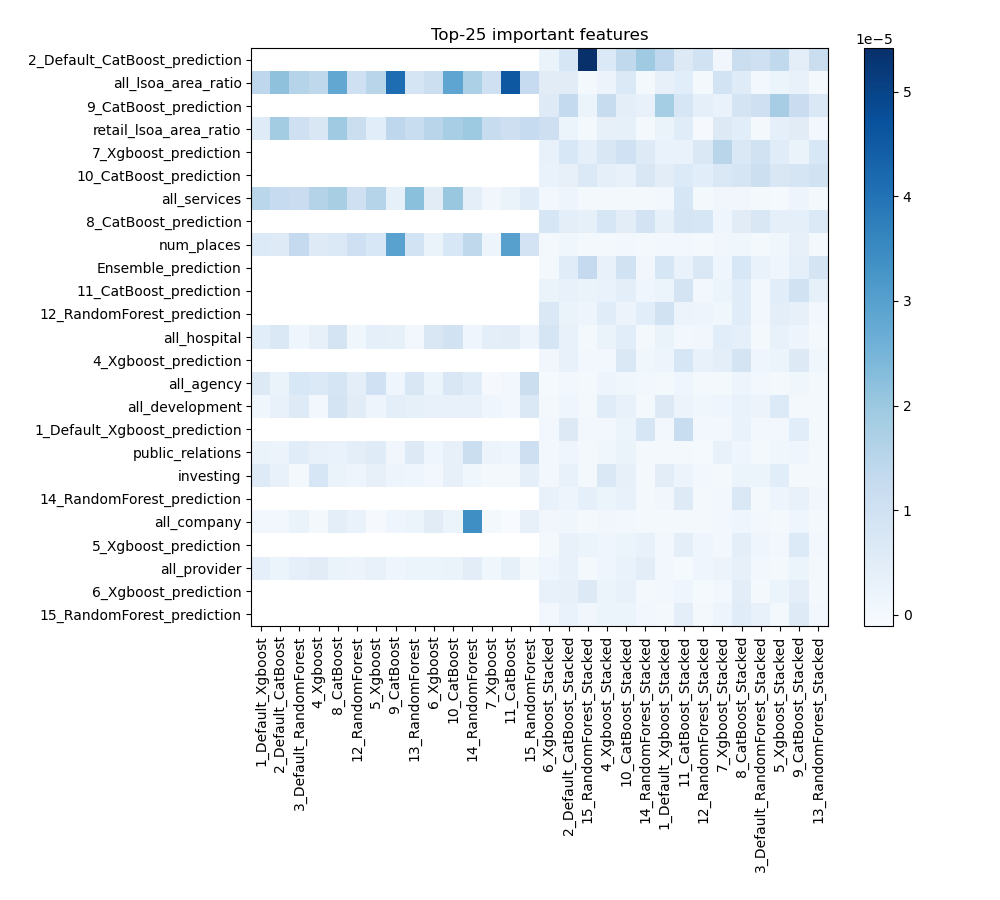
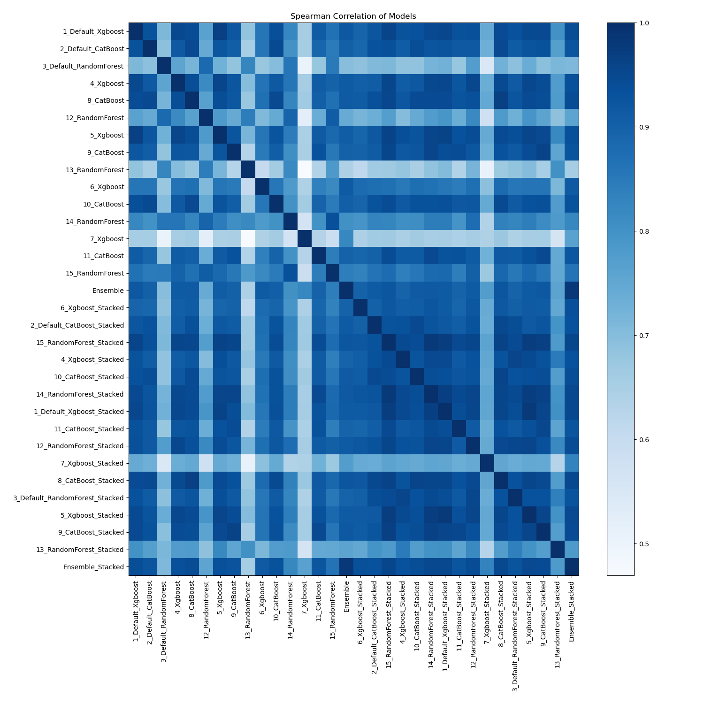

# AutoML Leaderboard

| Best model   | name                                                                       | model_type    | metric_type   |   metric_value |   train_time |
|:-------------|:---------------------------------------------------------------------------|:--------------|:--------------|---------------:|-------------:|
|              | [1_Default_Xgboost](1_Default_Xgboost/README.md)                           | Xgboost       | rmse          |     0.00870967 |        49.09 |
|              | [2_Default_CatBoost](2_Default_CatBoost/README.md)                         | CatBoost      | rmse          |     0.00861916 |       305.15 |
|              | [3_Default_RandomForest](3_Default_RandomForest/README.md)                 | Random Forest | rmse          |     0.00936912 |      1057.72 |
|              | [4_Xgboost](4_Xgboost/README.md)                                           | Xgboost       | rmse          |     0.00869388 |        39.95 |
|              | [8_CatBoost](8_CatBoost/README.md)                                         | CatBoost      | rmse          |     0.00912541 |       704.27 |
|              | [12_RandomForest](12_RandomForest/README.md)                               | Random Forest | rmse          |     0.00909813 |        46.19 |
|              | [5_Xgboost](5_Xgboost/README.md)                                           | Xgboost       | rmse          |     0.00908535 |        65.3  |
|              | [9_CatBoost](9_CatBoost/README.md)                                         | CatBoost      | rmse          |     0.00939604 |        69.74 |
|              | [13_RandomForest](13_RandomForest/README.md)                               | Random Forest | rmse          |     0.00976009 |        57.48 |
|              | [6_Xgboost](6_Xgboost/README.md)                                           | Xgboost       | rmse          |     0.00850743 |        37.98 |
|              | [10_CatBoost](10_CatBoost/README.md)                                       | CatBoost      | rmse          |     0.00885779 |        61.26 |
|              | [14_RandomForest](14_RandomForest/README.md)                               | Random Forest | rmse          |     0.00908164 |       144.03 |
|              | [7_Xgboost](7_Xgboost/README.md)                                           | Xgboost       | rmse          |     0.00884278 |        41.86 |
|              | [11_CatBoost](11_CatBoost/README.md)                                       | CatBoost      | rmse          |     0.0088594  |        54.87 |
|              | [15_RandomForest](15_RandomForest/README.md)                               | Random Forest | rmse          |     0.00892692 |       497.45 |
|              | [Ensemble](Ensemble/README.md)                                             | Ensemble      | rmse          |     0.00820559 |         0.18 |
|              | [6_Xgboost_Stacked](6_Xgboost_Stacked/README.md)                           | Xgboost       | rmse          |     0.00846859 |        41.14 |
|              | [2_Default_CatBoost_Stacked](2_Default_CatBoost_Stacked/README.md)         | CatBoost      | rmse          |     0.00884879 |        54.12 |
|              | [15_RandomForest_Stacked](15_RandomForest_Stacked/README.md)               | Random Forest | rmse          |     0.00903088 |        81.72 |
|              | [4_Xgboost_Stacked](4_Xgboost_Stacked/README.md)                           | Xgboost       | rmse          |     0.0085625  |       199.35 |
|              | [10_CatBoost_Stacked](10_CatBoost_Stacked/README.md)                       | CatBoost      | rmse          |     0.00883919 |        95.43 |
|              | [14_RandomForest_Stacked](14_RandomForest_Stacked/README.md)               | Random Forest | rmse          |     0.00912543 |        62.24 |
|              | [1_Default_Xgboost_Stacked](1_Default_Xgboost_Stacked/README.md)           | Xgboost       | rmse          |     0.00865062 |       117.13 |
|              | [11_CatBoost_Stacked](11_CatBoost_Stacked/README.md)                       | CatBoost      | rmse          |     0.00966729 |       998.91 |
|              | [12_RandomForest_Stacked](12_RandomForest_Stacked/README.md)               | Random Forest | rmse          |     0.00856609 |        59.61 |
|              | [7_Xgboost_Stacked](7_Xgboost_Stacked/README.md)                           | Xgboost       | rmse          |     0.00876039 |        45.92 |
|              | [8_CatBoost_Stacked](8_CatBoost_Stacked/README.md)                         | CatBoost      | rmse          |     0.0091165  |       296.37 |
|              | [3_Default_RandomForest_Stacked](3_Default_RandomForest_Stacked/README.md) | Random Forest | rmse          |     0.00880531 |        58.4  |
|              | [5_Xgboost_Stacked](5_Xgboost_Stacked/README.md)                           | Xgboost       | rmse          |     0.00883848 |        41.68 |
|              | [9_CatBoost_Stacked](9_CatBoost_Stacked/README.md)                         | CatBoost      | rmse          |     0.00936812 |      1054.05 |
|              | [13_RandomForest_Stacked](13_RandomForest_Stacked/README.md)               | Random Forest | rmse          |     0.00924817 |        57.24 |
| **the best** | [Ensemble_Stacked](Ensemble_Stacked/README.md)                             | Ensemble      | rmse          |     0.00814981 |         0.54 |

### AutoML Performance

### AutoML Performance Boxplot

### Features Importance

### Spearman Correlation of Models

