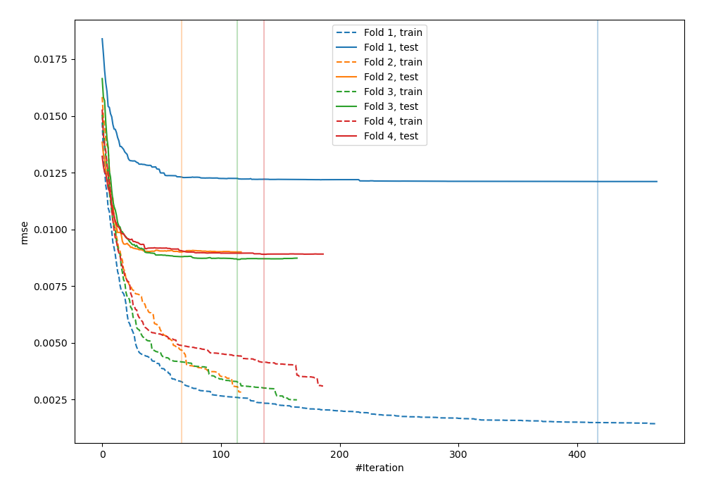
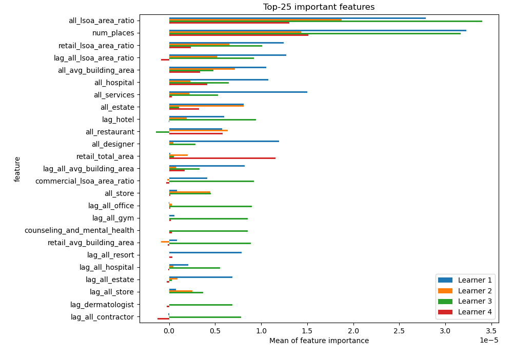
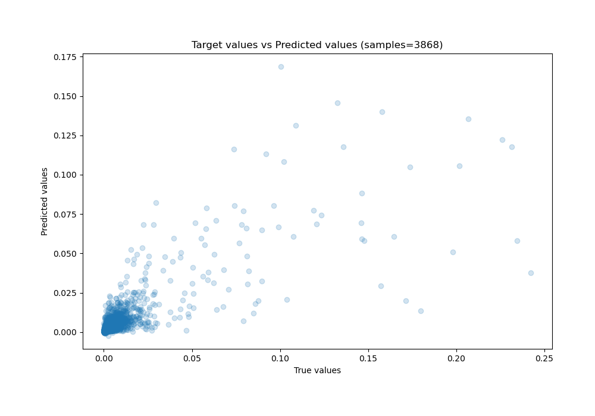
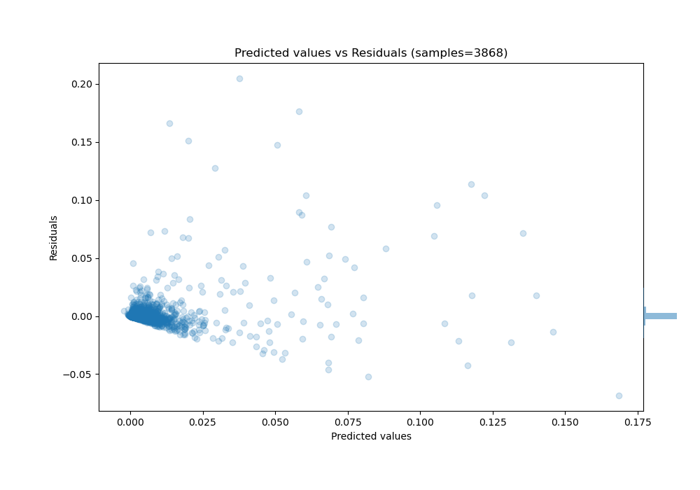

# Summary of 11_CatBoost

[<< Go back](../README.md)

## CatBoost
- **n_jobs**: -1
- **learning_rate**: 0.2
- **depth**: 8
- **rsm**: 1.0
- **loss_function**: MAE
- **eval_metric**: RMSE
- **explain_level**: 1

## Validation
 - **validation_type**: kfold
 - **k_folds**: 4
 - **shuffle**: False

## Optimized metric
rmse

## Training time

249.8 seconds

### Metric details:
| Metric   |       Score |
|:---------|------------:|
| MAE      | 0.00248773  |
| MSE      | 9.55006e-05 |
| RMSE     | 0.00977244  |
| R2       | 0.616873    |
| MAPE     | 8.81855e+09 |

## Learning curves

## Permutation-based Importance

## True vs Predicted

## Predicted vs Residuals

[<< Go back](../README.md)
