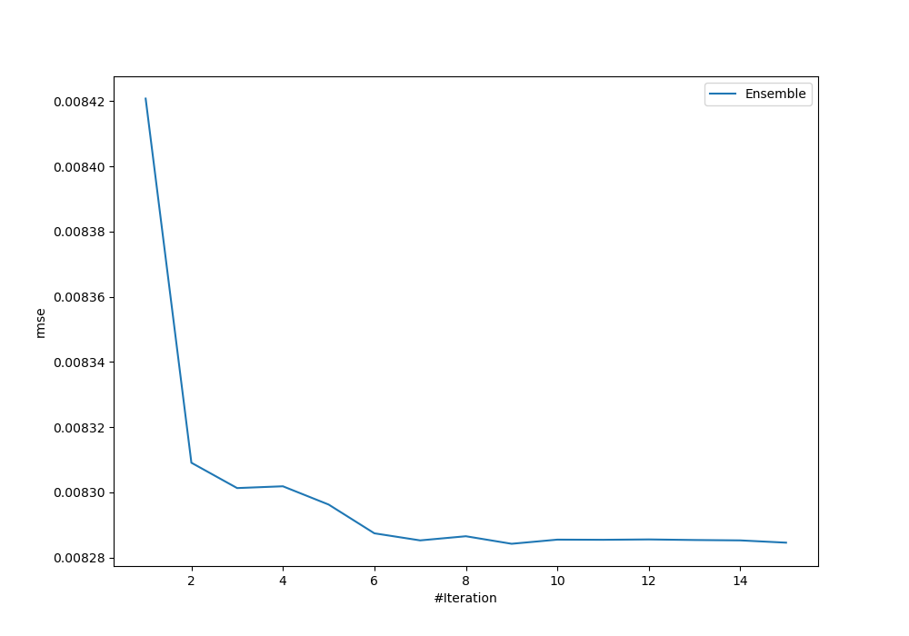
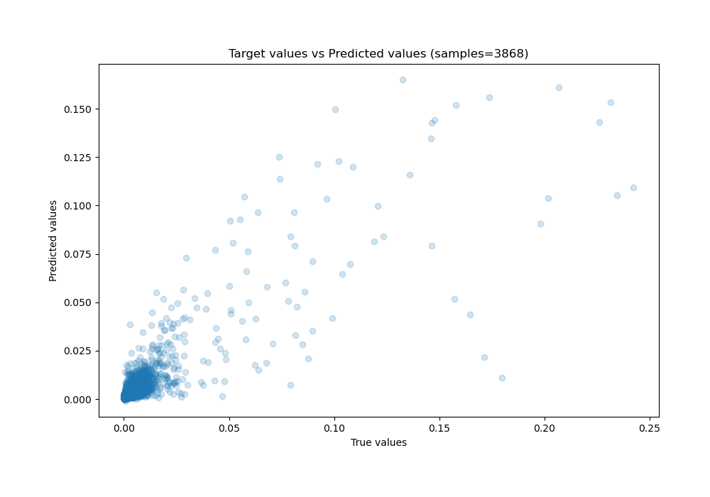
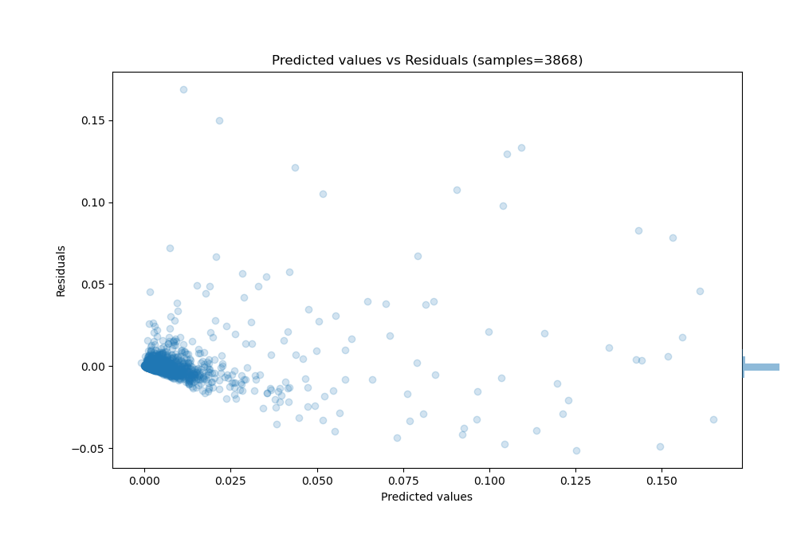

# Summary of Ensemble

[<< Go back](../README.md)

## Ensemble structure
| Model     |   Weight |
|:----------|---------:|
| 4_Xgboost |        5 |
| 6_Xgboost |        3 |
| 7_Xgboost |        1 |

### Metric details:
| Metric   |       Score |
|:---------|------------:|
| MAE      | 0.00236838  |
| MSE      | 6.86288e-05 |
| RMSE     | 0.00828425  |
| R2       | 0.724677    |
| MAPE     | 5.17586e+09 |

## Learning curves

## True vs Predicted

## Predicted vs Residuals

[<< Go back](../README.md)
