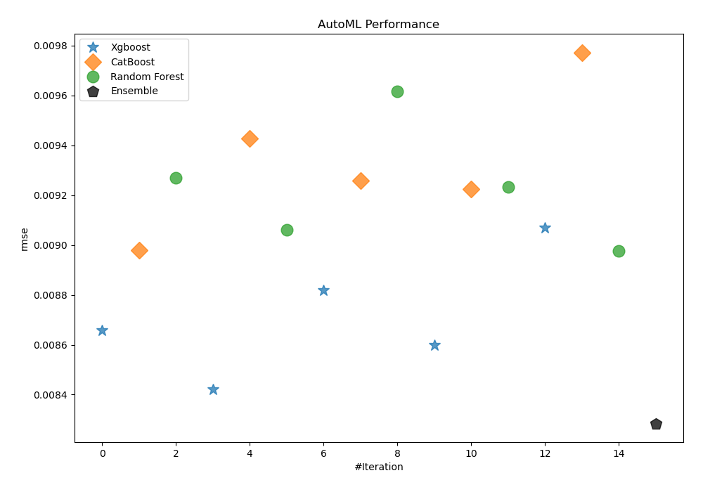
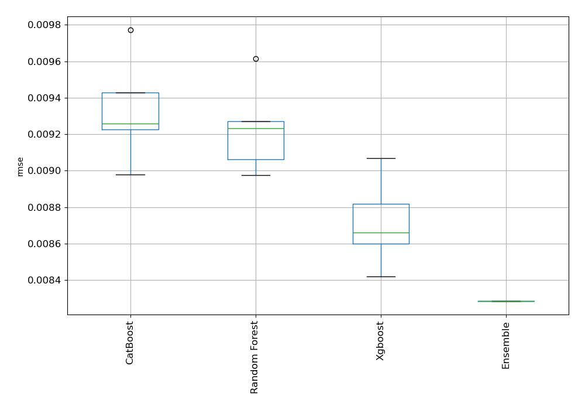
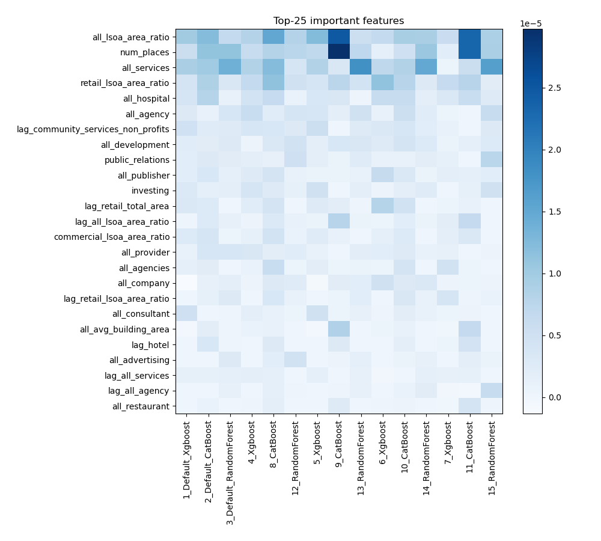
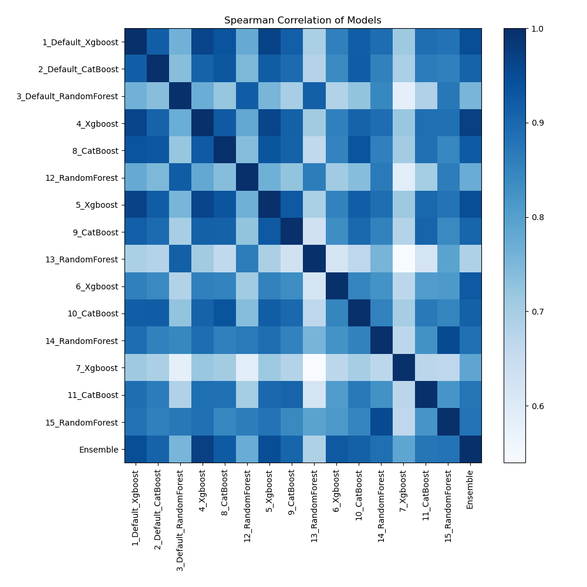

# AutoML Leaderboard

| Best model   | name                                                       | model_type    | metric_type   |   metric_value |   train_time |
|:-------------|:-----------------------------------------------------------|:--------------|:--------------|---------------:|-------------:|
|              | [1_Default_Xgboost](1_Default_Xgboost/README.md)           | Xgboost       | rmse          |     0.00865891 |       199.1  |
|              | [2_Default_CatBoost](2_Default_CatBoost/README.md)         | CatBoost      | rmse          |     0.00897866 |       310.93 |
|              | [3_Default_RandomForest](3_Default_RandomForest/README.md) | Random Forest | rmse          |     0.00927026 |       434.77 |
|              | [4_Xgboost](4_Xgboost/README.md)                           | Xgboost       | rmse          |     0.00842079 |       146.49 |
|              | [8_CatBoost](8_CatBoost/README.md)                         | CatBoost      | rmse          |     0.00942859 |       345.83 |
|              | [12_RandomForest](12_RandomForest/README.md)               | Random Forest | rmse          |     0.00906183 |       427.85 |
|              | [5_Xgboost](5_Xgboost/README.md)                           | Xgboost       | rmse          |     0.00881883 |       161.08 |
|              | [9_CatBoost](9_CatBoost/README.md)                         | CatBoost      | rmse          |     0.00925888 |       445.89 |
|              | [13_RandomForest](13_RandomForest/README.md)               | Random Forest | rmse          |     0.00961618 |       287.32 |
|              | [6_Xgboost](6_Xgboost/README.md)                           | Xgboost       | rmse          |     0.00859883 |      1020.23 |
|              | [10_CatBoost](10_CatBoost/README.md)                       | CatBoost      | rmse          |     0.00922556 |      1420.71 |
|              | [14_RandomForest](14_RandomForest/README.md)               | Random Forest | rmse          |     0.00923181 |       144.74 |
|              | [7_Xgboost](7_Xgboost/README.md)                           | Xgboost       | rmse          |     0.00906889 |       158.1  |
|              | [11_CatBoost](11_CatBoost/README.md)                       | CatBoost      | rmse          |     0.00977244 |       250.09 |
|              | [15_RandomForest](15_RandomForest/README.md)               | Random Forest | rmse          |     0.00897558 |       152.32 |
| **the best** | [Ensemble](Ensemble/README.md)                             | Ensemble      | rmse          |     0.00828425 |         0.16 |

### AutoML Performance

### AutoML Performance Boxplot

### Features Importance

### Spearman Correlation of Models

