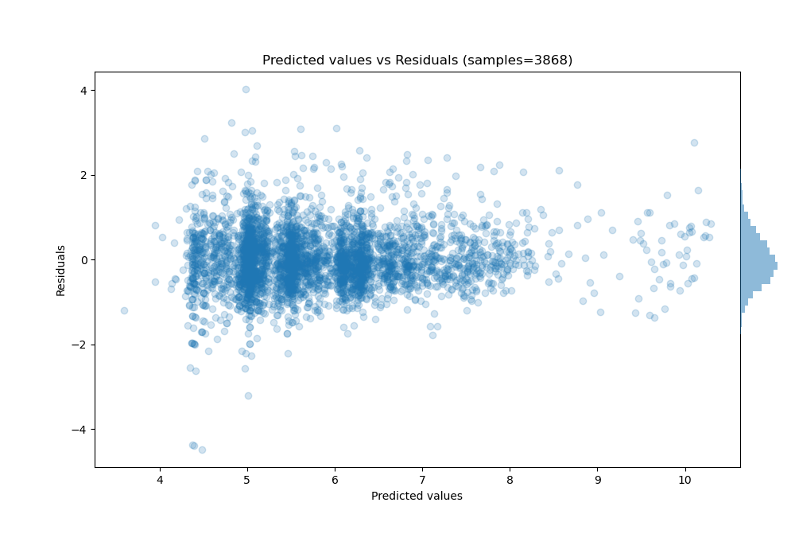

# Summary of 3_Default_RandomForest

[<< Go back](../README.md)

## Random Forest
- **n_jobs**: -1
- **criterion**: squared_error
- **max_features**: 0.9
- **min_samples_split**: 30
- **max_depth**: 4
- **eval_metric_name**: rmse
- **explain_level**: 1

## Validation
 - **validation_type**: kfold
 - **k_folds**: 4
 - **shuffle**: False

## Optimized metric
rmse

## Training time

405.9 seconds

### Metric details:
| Metric   |      Score |
|:---------|-----------:|
| MAE      | 0.517897   |
| MSE      | 0.479464   |
| RMSE     | 0.692433   |
| R2       | 0.700645   |
| MAPE     | 1.1511e+13 |

## Learning curves

## Permutation-based Importance

## True vs Predicted

## Predicted vs Residuals

[<< Go back](../README.md)
