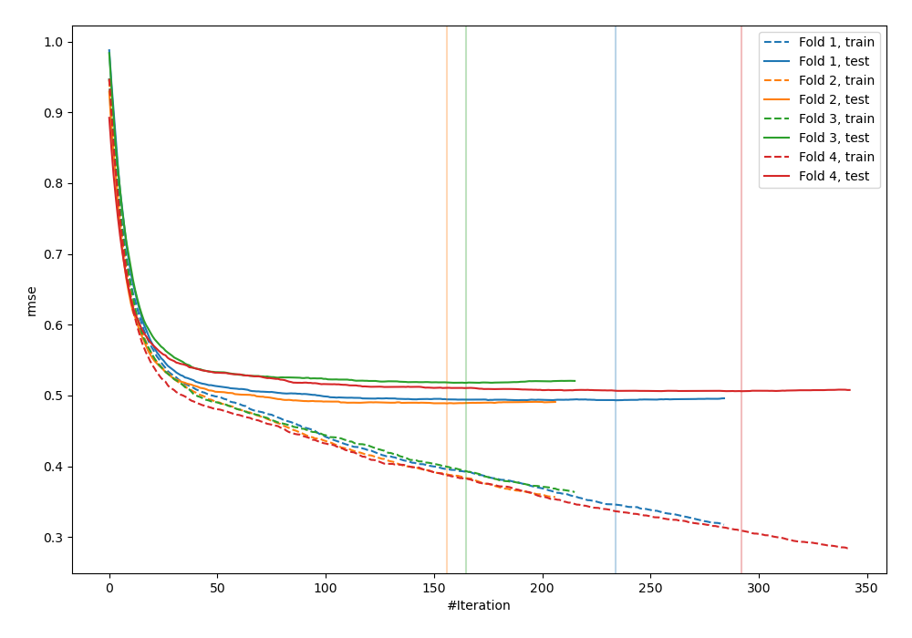
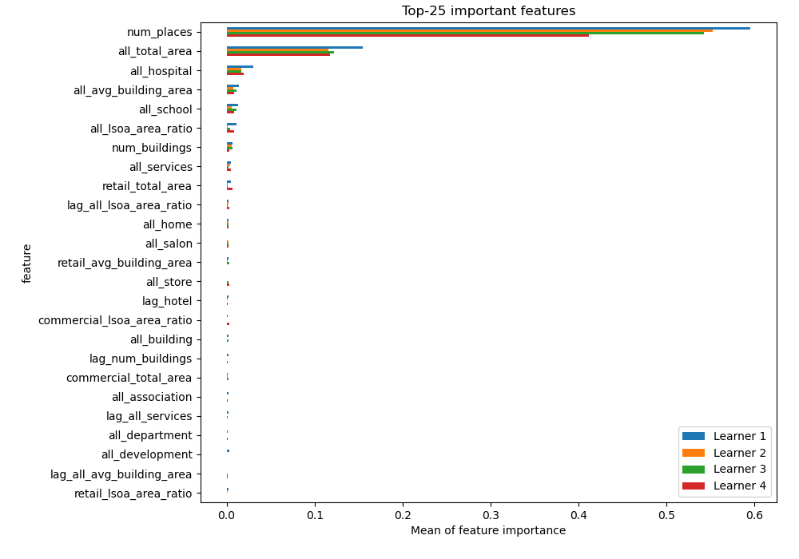
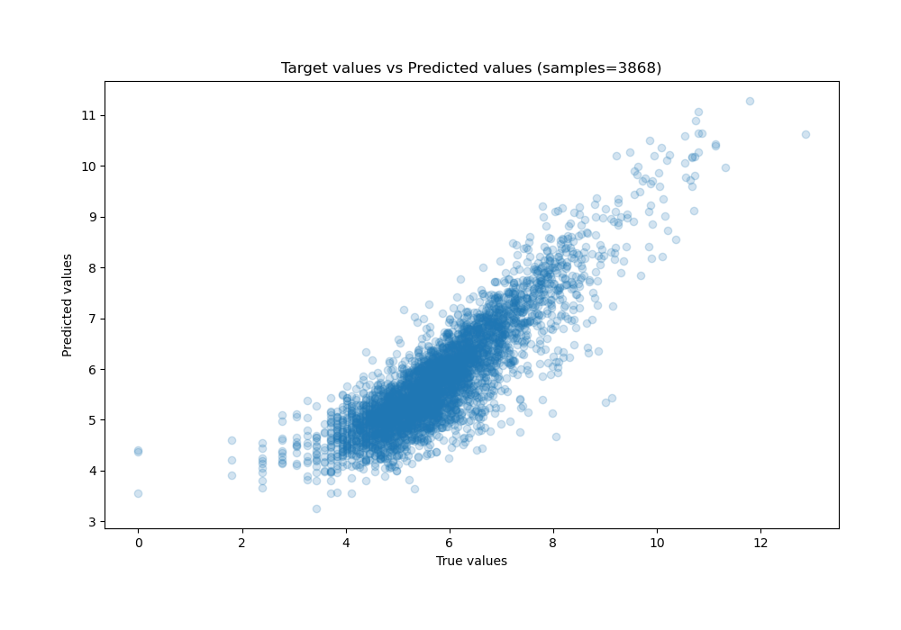
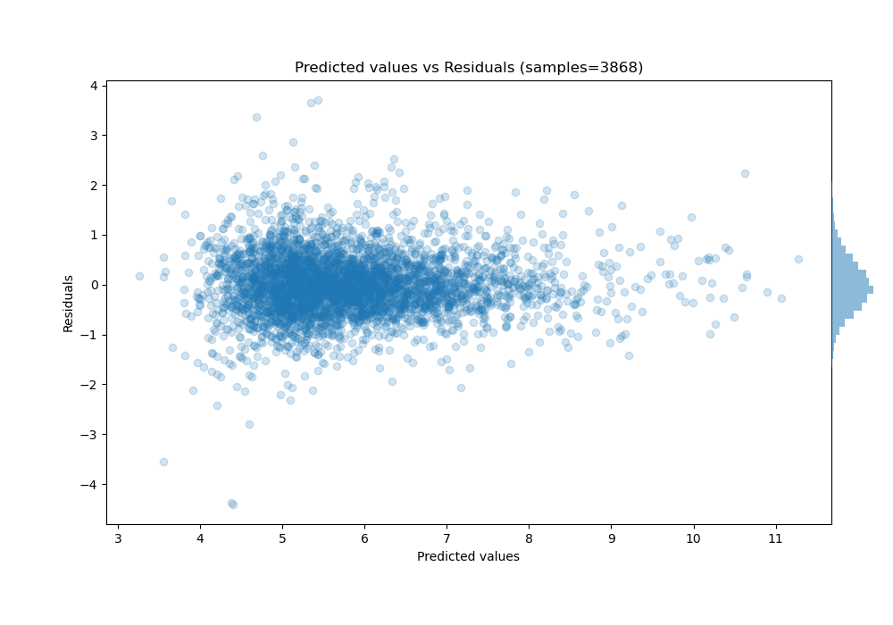

# Summary of 4_CatBoost

[<< Go back](../README.md)

## CatBoost
- **n_jobs**: -1
- **learning_rate**: 0.1
- **depth**: 6
- **rsm**: 0.9
- **loss_function**: RMSE
- **eval_metric**: RMSE
- **explain_level**: 1

## Validation
 - **validation_type**: kfold
 - **k_folds**: 4
 - **shuffle**: False

## Optimized metric
rmse

## Training time

1320.5 seconds

### Metric details:
| Metric   |       Score |
|:---------|------------:|
| MAE      | 0.473113    |
| MSE      | 0.40294     |
| RMSE     | 0.634776    |
| R2       | 0.748423    |
| MAPE     | 1.05414e+13 |

## Learning curves

## Permutation-based Importance

## True vs Predicted

## Predicted vs Residuals

[<< Go back](../README.md)
