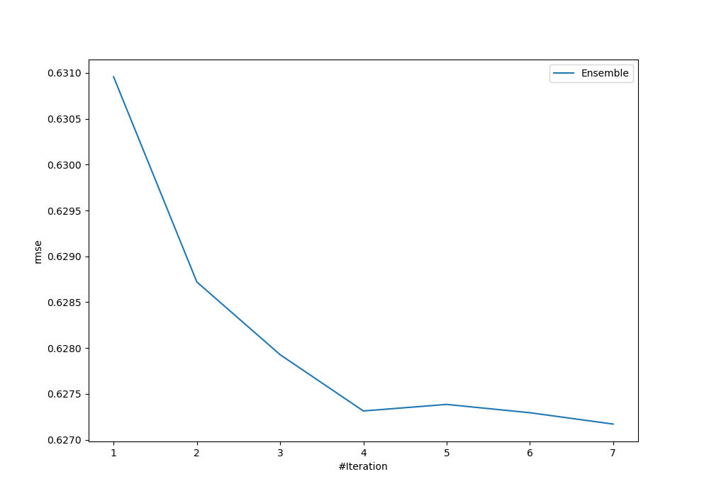
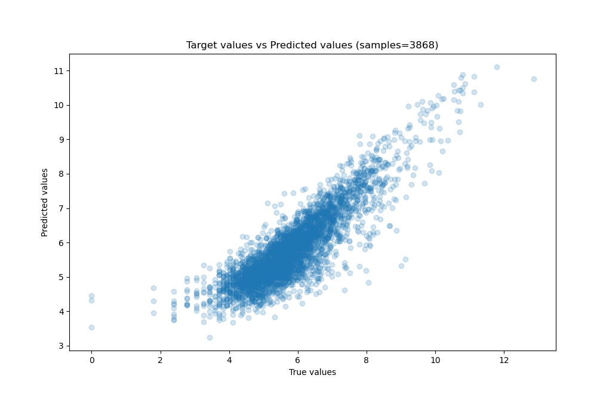
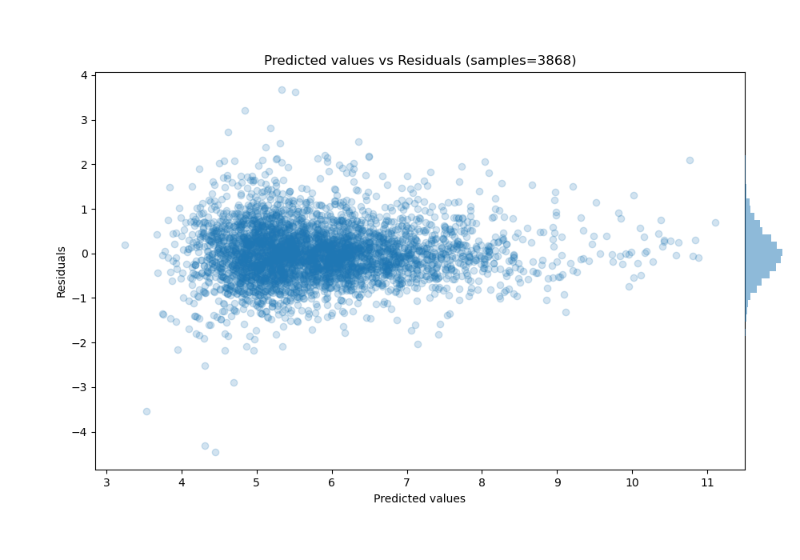

# Summary of Ensemble

[<< Go back](../README.md)

## Ensemble structure
| Model              |   Weight |
|:-------------------|---------:|
| 1_Default_Xgboost  |        1 |
| 2_Default_CatBoost |        3 |
| 4_CatBoost         |        2 |
| 5_Xgboost          |        1 |

### Metric details:
| Metric   |       Score |
|:---------|------------:|
| MAE      | 0.464857    |
| MSE      | 0.393344    |
| RMSE     | 0.627171    |
| R2       | 0.754414    |
| MAPE     | 1.04324e+13 |

## Learning curves

## True vs Predicted

## Predicted vs Residuals

[<< Go back](../README.md)
