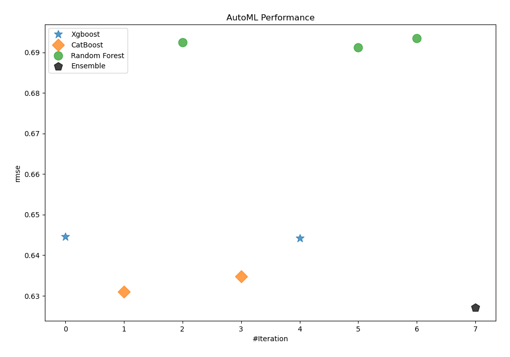
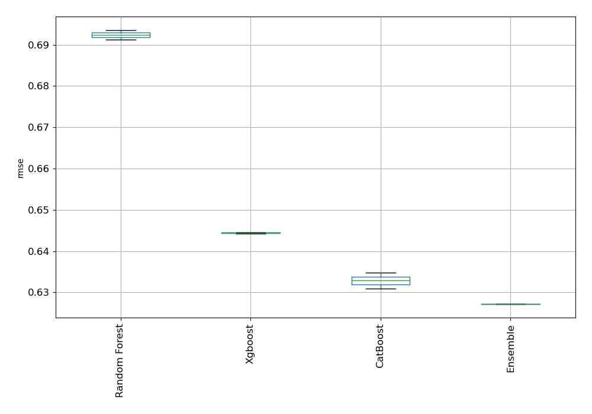
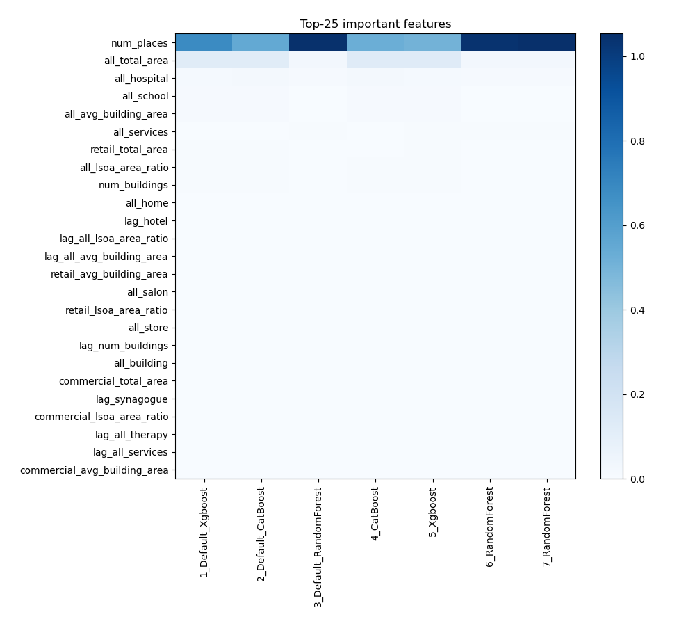
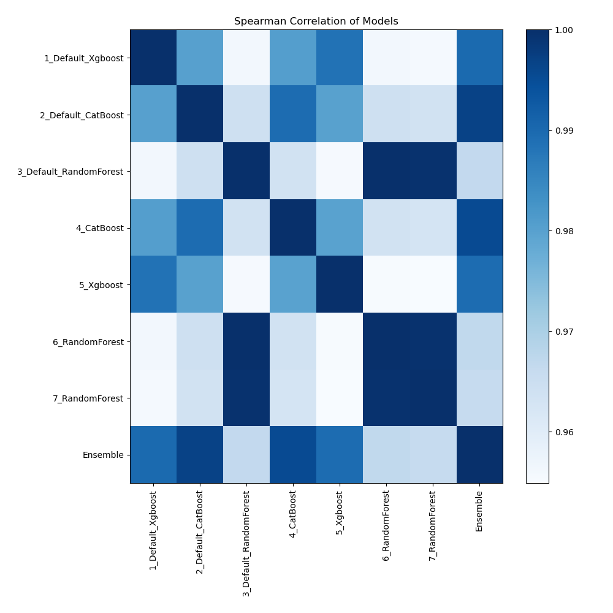

# AutoML Leaderboard

| Best model   | name                                                       | model_type    | metric_type   |   metric_value |   train_time |
|:-------------|:-----------------------------------------------------------|:--------------|:--------------|---------------:|-------------:|
|              | [1_Default_Xgboost](1_Default_Xgboost/README.md)           | Xgboost       | rmse          |       0.644563 |       437.49 |
|              | [2_Default_CatBoost](2_Default_CatBoost/README.md)         | CatBoost      | rmse          |       0.630957 |      1403.35 |
|              | [3_Default_RandomForest](3_Default_RandomForest/README.md) | Random Forest | rmse          |       0.692433 |       406.17 |
|              | [4_CatBoost](4_CatBoost/README.md)                         | CatBoost      | rmse          |       0.634776 |      1320.78 |
|              | [5_Xgboost](5_Xgboost/README.md)                           | Xgboost       | rmse          |       0.644257 |       197.65 |
|              | [6_RandomForest](6_RandomForest/README.md)                 | Random Forest | rmse          |       0.691184 |       280.59 |
|              | [7_RandomForest](7_RandomForest/README.md)                 | Random Forest | rmse          |       0.693548 |      1087.31 |
| **the best** | [Ensemble](Ensemble/README.md)                             | Ensemble      | rmse          |       0.627171 |         0.08 |

### AutoML Performance

### AutoML Performance Boxplot

### Features Importance

### Spearman Correlation of Models

