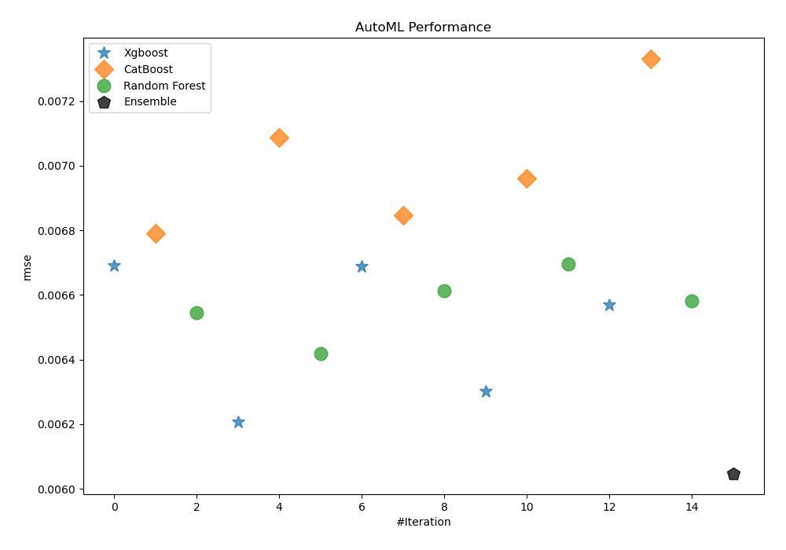
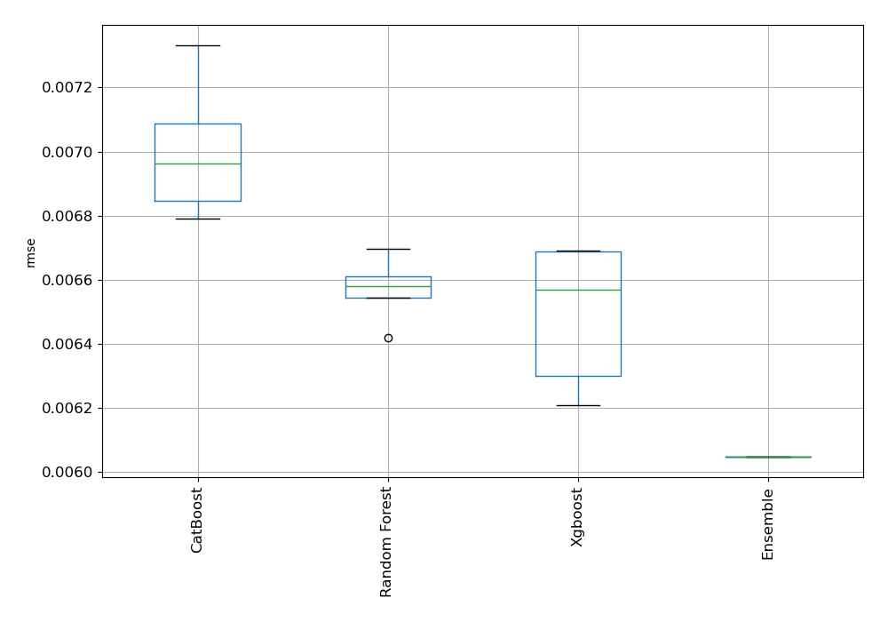
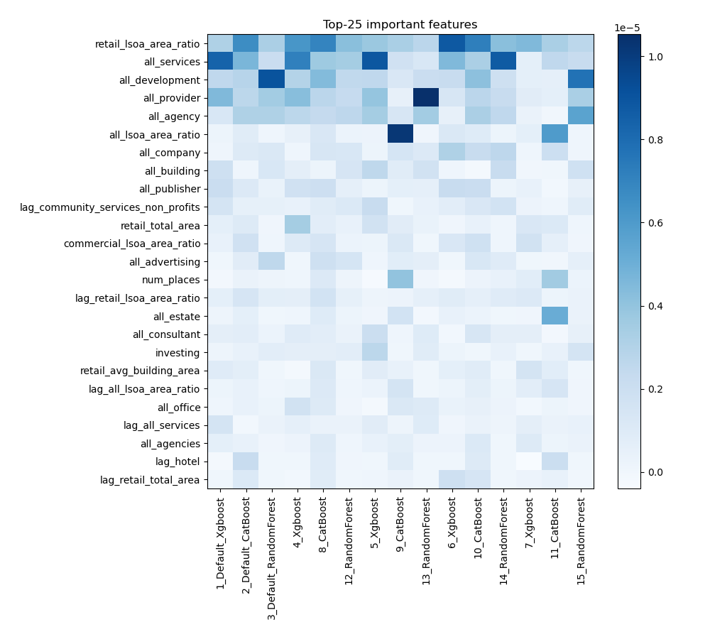
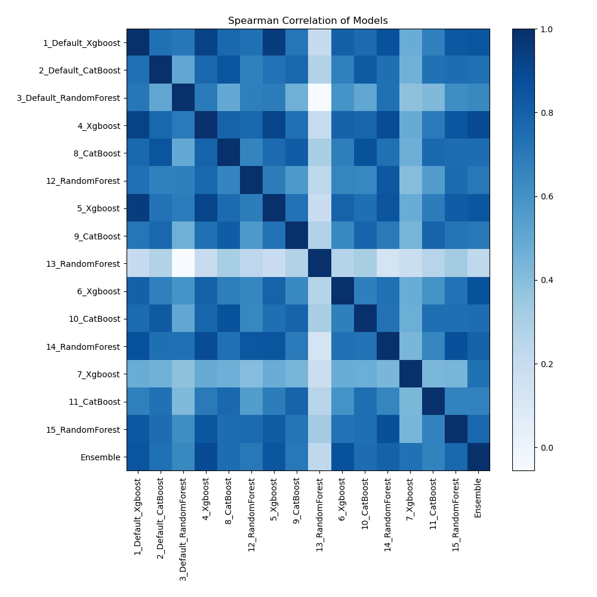

# AutoML Leaderboard

| Best model   | name                                                       | model_type    | metric_type   |   metric_value |   train_time |
|:-------------|:-----------------------------------------------------------|:--------------|:--------------|---------------:|-------------:|
|              | [1_Default_Xgboost](1_Default_Xgboost/README.md)           | Xgboost       | rmse          |     0.00669091 |       163.21 |
|              | [2_Default_CatBoost](2_Default_CatBoost/README.md)         | CatBoost      | rmse          |     0.00679132 |       240.63 |
|              | [3_Default_RandomForest](3_Default_RandomForest/README.md) | Random Forest | rmse          |     0.00654373 |       163.87 |
|              | [4_Xgboost](4_Xgboost/README.md)                           | Xgboost       | rmse          |     0.00620754 |       181.68 |
|              | [8_CatBoost](8_CatBoost/README.md)                         | CatBoost      | rmse          |     0.00708605 |       349.87 |
|              | [12_RandomForest](12_RandomForest/README.md)               | Random Forest | rmse          |     0.00641859 |       198.84 |
|              | [5_Xgboost](5_Xgboost/README.md)                           | Xgboost       | rmse          |     0.00668749 |       706.14 |
|              | [9_CatBoost](9_CatBoost/README.md)                         | CatBoost      | rmse          |     0.00684595 |       516.48 |
|              | [13_RandomForest](13_RandomForest/README.md)               | Random Forest | rmse          |     0.00661186 |       270.79 |
|              | [6_Xgboost](6_Xgboost/README.md)                           | Xgboost       | rmse          |     0.00630097 |       154.8  |
|              | [10_CatBoost](10_CatBoost/README.md)                       | CatBoost      | rmse          |     0.00696159 |       254.14 |
|              | [14_RandomForest](14_RandomForest/README.md)               | Random Forest | rmse          |     0.0066965  |       175.14 |
|              | [7_Xgboost](7_Xgboost/README.md)                           | Xgboost       | rmse          |     0.00656932 |       174.94 |
|              | [11_CatBoost](11_CatBoost/README.md)                       | CatBoost      | rmse          |     0.00733151 |       300.62 |
|              | [15_RandomForest](15_RandomForest/README.md)               | Random Forest | rmse          |     0.00658087 |       143.56 |
| **the best** | [Ensemble](Ensemble/README.md)                             | Ensemble      | rmse          |     0.00604751 |         0.2  |

### AutoML Performance

### AutoML Performance Boxplot

### Features Importance

### Spearman Correlation of Models

