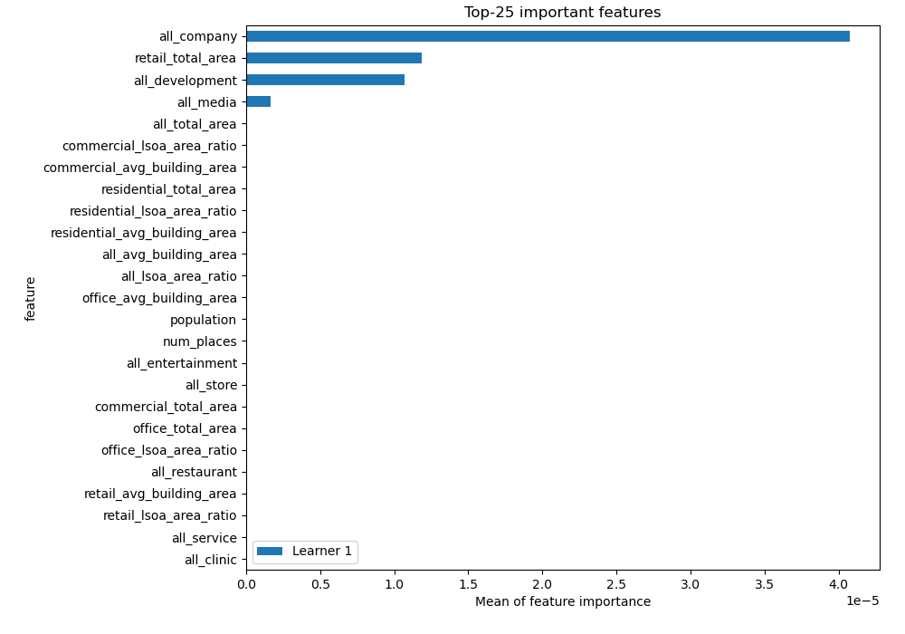

# Summary of 2_DecisionTree

[<< Go back](../README.md)

## Decision Tree
- **n_jobs**: -1
- **criterion**: squared_error
- **max_depth**: 3
- **explain_level**: 2

## Validation
 - **validation_type**: split
 - **train_ratio**: 0.75
 - **shuffle**: True

## Optimized metric
rmse

## Training time

8.1 seconds

### Metric details:
| Metric   |       Score |
|:---------|------------:|
| MAE      | 0.00199058  |
| MSE      | 5.6032e-05  |
| RMSE     | 0.00748545  |
| R2       | 0.510574    |
| MAPE     | 1.52744e+11 |

## Learning curves

## Permutation-based Importance

## True vs Predicted

## Predicted vs Residuals

[<< Go back](../README.md)
