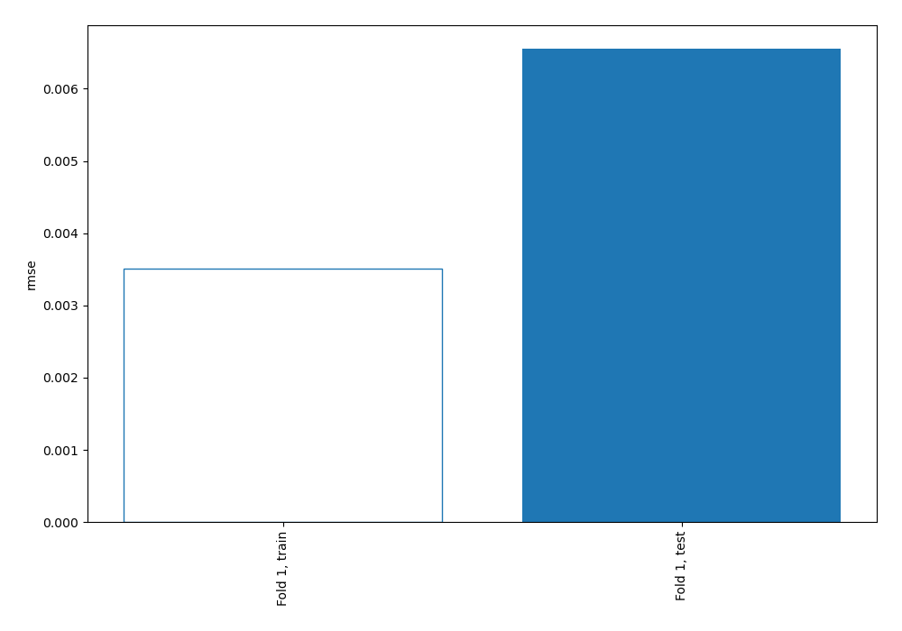
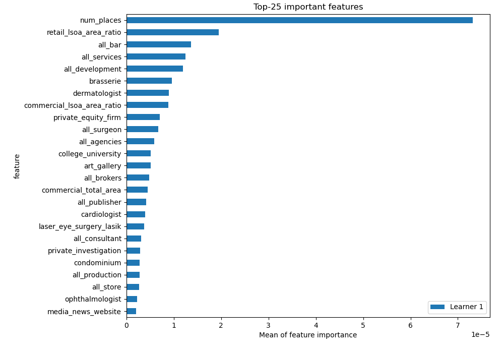
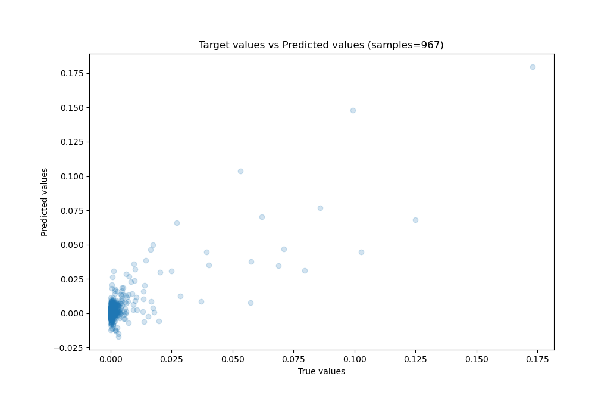
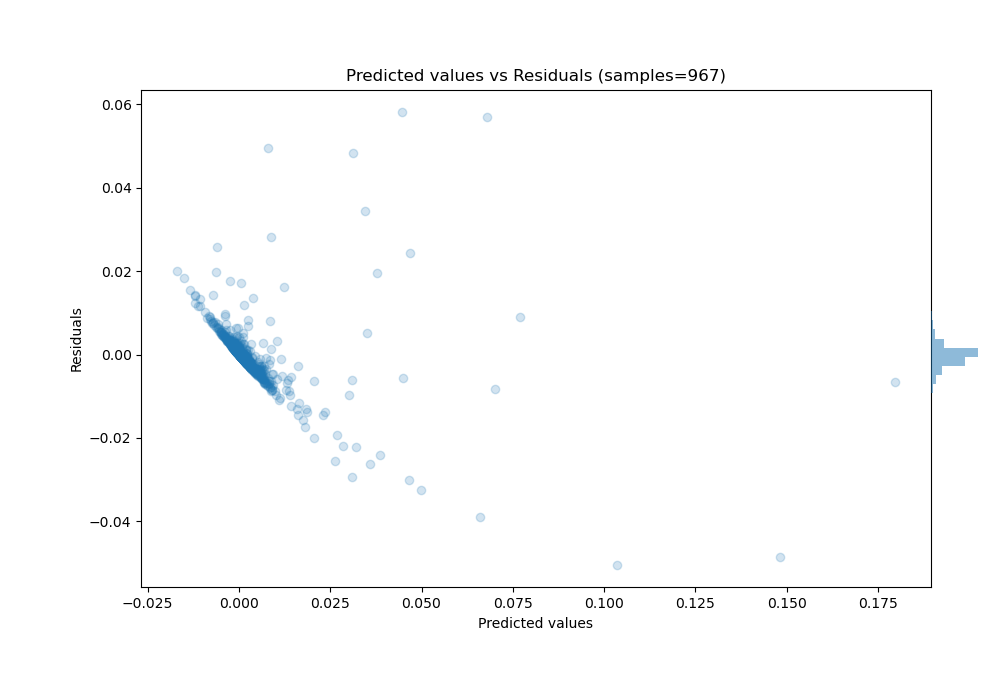

# Summary of 3_Linear

[<< Go back](../README.md)

## Linear Regression (Linear)
- **n_jobs**: -1
- **explain_level**: 2

## Validation
 - **validation_type**: split
 - **train_ratio**: 0.75
 - **shuffle**: True

## Optimized metric
rmse

## Training time

4.3 seconds

### Metric details:
| Metric   |       Score |
|:---------|------------:|
| MAE      | 0.00311724  |
| MSE      | 4.29625e-05 |
| RMSE     | 0.00655458  |
| R2       | 0.624732    |
| MAPE     | 1.47471e+11 |

## Learning curves

## Permutation-based Importance

## True vs Predicted

## Predicted vs Residuals

[<< Go back](../README.md)
