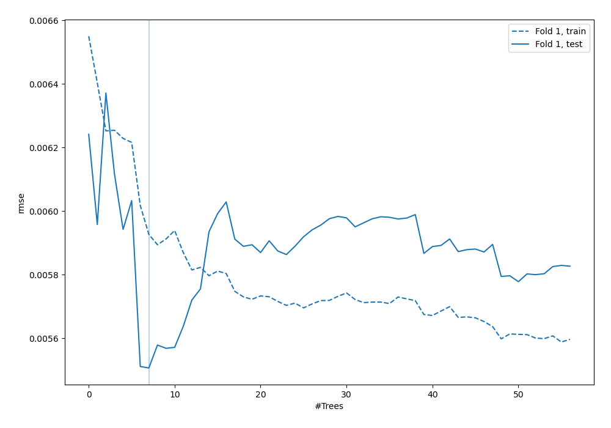
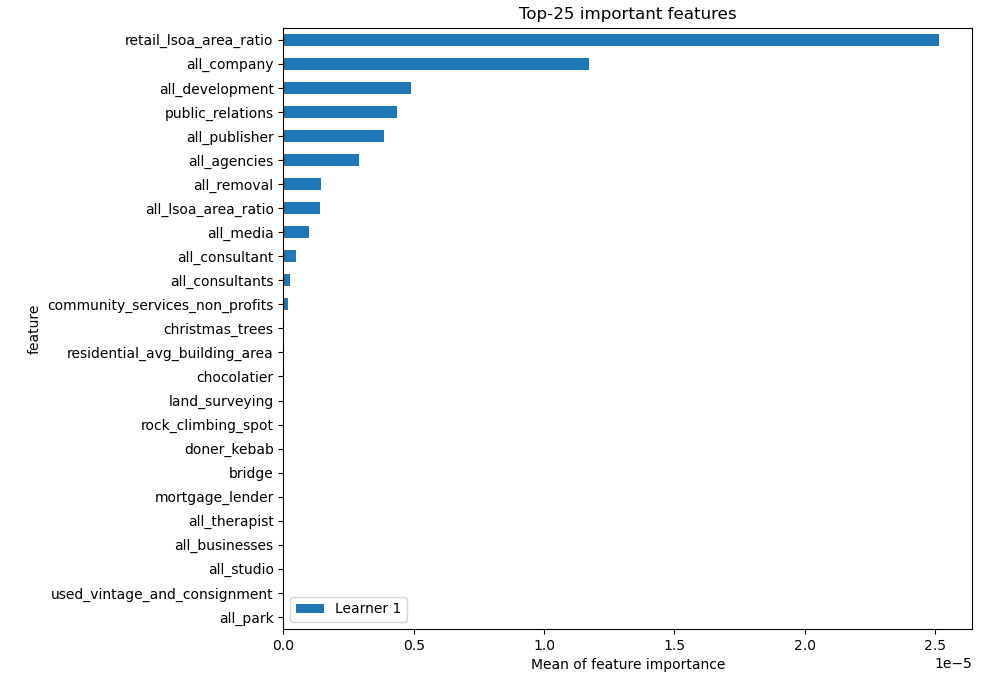
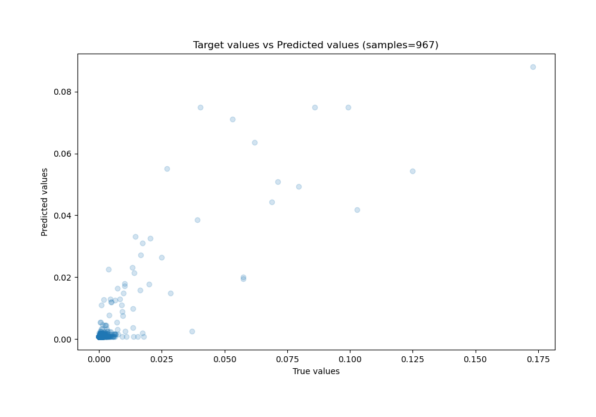
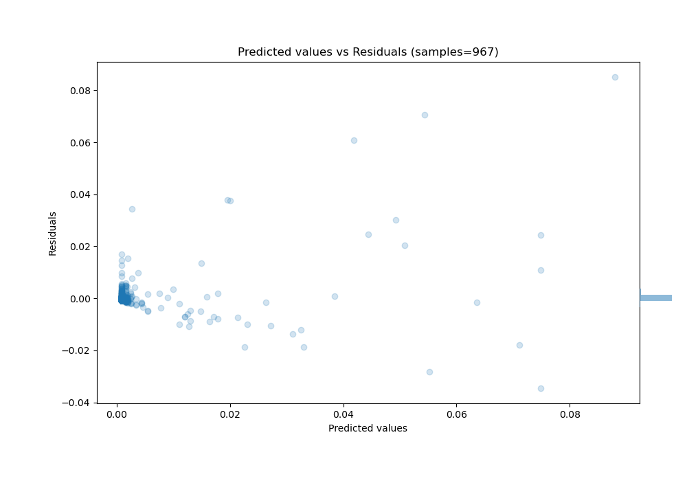

# Summary of 6_Default_RandomForest

[<< Go back](../README.md)

## Random Forest
- **n_jobs**: -1
- **criterion**: squared_error
- **max_features**: 0.9
- **min_samples_split**: 30
- **max_depth**: 4
- **eval_metric_name**: rmse
- **explain_level**: 2

## Validation
 - **validation_type**: split
 - **train_ratio**: 0.75
 - **shuffle**: True

## Optimized metric
rmse

## Training time

8.3 seconds

### Metric details:
| Metric   |       Score |
|:---------|------------:|
| MAE      | 0.00158494  |
| MSE      | 3.03167e-05 |
| RMSE     | 0.00550606  |
| R2       | 0.73519     |
| MAPE     | 1.34568e+11 |

## Learning curves

## Permutation-based Importance

## True vs Predicted

## Predicted vs Residuals

[<< Go back](../README.md)
