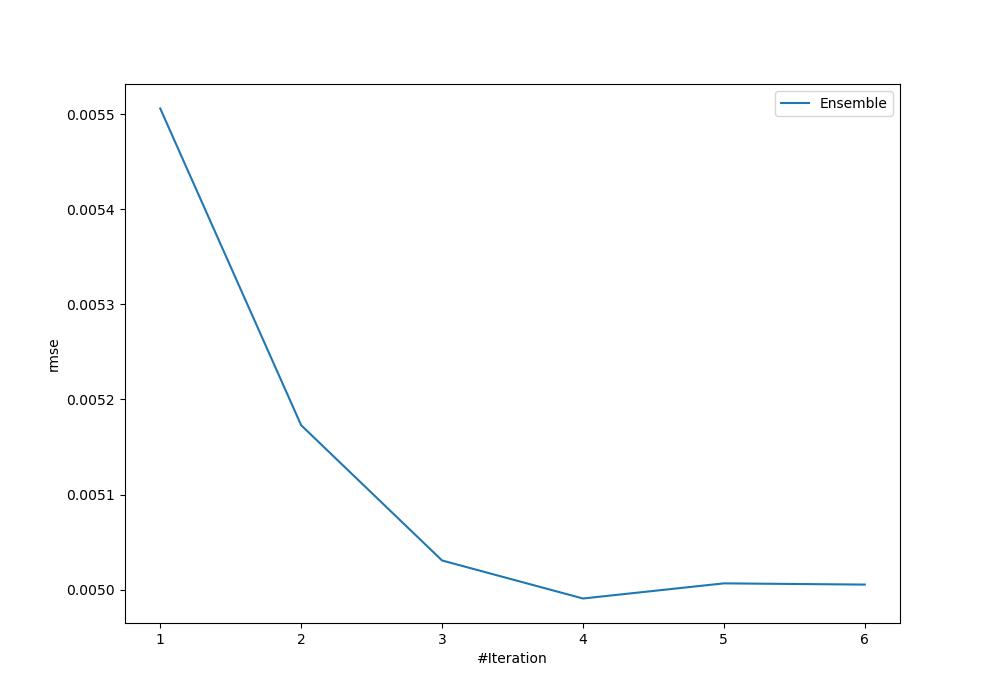
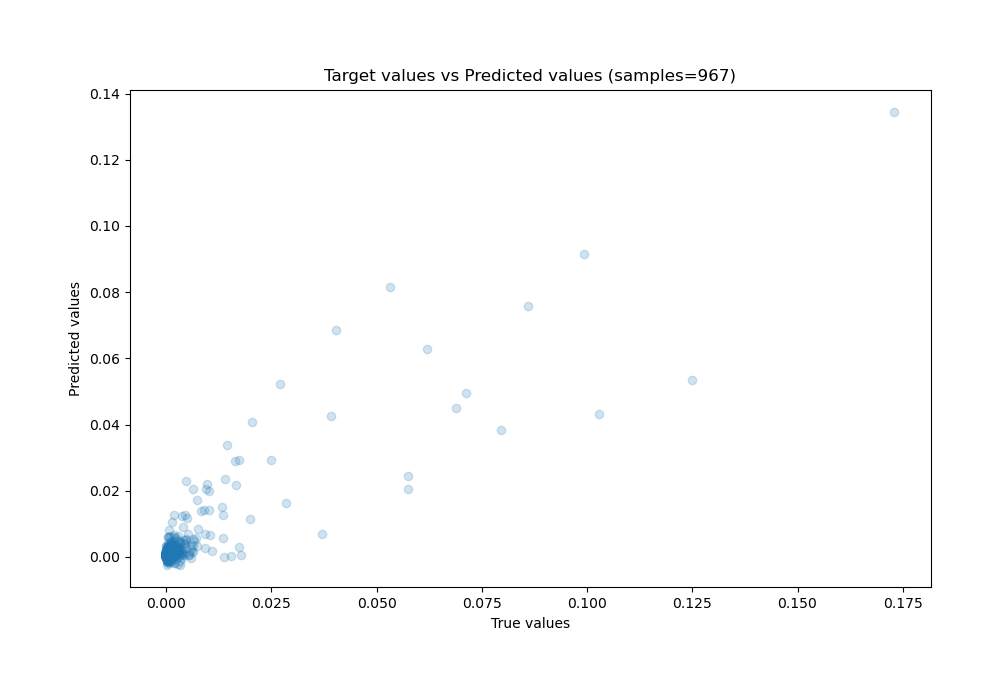
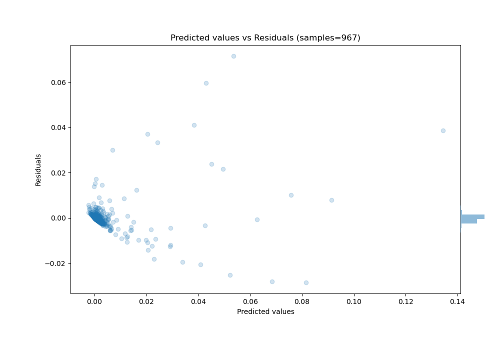

# Summary of Ensemble

[<< Go back](../README.md)

## Ensemble structure
| Model                  |   Weight |
|:-----------------------|---------:|
| 3_Linear               |        1 |
| 4_Default_Xgboost      |        1 |
| 6_Default_RandomForest |        2 |

### Metric details:
| Metric   |       Score |
|:---------|------------:|
| MAE      | 0.00159212  |
| MSE      | 2.4907e-05  |
| RMSE     | 0.00499069  |
| R2       | 0.782443    |
| MAPE     | 6.95256e+10 |

## Learning curves

## True vs Predicted

## Predicted vs Residuals

[<< Go back](../README.md)
