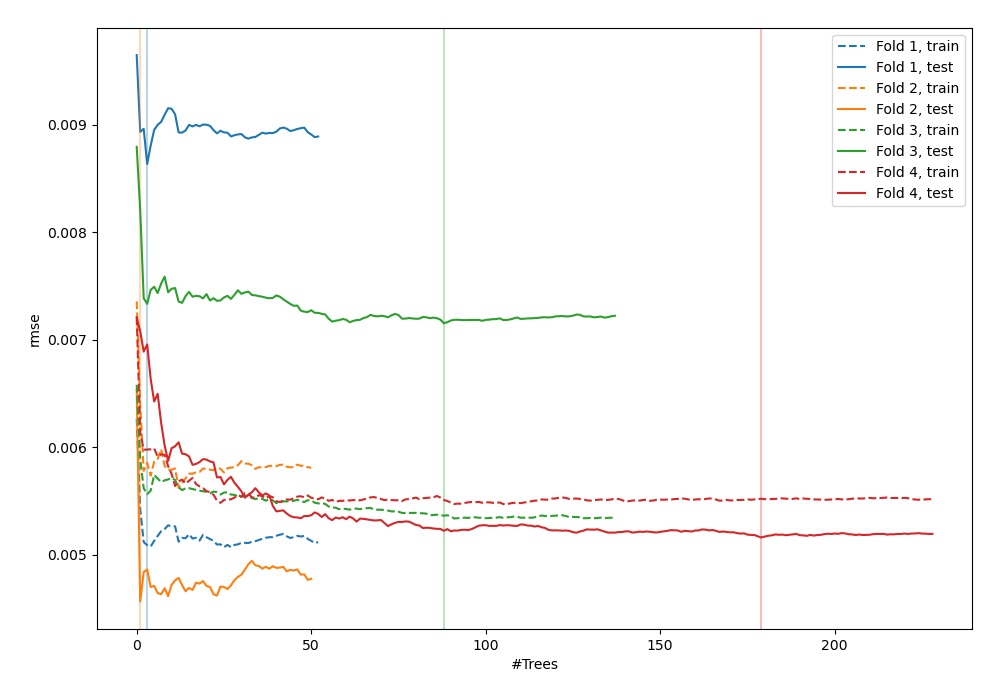
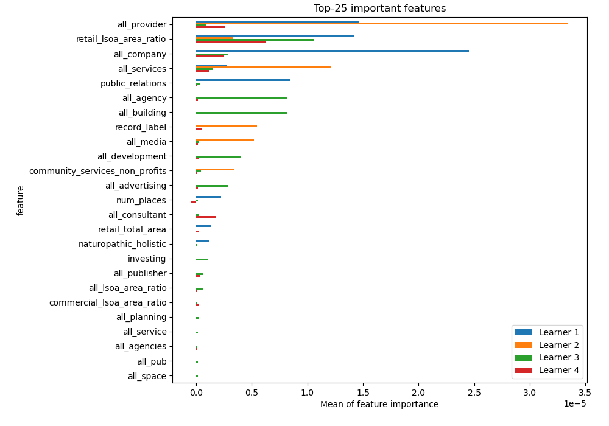
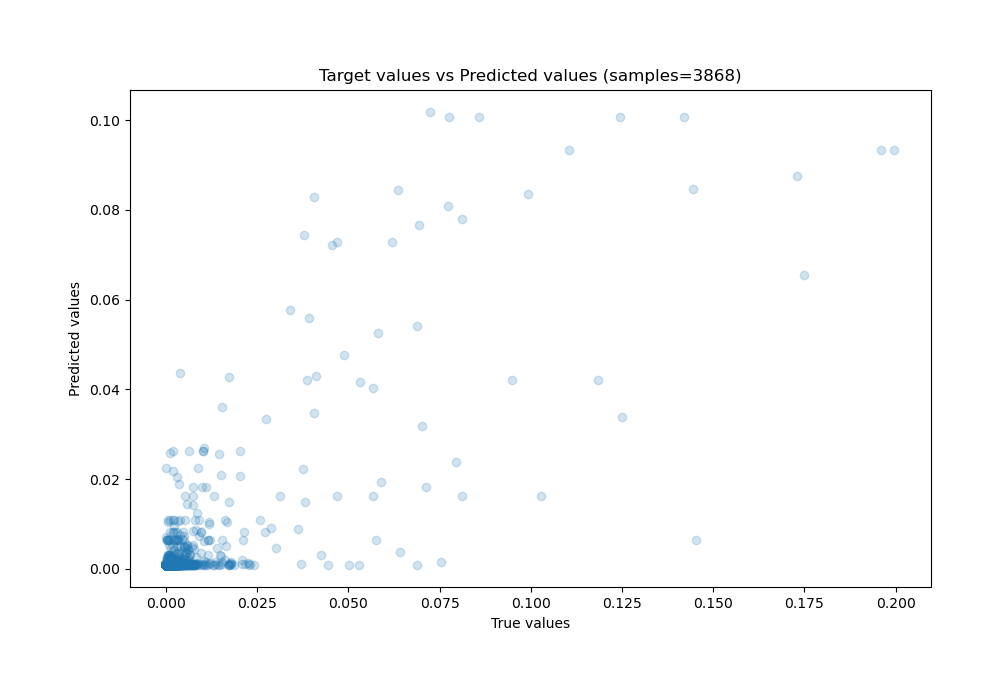
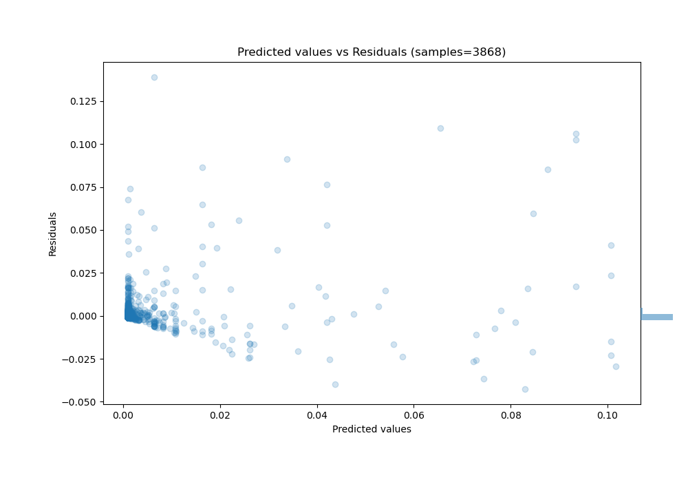

# Summary of 13_RandomForest

[<< Go back](../README.md)

## Random Forest
- **n_jobs**: -1
- **criterion**: squared_error
- **max_features**: 0.7
- **min_samples_split**: 50
- **max_depth**: 3
- **eval_metric_name**: rmse
- **explain_level**: 1

## Validation
 - **validation_type**: kfold
 - **k_folds**: 4
 - **shuffle**: False

## Optimized metric
rmse

## Training time

62.9 seconds

### Metric details:
| Metric   |       Score |
|:---------|------------:|
| MAE      | 0.00172785  |
| MSE      | 4.32989e-05 |
| RMSE     | 0.00658019  |
| R2       | 0.618103    |
| MAPE     | 1.56736e+11 |

## Learning curves

## Permutation-based Importance

## True vs Predicted

## Predicted vs Residuals

[<< Go back](../README.md)
