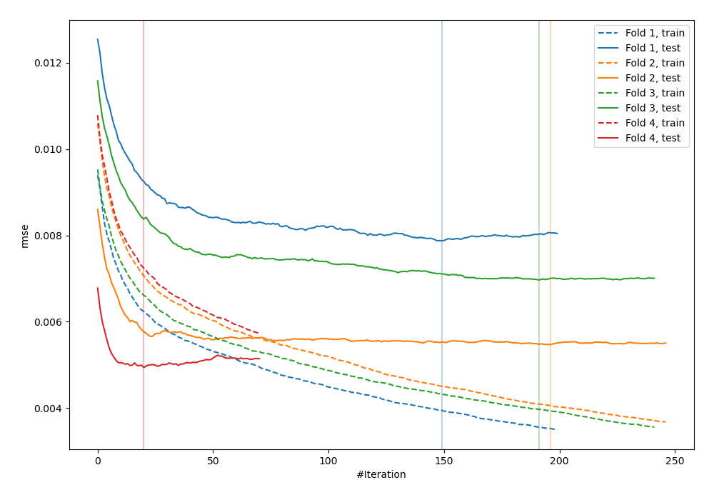

# Summary of 24_Xgboost

[<< Go back](../README.md)

## Extreme Gradient Boosting (Xgboost)
- **n_jobs**: -1
- **objective**: reg:squarederror
- **eta**: 0.15
- **max_depth**: 7
- **min_child_weight**: 50
- **subsample**: 0.6
- **colsample_bytree**: 0.6
- **eval_metric**: rmse
- **explain_level**: 1

## Validation
 - **validation_type**: kfold
 - **k_folds**: 4
 - **shuffle**: False

## Optimized metric
rmse

## Training time

739.4 seconds

### Metric details:
| Metric   |       Score |
|:---------|------------:|
| MAE      | 0.00207016  |
| MSE      | 4.12053e-05 |
| RMSE     | 0.00641913  |
| R2       | 0.636568    |
| MAPE     | 8.62081e+10 |

## Learning curves

## Permutation-based Importance

## True vs Predicted

## Predicted vs Residuals

[<< Go back](../README.md)
