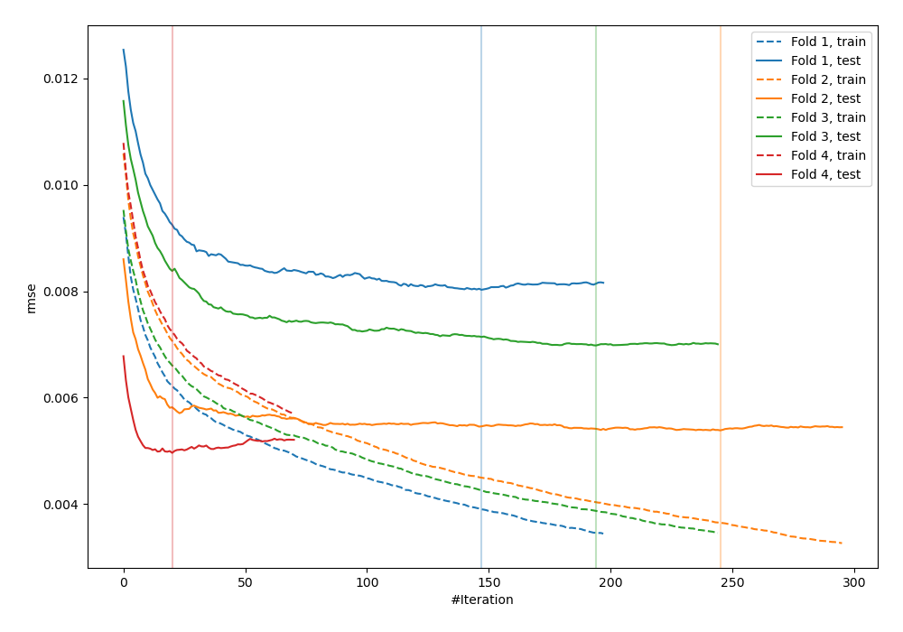
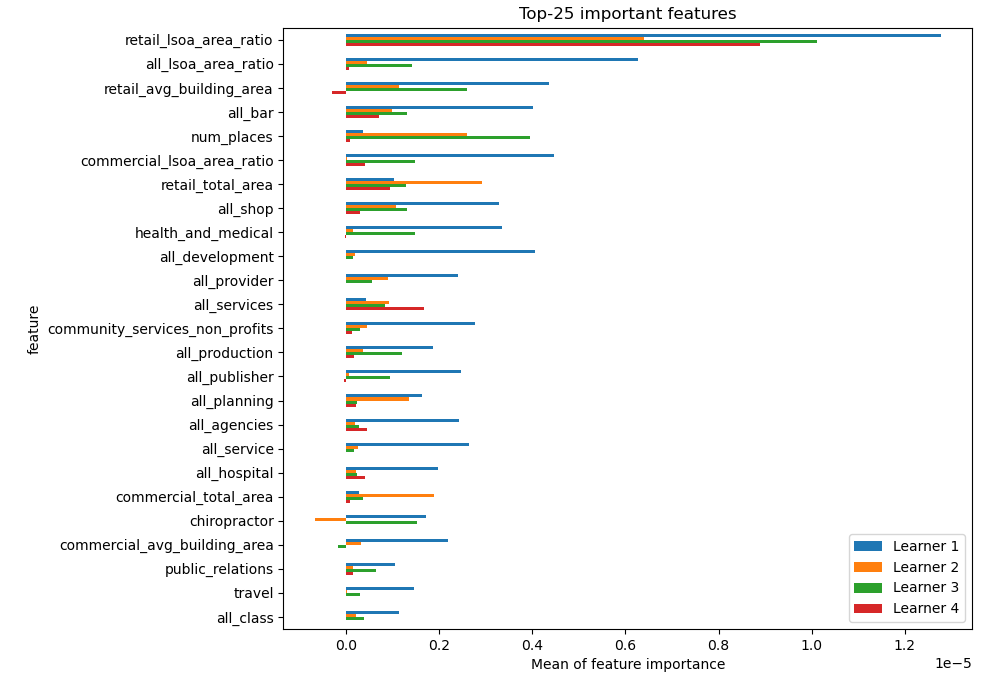
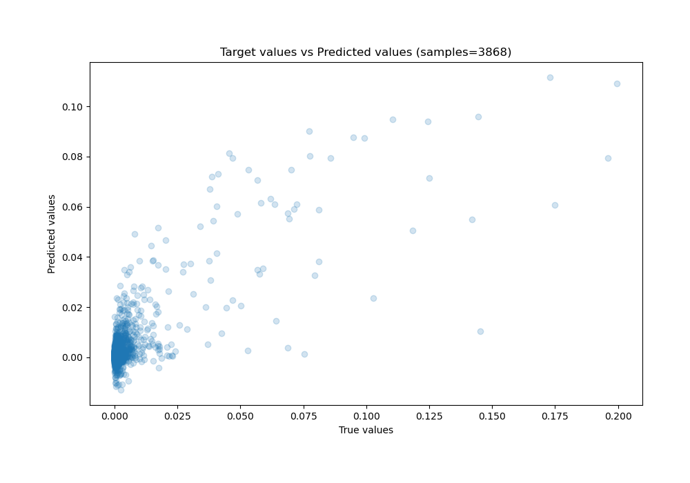
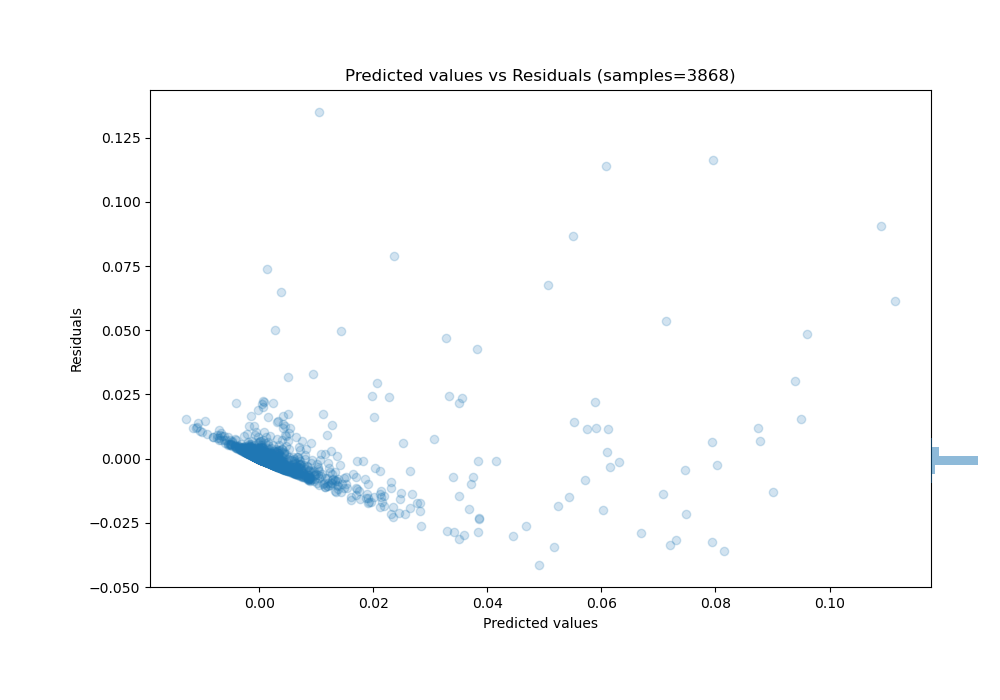

# Summary of 25_Xgboost

[<< Go back](../README.md)

## Extreme Gradient Boosting (Xgboost)
- **n_jobs**: -1
- **objective**: reg:squarederror
- **eta**: 0.15
- **max_depth**: 9
- **min_child_weight**: 50
- **subsample**: 0.6
- **colsample_bytree**: 0.6
- **eval_metric**: rmse
- **explain_level**: 1

## Validation
 - **validation_type**: kfold
 - **k_folds**: 4
 - **shuffle**: False

## Optimized metric
rmse

## Training time

43.3 seconds

### Metric details:
| Metric   |       Score |
|:---------|------------:|
| MAE      | 0.00212302  |
| MSE      | 4.1692e-05  |
| RMSE     | 0.00645693  |
| R2       | 0.632276    |
| MAPE     | 9.42649e+10 |

## Learning curves

## Permutation-based Importance

## True vs Predicted

## Predicted vs Residuals

[<< Go back](../README.md)
