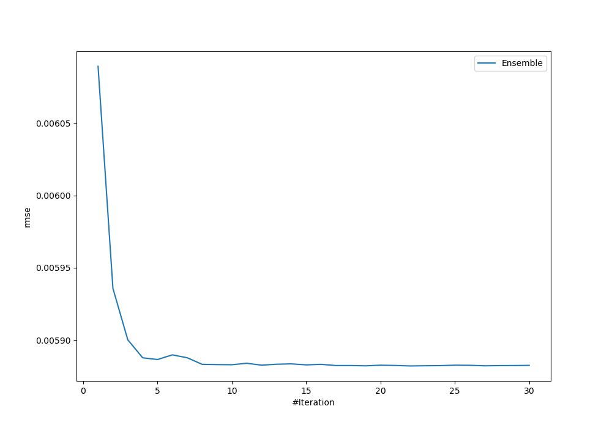
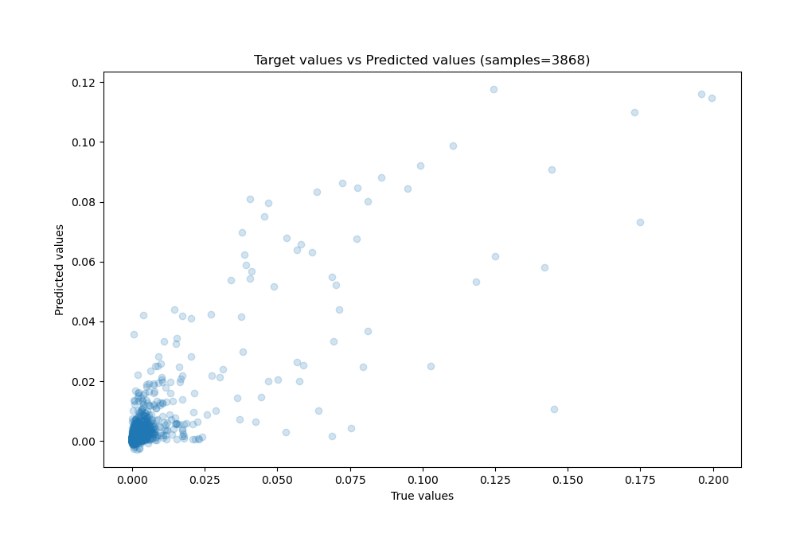
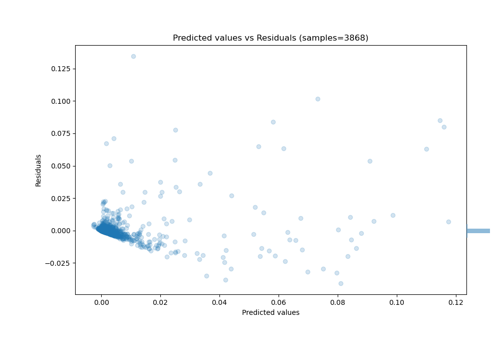

# Summary of Ensemble

[<< Go back](../README.md)

## Ensemble structure
| Model           |   Weight |
|:----------------|---------:|
| 16_Xgboost      |        9 |
| 21_Xgboost      |        6 |
| 22_RandomForest |        2 |
| 7_Xgboost       |        5 |

### Metric details:
| Metric   |       Score |
|:---------|------------:|
| MAE      | 0.00145928  |
| MSE      | 3.45995e-05 |
| RMSE     | 0.00588214  |
| R2       | 0.694831    |
| MAPE     | 7.53633e+10 |

## Learning curves

## True vs Predicted

## Predicted vs Residuals

[<< Go back](../README.md)
