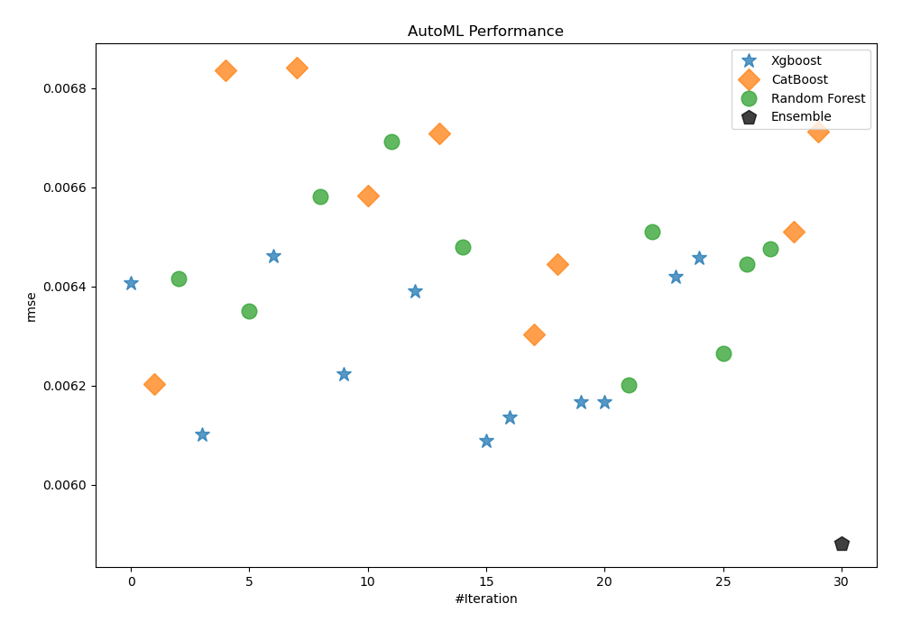
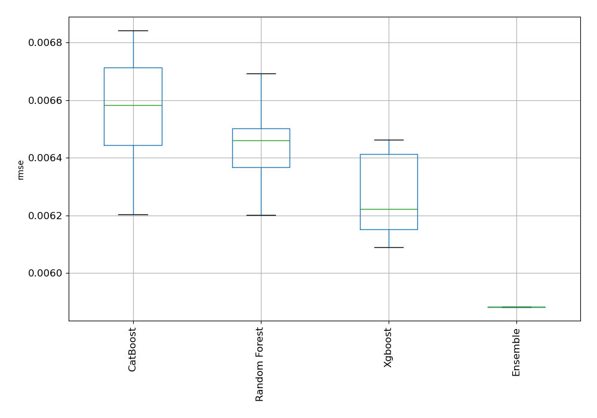
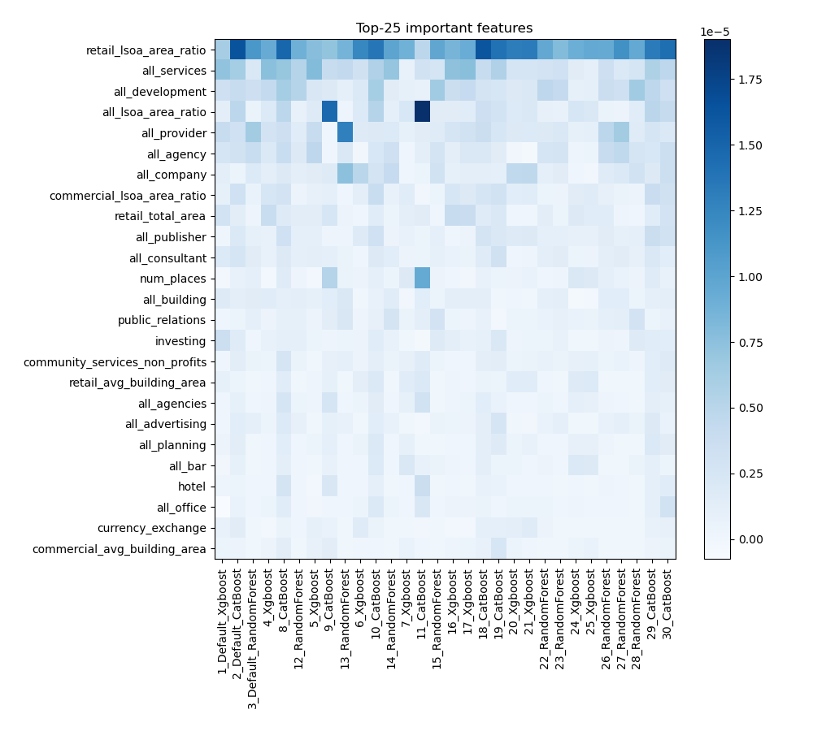
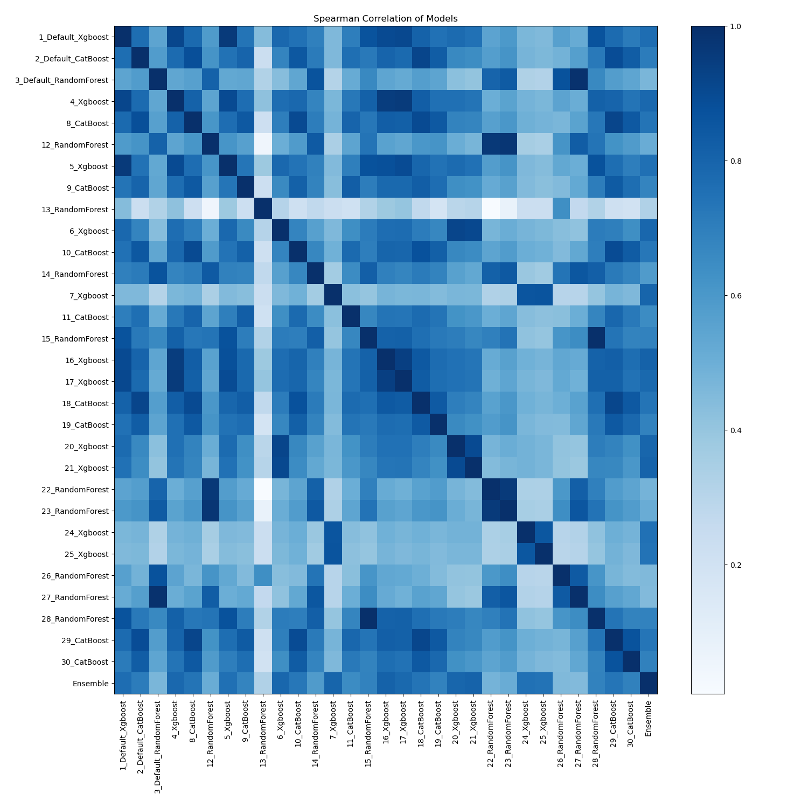

# AutoML Leaderboard

| Best model   | name                                                       | model_type    | metric_type   |   metric_value |   train_time |
|:-------------|:-----------------------------------------------------------|:--------------|:--------------|---------------:|-------------:|
|              | [1_Default_Xgboost](1_Default_Xgboost/README.md)           | Xgboost       | rmse          |     0.00640708 |        44.29 |
|              | [2_Default_CatBoost](2_Default_CatBoost/README.md)         | CatBoost      | rmse          |     0.0062026  |       107.91 |
|              | [3_Default_RandomForest](3_Default_RandomForest/README.md) | Random Forest | rmse          |     0.00641599 |       419.4  |
|              | [4_Xgboost](4_Xgboost/README.md)                           | Xgboost       | rmse          |     0.00610206 |       740.45 |
|              | [8_CatBoost](8_CatBoost/README.md)                         | CatBoost      | rmse          |     0.00683615 |        95.08 |
|              | [12_RandomForest](12_RandomForest/README.md)               | Random Forest | rmse          |     0.00635    |        46.2  |
|              | [5_Xgboost](5_Xgboost/README.md)                           | Xgboost       | rmse          |     0.00646193 |        38.62 |
|              | [9_CatBoost](9_CatBoost/README.md)                         | CatBoost      | rmse          |     0.00684186 |        68.61 |
|              | [13_RandomForest](13_RandomForest/README.md)               | Random Forest | rmse          |     0.00658019 |        63.22 |
|              | [6_Xgboost](6_Xgboost/README.md)                           | Xgboost       | rmse          |     0.00622234 |        50.36 |
|              | [10_CatBoost](10_CatBoost/README.md)                       | CatBoost      | rmse          |     0.00658236 |        95.92 |
|              | [14_RandomForest](14_RandomForest/README.md)               | Random Forest | rmse          |     0.00669226 |        61.28 |
|              | [7_Xgboost](7_Xgboost/README.md)                           | Xgboost       | rmse          |     0.00639108 |        56.46 |
|              | [11_CatBoost](11_CatBoost/README.md)                       | CatBoost      | rmse          |     0.00670857 |        90.18 |
|              | [15_RandomForest](15_RandomForest/README.md)               | Random Forest | rmse          |     0.00647877 |        50.41 |
|              | [16_Xgboost](16_Xgboost/README.md)                         | Xgboost       | rmse          |     0.0060893  |        55.35 |
|              | [17_Xgboost](17_Xgboost/README.md)                         | Xgboost       | rmse          |     0.00613604 |        49.32 |
|              | [18_CatBoost](18_CatBoost/README.md)                       | CatBoost      | rmse          |     0.00630342 |        61.42 |
|              | [19_CatBoost](19_CatBoost/README.md)                       | CatBoost      | rmse          |     0.00644423 |        41.16 |
|              | [20_Xgboost](20_Xgboost/README.md)                         | Xgboost       | rmse          |     0.00616677 |       573.11 |
|              | [21_Xgboost](21_Xgboost/README.md)                         | Xgboost       | rmse          |     0.00616684 |        53.51 |
|              | [22_RandomForest](22_RandomForest/README.md)               | Random Forest | rmse          |     0.00620089 |       182.06 |
|              | [23_RandomForest](23_RandomForest/README.md)               | Random Forest | rmse          |     0.00650982 |        62.21 |
|              | [24_Xgboost](24_Xgboost/README.md)                         | Xgboost       | rmse          |     0.00641913 |       739.67 |
|              | [25_Xgboost](25_Xgboost/README.md)                         | Xgboost       | rmse          |     0.00645693 |        43.61 |
|              | [26_RandomForest](26_RandomForest/README.md)               | Random Forest | rmse          |     0.00626456 |        52.83 |
|              | [27_RandomForest](27_RandomForest/README.md)               | Random Forest | rmse          |     0.00644474 |       147.3  |
|              | [28_RandomForest](28_RandomForest/README.md)               | Random Forest | rmse          |     0.00647572 |        45.62 |
|              | [29_CatBoost](29_CatBoost/README.md)                       | CatBoost      | rmse          |     0.00651049 |        88.26 |
|              | [30_CatBoost](30_CatBoost/README.md)                       | CatBoost      | rmse          |     0.00671242 |        41.7  |
| **the best** | [Ensemble](Ensemble/README.md)                             | Ensemble      | rmse          |     0.00588214 |         0.51 |

### AutoML Performance

### AutoML Performance Boxplot

### Features Importance

### Spearman Correlation of Models

