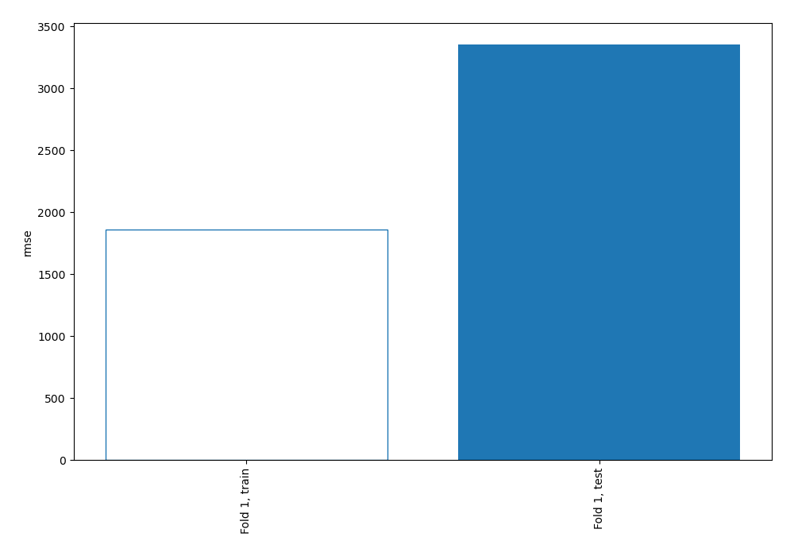
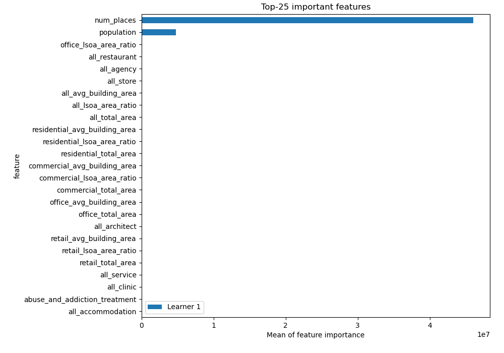
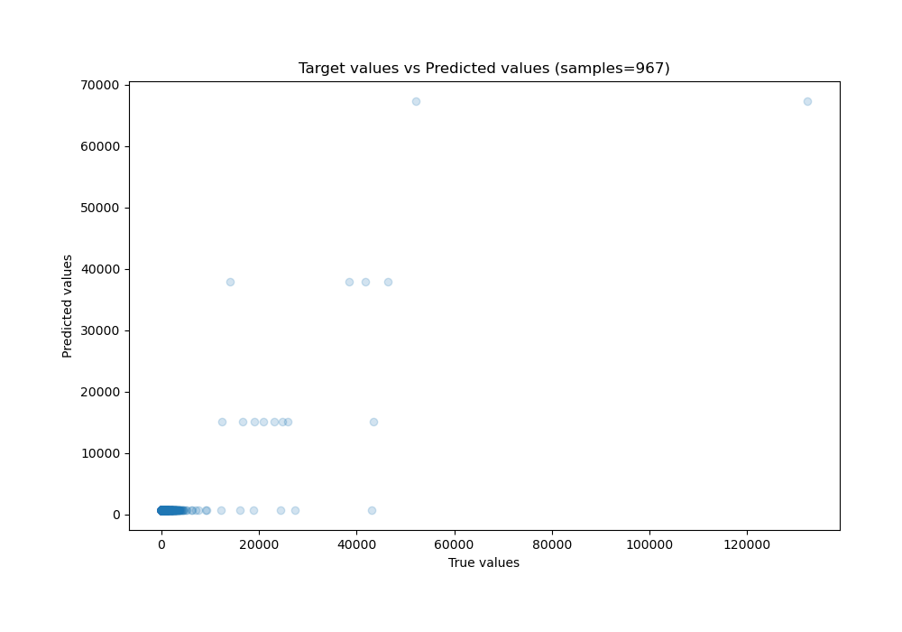
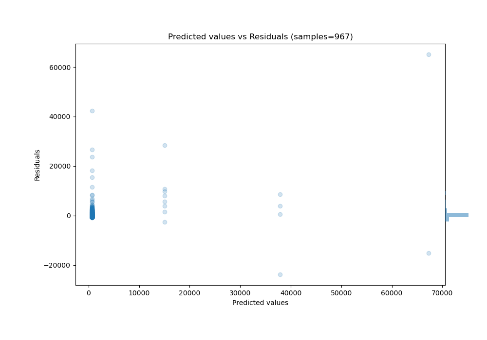

# Summary of 2_DecisionTree

[<< Go back](../README.md)

## Decision Tree
- **n_jobs**: -1
- **criterion**: squared_error
- **max_depth**: 3
- **explain_level**: 2

## Validation
 - **validation_type**: split
 - **train_ratio**: 0.75
 - **shuffle**: True

## Optimized metric
rmse

## Training time

9.0 seconds

### Metric details:
| Metric   |          Score |
|:---------|---------------:|
| MAE      |  954.861       |
| MSE      |    1.12748e+07 |
| RMSE     | 3357.79        |
| R2       |    0.682326    |
| MAPE     |    1.01051e+16 |

## Learning curves

## Permutation-based Importance

## True vs Predicted

## Predicted vs Residuals

[<< Go back](../README.md)
